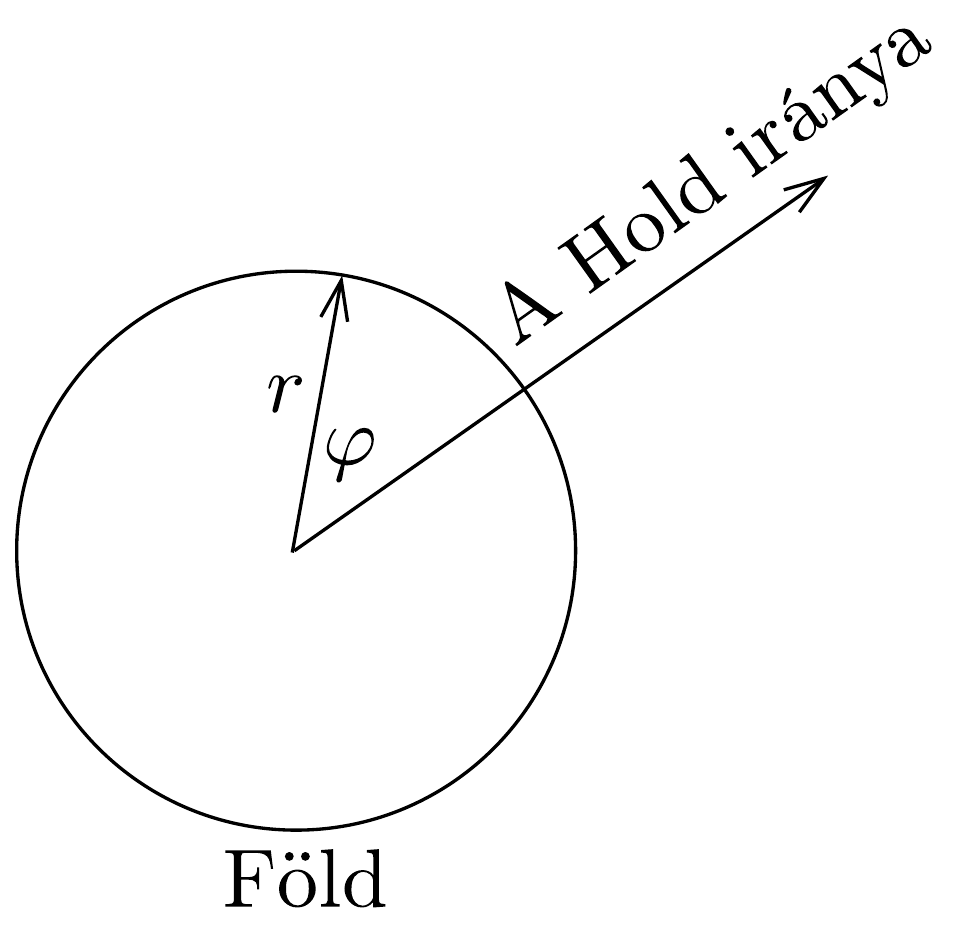

## Feladat 3

Ebben a feladatban a Földön, a nyílt óceánokon kialakuló árapály jelenség néhány alapvető tulajdonságát vizsgáljuk. A feladat megoldásakor a következó egyszerúsító feltevéseket használjuk:
- (i) A Föld és a Hold alkotta rendszert minden mástól elszigeteltnek tekintjük.
- (ii) A Hold és a Föld közötti távolságot állandónak vesszük.
- (iii) A Földet teljes mértékben óceánnal borítottnak képzeljük.
- (iv) A Föld tengely körüli forgásának dinamikai hatásait elhanyagoljuk.
- (v) A Föld által kifejtett gravitációs vonzóerő úgy számítható, mintha a teljes tömeg a Föld középpontjában lenne.

A következő adatok adottak:
A Föld tömege: $M=5,98 \cdot 10^{24} \mathrm{~kg}$;
- a Hold tömege: $M_{\mathrm{H}}=7,35 \cdot 10^{22} \mathrm{~kg}$;
- a Föld sugara: $R=6,37 \cdot 10^{6} \mathrm{~m}$;
- a Föld középpontja és a Hold középpontja közötti távolság: $L=3,84 \cdot 10^{8} \mathrm{~m}$;
- a gravitációs állandó: $G=6,67 \cdot 10^{-11} \mathrm{~m}^{3} \mathrm{~kg}^{-1} \mathrm{~s}^{-2}$.
- a) A Hold és a Föld $\omega$ szögsebességgel kering a $C$ közös tömegközéppont körül. Milyen messze van $C$ a Föld középpontjától? (Jelöljük ezt a távolságot $\ell$-lel!) Határozzuk meg $\omega$ számértékét!

A továbbiakban használjuk azt a vonatkoztatási rendszert, amely a Hold és a Föld középpontjával együtt a $C$ pont körül forog. Ebben a vonatkoztatási rendszerben a Föld folyadékfelszínének alakja állandó.

A $P$ síkon, ami átmegy a $C$ ponton és meróleges a forgástengelyre, a Föld folyadékfelszínén lévő tömegpontot az $r$ és $\varphi$ polárkoordináták segítségével adhatjuk meg, amint a 201. ábra mutatja. Itt $r$ a Föld középpontjától mért távolság.

A Föld folyadékfelszínének $r(\varphi)=R+h(\varphi)$ alakját fogjuk tanulmányozni a $P$ síkban.
b) Tekintsünk egy $m$ tömegü tömegpontot a Föld folyadékfelszínén (a $P$ síkban). Vonatkoztatási rendszerünkben a tömegpontra a centrifugális erő, valamint a Hold és a Föld gravitációs ereje hat. Határozzuk meg ennek a három erőnek megfelelő potenciális energia kifejezését!

Megjegyzés: Bármely $F(r)$ centrális eró kifejezhető egy gömbszimmetrikus $V(r)$ potenciális energia negatív deriváltjaként: $F(r)=-V^{\prime}(r)$.
$c) \mathrm{Az}$ adott $M, M_{\mathrm{H}}$ stb. mennyiségekkel határozzuk meg az árapály hatására kialakuló vízfelszínt leíró $h(\varphi)$ függvény közelítő alakját! Mekkora a modell szerint az apály és a dagály szintek közötti különbség méterben?

Ha $a \ll 1$, akkor használhatjuk a következő közelítést:
\[
\frac{1}{\sqrt{1+a^{2}-2 a \cos \theta}} \approx 1+a \cos \theta+\frac{1}{2} a^{2}\left(3 \cos ^{2} \theta-1\right) .
\]

A számítások során használjunk egyszerúsító közelítéseket mindenhol, ahol a közelítés észszerű!
