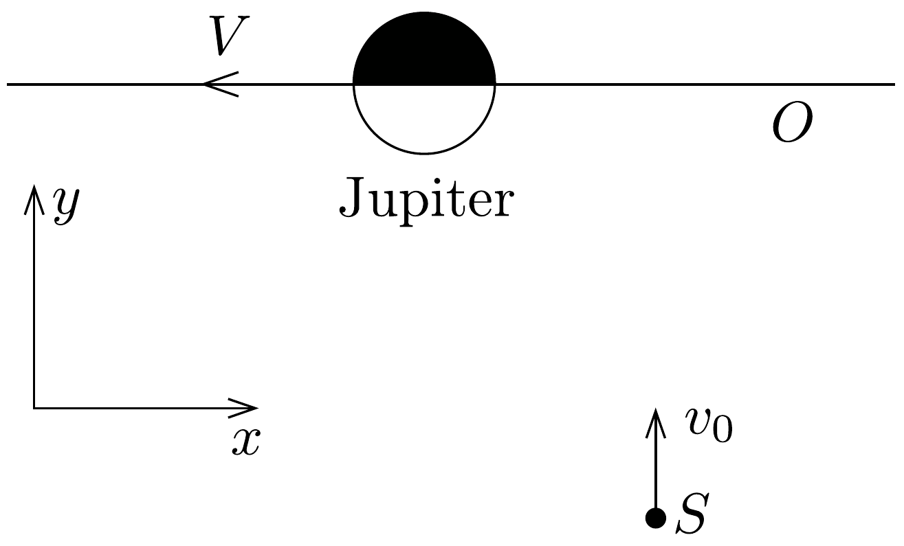
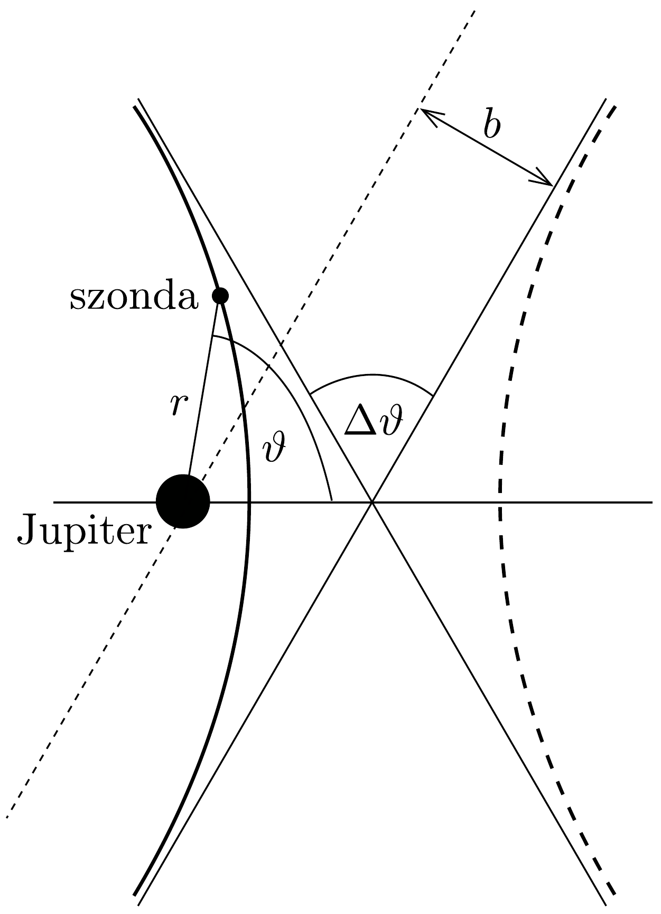

## Feladat 3

Ürszonda a Jupiter gravitációs terében
Ebben a feladatban egy olyan módszerrel (a „gravitációs parittyával”) foglalkozunk, melyet gyakran használnak űrszondák gyorsítására. Az úrszonda megközelít egy bolygót, majd a bolygó hatására a szonda sebessége jelentősen megnövekedhet, mozgásiránya lényegesen megváltozhat, és eközben a bolygó pályamenti mozgásához tartozó energia igen csekély mértékben lecsökken. A továbbiakban ezt a hatást fogjuk tanulmányozni egy, a Jupiter közelében elhaladó úrszondánál.

A Jupiter bolygó olyan ellipszispályán kering a Nap körül, amely az átlagos $R$ sugárnak megfelelő körpályával közelíthető. Mielőtt a fizikai folyamatok elemzésébe kezdenénk, válaszoljunk a következő egyszerú kérdésekre:
a) Mekkora $V$ sebességgel kering a Jupiter a Nap körül?
b) Amikor a szonda a Nap és a Jupiter között (azokat összekető egyenes mentén) van, a Jupitertől milyen távolságra található az a pont, ahol a Nap gravitációs vonzása kiegyenlíti a Jupiterét?

Egy $m=825 \mathrm{~kg}$ tömegú úrszonda repül a Jupiter felé. Az egyszerúség kedvéért tegyük fel, hogy a szonda pályája éppen a Jupiter pályasíkjában fekszik. (Ezáltal nem vesszük figyelembe azt a fontos lehetőséget, hogy a szonda a Jupiter pályasíkjából kilökődhet.)

Csak azzal a tartománnyal foglalkozzunk, ahol a Jupiter vonzása felülmúl minden más gravitációs erőt.

A Jupiter pályáját $(O)$ és az úrszondát $(S)$ a Nap tömegközéppontjához rögzített vonatkoztatási rendszerben a 227. ábra mutatja. A szonda kezdeti sebessége $v_{0}=1,00 \cdot 10^{4} \mathrm{~m} / \mathrm{s}$. A „kezdeti sebesség” a szondának azt a sebességét jelenti, amikor még a bolygóközi térben, a Jupitertól messze van, de már abban a tartományban, ahol a Nap vonzása elhanyagolható a Jupiteré mellett. Feltesszük, hogy a bolygóval történó találkozás olyan rövid idő alatt zajlik le, hogy a Jupiter Nap körüli pályamozgásában bekövetkezó irányváltozást elhanyagolhatjuk. Azt is feltesszük, hogy a szonda a Jupiter mögött halad el, vagyis a szonda $x$ koordinátája nagyobb, mint a Jupiteré, amikor az $y$ koordináták megegyeznek.

c) Adjuk meg az úrszonda mozgásirányát (a sebességvektor és az $x$ tengely által bezárt $\varphi$ szöget), továbbá a szonda $v^{\prime}$ sebességét a Jupiter vonatkoztatási rendszerében, ha a szonda messze van a Jupitertől!
d) Határozzuk meg a szonda teljes $E$ mechanikai energiáját a Jupiter vonatkoztatási rendszerében, amikor a szonda még elegendően messze van ahhoz, hogy a gravitációs kölcsönhatás gyengesége miatt csaknem egyenletes sebességgel mozogjon! (A potenciális energiát - szokásos módon - nagyon nagy távolságban választjuk nullának.)

Az úrszonda pályája a Jupiter vonatkoztatási rendszerében egy hiperbola, melynek polárkoordinátákkal kifejezett egyenlete ebben a vonatkoztatási rendszerben:
\[
\frac{1}{r}=\frac{G M}{v^{\prime 2} b^{2}}\left(1+\sqrt{1+\frac{2 E v^{\prime 2} b^{2}}{G^{2} M^{2} m}} \cos \vartheta\right),
\]
ahol $b$ az egyik aszimptota távolsága a Jupitertől (az úgynevezett impakt paraméter), $E$ a szonda teljes mechanikai energiája a Jupiter vonatkoztatási rendszerében, $G$ a gravitációs állandó, $M$ a Jupiter tömege, $r$ és $\vartheta$ polárkoordináták (a vezérsugár és a polárszög).

A 228. ábra a (99-1) egyenlet által leírt hiperbola két ágát ábrázolja (az aszimptotákat és a polárkoordinátákat is feltüntetve). Figyeljünk arra, hogy a (99-1)
egyenletbeli origó a hiperbola „vonzó fókuszpontja”. A szonda pályagörbéje a vonzási pálya, melyet a 228. ábrán folytonos, vastag vonal jelöl.

e) Felhasználva a pályagörbét leíró (99-1) egyenletet, határozzuk meg a teljes $\Delta \vartheta$ szögeltérülést a Jupiter vonatkoztatási rendszerében (lásd a 228, ábrát), és fejezzük ki ezt a szögeltérülést a kezdeti $v^{\prime}$ sebesség, valamint a $b$ impakt paraméter függvényében!
f) Tételezzük fel, hogy a szonda nem kerülhet közelebb a Jupiter középpontjához, mint a bolygó (a Jupiter) sugarának háromszorosa. Számítsuk ki ebben az esetben a legkisebb impakt paramétert és az így létrejövő legnagyobb szögeltérülést!
g) Vezessünk le egy olyan egyenletet, amely megadja a Nap vonatkoztatási rendszerében a szonda $v^{\prime \prime}$ végsebességét a Jupiter $V$ sebességének, a szonda kezdeti $v_{0}$ sebességének és a $\Delta \vartheta$ szögeltérülésnek a függvényében!
$h)$ A fenti eredmények felhasználásával adjuk meg numerikusan a szonda $v^{\prime \prime}$ végsebességét a Nap vonatkoztatási rendszerében, ha a szögeltérülés a lehető legnagyobb megengedett értékú!
Adatok:
a Nap tömege: $M_{\mathrm{N}}=1,99 \cdot 10^{30} \mathrm{~kg}$,
a Jupiter tömege: $M=1,90 \cdot 10^{27} \mathrm{~kg}$,
a Jupiter egyenlítői sugara: $R_{\mathrm{J}}=6,98 \cdot 10^{7} \mathrm{~m}$,
a Jupiter átlagos pályasugara: $R=7,78 \cdot 10^{11} \mathrm{~m}$,
a Jupiter tengelyforgási ideje: $t_{\mathrm{J}}=3,56 \cdot 10^{4} \mathrm{~s}$,
a Jupiter keringési ideje: $T_{\mathrm{J}}=3,74 \cdot 10^{8} \mathrm{~s}$.
