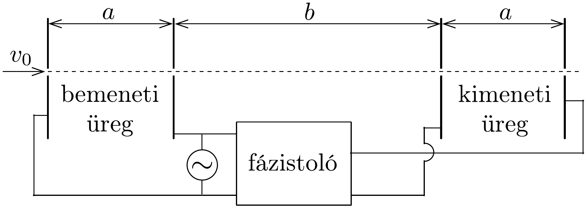
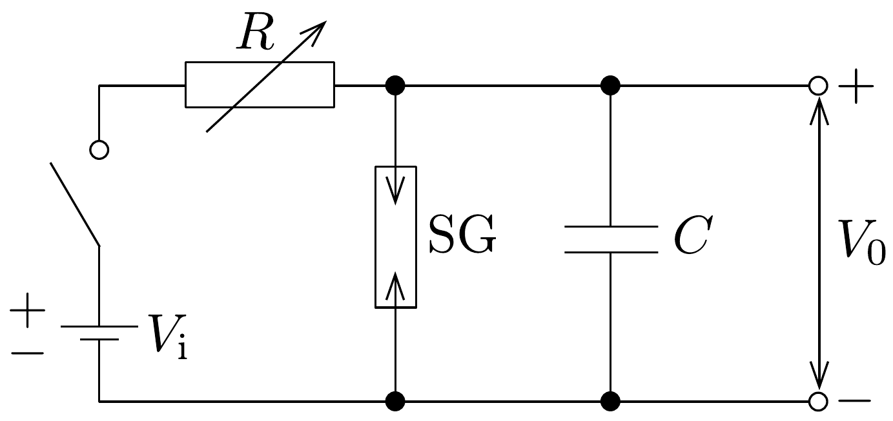
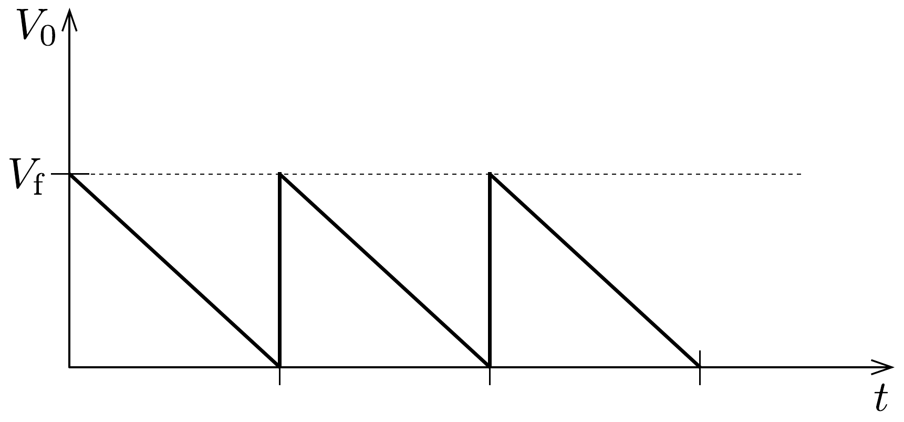
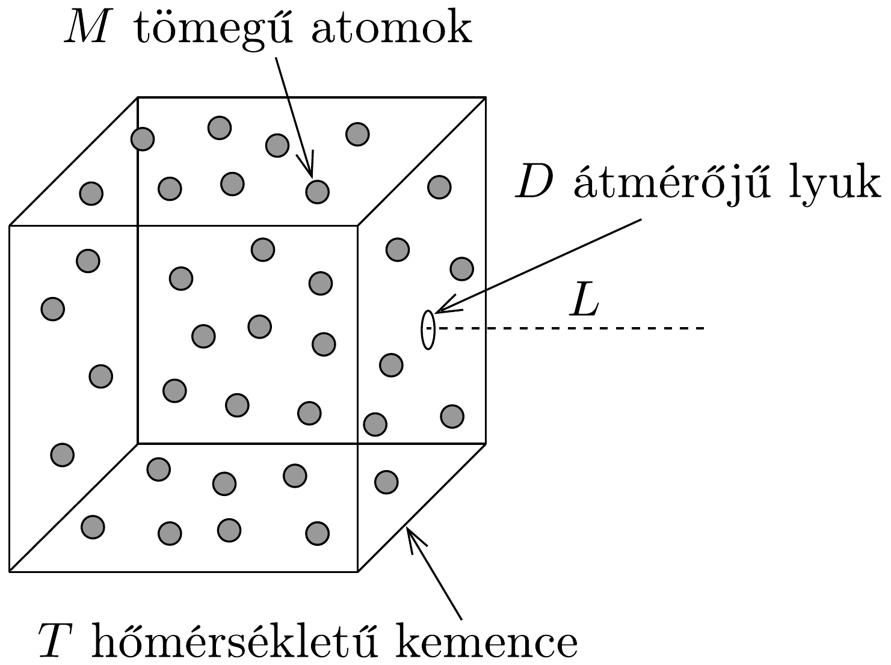

## Feladat 1

Négy független feladat
1.1. feladat. Klisztron

A klisztron nagyon nagy frekvenciás jelek erósítésére szolgáló eszköz. A klisztron lényegében két egyforma lemezpárból (üregből) áll, melyek egymástól $b$ távolságra vannak a 238. ábrán látható módon.

Egy kezdetben $v_{0}$ sebességú elektronsugár halad át az egész rendszeren a lemezekre vágott kicsiny lyukakon keresztül. Az erósítendő nagyfrekvenciás feszültséget egy meghatározott fáziskülönbséggel (a $T$ periódusidő $2 \pi$ fázisnak felel meg) rákapcsolják mindkét lemezpárra, ezáltal az üregekben vízszintes, váltakozó elektromos tér keletkezik. Azok az elektronok, amelyek akkor lépnek be a bal oldali üregbe (input cavity), amikor az elektromos térerősség vektora jobbra mutat, lelassulnak, és fordítva: a balra mutató elektromos térbe érkező elektronok felgyorsulnak. Így a továbbhaladó elektronok bizonyos távolságra összetorlódnak. Ha a jobb oldali üreg (output cavity) éppen egy torlódási pontnál van, az üregben levő elektromos tér energiát kap az elektronsugártól, feltéve, hogy az elektromos tér fázisa megfelelő.

Legyen a feszültségjel egy négyszögjel $T=1,0 \cdot 10^{-9} \mathrm{~s}$ periódusidővel váltakozva $V= \pm 0,5 \mathrm{~V}$ feszültségek között! Az elektronok kezdeti sebessége $v_{0}=$ $2,0 \cdot 10^{6} \mathrm{~m} / \mathrm{s}$, fajlagos töltése pedig $e / m=1,76 \cdot 10^{11} \mathrm{C} / \mathrm{kg}$. Az $a$ távolság olyan kicsi, hogy az elektronok üregen való áthaladási ideje elhanyagolható. Számítsuk ki, és adjuk meg 4 értékes jegy pontossággal a következőket:
- $a)$ azt a $b$ távolságot, ahol az elektronok összetorlódnak;
- $b)$ a fázistoló által létrehozandó fáziskülönbséget!

\section*{1.2. feladat. Molekulák közötti távolság}

Jelölje $d_{\mathrm{L}}$ a vízmolekulák közti átlagos távolságot, $d_{\mathrm{V}}$ pedig a vízgőz molekuláinak átlagos távolságát. Feltételezzük, hogy mindkét fázis $100^{\circ} \mathrm{C}$-os és légköri nyomású, továbbá azt, hogy a vízgőz ideális gázként viselkedik. Számítsuk ki az alábbi adatok felhasználásával a $d_{\mathrm{V}} / d_{\mathrm{L}}$ arányt!

Adatok:
a víz súrúsége folyadékfázisban: $\varrho_{\mathrm{L}}=1,0 \cdot 10^{3} \mathrm{~kg} / \mathrm{m}^{3}$,
a víz móltömege: $M=1,8 \cdot 10^{-2} \mathrm{~kg} / \mathrm{mol}$,
a légköri nyomás: $p_{0}=1,0 \cdot 10^{5} \mathrm{~N} / \mathrm{m}^{2}$,
az univerzális gázállandó: $R=8,3 \mathrm{~J} /(\mathrm{mol} \cdot \mathrm{K})$,
az Avogadro-szám: $N_{A}=6,0 \cdot 10^{23} / \mathrm{mol}$.

\section*{1.3. feladat. Egyszerú fürészfog-generátor}

Egy fürészfog alakú feszültségjel $\left(V_{0}\right)$ a 239, ábrán látható $C$ kapacitással, $R$ változtatható ellenállással, $V_{\mathrm{i}}$ ideális teleppel és az SG jelú szikraközzel (spark gap) állítható elő. Ez utóbbi két elektródát tartalmaz, melyek távolsága változtatható.

Ha az elekródák közötti feszültség eléri a $V_{\mathrm{f}}$ kisülési (firing) feszültséget, a közöttük lévő levegő átüt, így a szikraköz rövidzárként múködik mindaddig, míg a rá eső feszültség nagyon kis értékre nem csökken.
a) Rajzoljuk fel, hogyan változik a kapcsoló zárását követően a $V_{0}$ feszültség a $t$ idő függvényében!
b) Milyen feltételnek kell teljesülnie ahhoz, hogy $V_{0}$ csaknem lineárisan változó fúrészfogjel legyen?
c) Feltéve, hogy ez a linearitási feltétel teljesül, vezessük le a jelalak $T$ periódusidejét megadó egyszerú közelítő formulát!
d) Mit változtassunk meg ( $R$-t és/vagy SG-t) ahhoz, hogy a fürészfogjelnek csak a periódusideje változzék?
$e$ ) Mit változtassunk meg ( $R$-t és/vagy SG-t) ahhoz, hogy a fürészfogjelnek csak az amplitúdója változzék?
f) A korábbi eszközök mellé rendelkezésre áll még egy változtatható kimenetú egyenáramú feszültségforrás is. Tervezzünk meg és rajzoljunk le egy olyan új áramkört, mellyel a 240. ábrán látható feszültségjelalakot állíthatjuk elő!

\section*{1.4. feladat. Atomsugár}

Egy atomsugarat úgy lehet előállítani, hogy bizonyos számú atomból álló gázt $T$ hőmérsékletre hevítünk, és lehetővé tesszük, hogy az atomok a kemence falán lévó igen kicsiny (az atomok méretével összemérhető) $D$ átmérőjü lyukon vízszintes irányban kilépjenek. Becsüljük meg, mekkorára nő a sugár átmérője $L$ hosszúságú, vízszintes út megtétele után! Az atomok tömege $M$.

