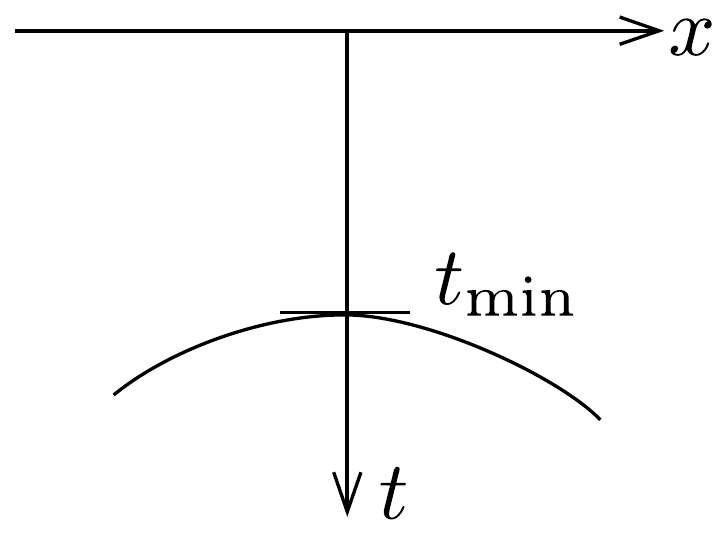

## Feladat 1

Földbe hatoló radar
A földbe hatoló radart a földfelszín alatt nem túl mélyen elhelyezkedő tárgyak felderítésére és helyük meghatározására használják. Működésének lényege, hogy elektromágneses hullámokat sugároz a földbe, és érzékeli a tárgyakról visszaverődő hullámokat. Az antenna és az érzékelő közvetlenül a föld felszínén, ugyanabban a pontban helyezkedik el.

Ha egy $\omega$ körfrekvenciájú, lineárisan polarizált elektromágneses síkhullám a $z$ tengely irányában halad, akkor benne az elektromos térerősség a következő összefüggéssel írható le:
\[
E=E_{0} \mathrm{e}^{-\alpha z} \cos (\omega t-\beta z),
\]
ahol $E_{0}$ állandó, $\alpha$ a csillapodási együttható, $\beta$ pedig a (kör)hullámszám. Esetünkben $\alpha$ és $\beta$ a következő összefüggésekkel adható meg:
\[
\alpha=\omega \sqrt{\frac{\mu \varepsilon}{2}\left(\sqrt{1+\frac{\sigma^{2}}{\varepsilon^{2} \omega^{2}}}-1\right)}, \quad \beta=\omega \sqrt{\frac{\mu \varepsilon}{2}\left(\sqrt{1+\frac{\sigma^{2}}{\varepsilon^{2} \omega^{2}}}+1\right)},
\]
ahol $\mu, \varepsilon$ és $\sigma$ a közeg mágneses permeabilitását, elektromos permittivitását és elektromos vezetőképességét jelöli. ( $\mu=\mu_{0} \mu_{\mathrm{r}}, \varepsilon=\varepsilon_{0} \varepsilon_{\mathrm{r}}$, a vezetőképesség pedig a fajlagos ellenállás reciproka.)

Egy, a talajban lévő tárgyat érzékelhetetlennek tekintünk, ha a felszínről induló radarjel amplitúdója 1/e-nél (37\%-nál) nagyobb arányban csökken le akkorra, amikor a jel a tárgyhoz érkezik. Rendszerint 10 MHz-1000 MHz között változtatható frekvenciájú elektromágneses hullámot használnak, mert ez felel meg a tárgyak helymeghatározásának és az észlelés felbontóképességének.

A radar felhasználhatósága függ a felbontóképességétól. A felbontóképesség az a minimális távolság, amely esetén még két ilyen közeli visszaverő objektum megkülönböztethető. Ez határesetben azt jelenti, hogy a két objektumról visszaverődő hullám fáziskülönbsége a detektornál (alkalmas helyzetben) eléri a 180°-ot.
(Adatok: $\mu_{0}=4 \pi \cdot 10^{-7} \mathrm{H} / \mathrm{m}$ és $\varepsilon_{0}=8,85 \cdot 10^{-12} \mathrm{~F} / \mathrm{m}$.)
$a)$ Tételezzük fel, hogy a talaj nem mágneses $\left(\mu=\mu_{0}\right)$, és teljesül, hogy $\left(\frac{\sigma}{\omega \varepsilon}\right)^{2} \ll 1$. A (02-1) és (02-2) összefüggések felhasználásával adjuk meg a hullám $v$ terjedési sebességét $\mu$-vel és $\varepsilon$-nal kifejezve!
b) Határozzuk meg a talajbeli érzékelés maximális mélységét, ha a talaj vezetőképessége $1,0 \mathrm{mS} / \mathrm{m}$, permittivitása $9 \varepsilon_{0}$, valamint teljesül a $\left(\frac{\sigma}{\omega \varepsilon}\right)^{2} \ll 1$ feltétel! $\left(\mathrm{S}[\right.$ siemens $]=\mathrm{ohm}^{-1}$, és felhasználhatjuk, hogy $\left.\mu=\mu_{0}.\right)$

c) Tegyük fel, hogy két párhuzamos vezetőrúd fekszik a talajban 4 méter mélyen. A talaj vezetóképessége $1,0 \mathrm{mS} / \mathrm{m}$ és a permittivitása $9 \varepsilon_{0}$. A radar jó közelítéssel az egyik rúd felett van. Tételezzük fel, hogy az érzékelő pontszerú. Határozzuk meg, hogy legalább mekkora frekvenciára van szükség ebben az elrendezésben 50 cm-es vízszintes (oldalirányú) felbontóképesség eléréséhez!
d) Ugyanebben a talajban meg szeretnénk mérni, hogy egy vízszintesen eltemetett rúd mekkora $d$ mélységben fekszik. Ezért a detektorral, a talajon, a rúdra merőleges irányban fekvő $x$ egyenes mentén méréseket végzünk, mérjük egy radarimpulzus visszaérkezésének $t$ idejét. Az eredményt (a $t$ visszaérkezési időt az $x$ detektorhelyzet függvényében, ahol $t_{\text {min }}=100 \mathrm{~ns}$ ) a 248. ábra mutatja. Adjuk meg a $t$ visszaérkezési időt $x$ függvényeként, és határozzuk meg a $d$ mélységet!

