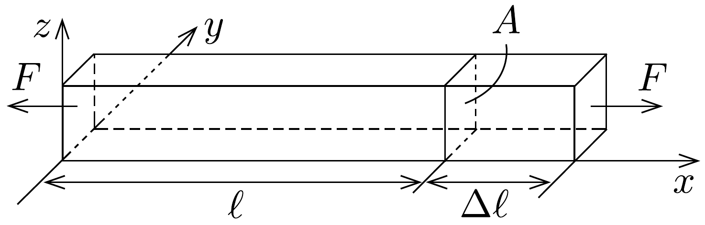
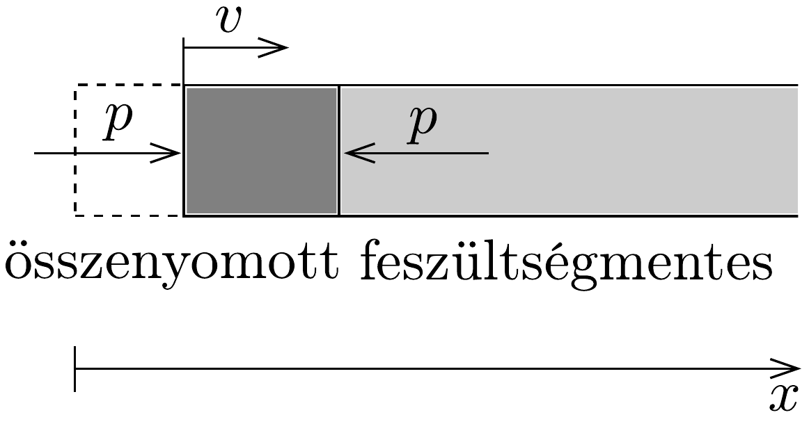
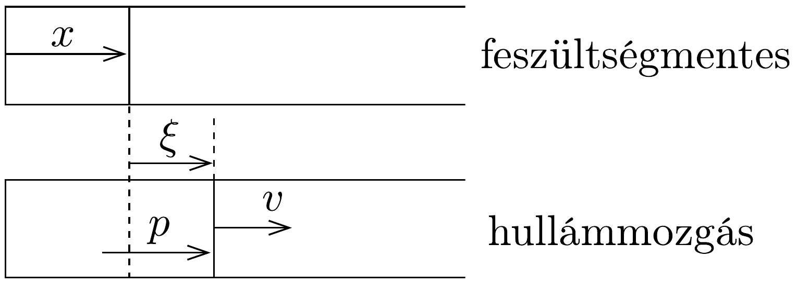
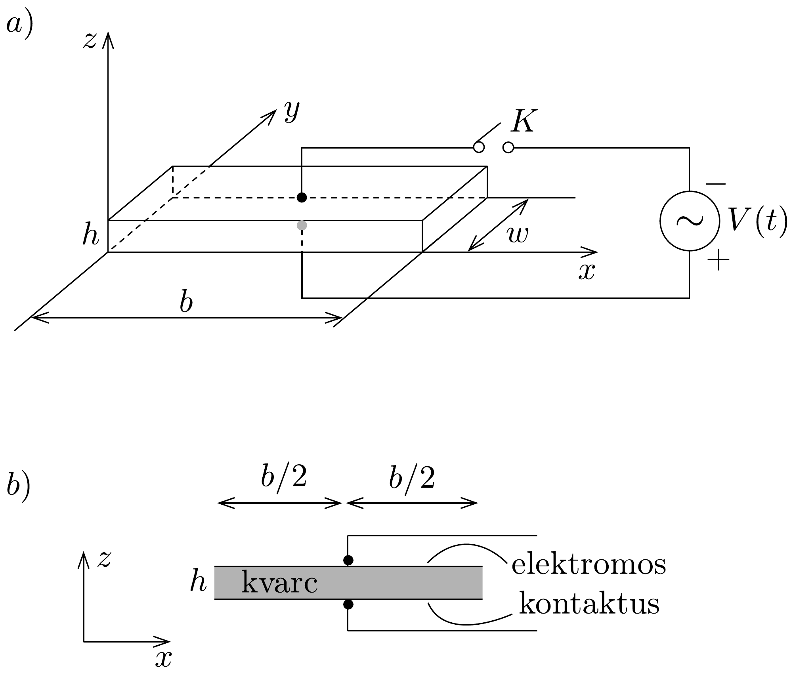

## Feladat 2

Piezoelektromos kristályrezonátor elektromos váltófeszültséggel

Tekintsünk egy homogén, $A$ keresztmetszetú rudat, melynek mechanikai feszültségektől mentes állapotban a hossza $\ell$ (259. ábra). Ha a rúd két végén azo-

nos nagyságú, de ellentétes irányú, a felületre merőleges $F$ erő hat, a rúd hossza $\Delta \ell$-lel megváltozik. A $T$ mechanikai feszültséget a rúd végein az $F / A$ kifejezés definiálja. A rúd hosszának relatív megváltozását, azaz a $\Delta \ell / \ell$-t deformációnak nevezzük, és $S$-sel jelöljük. A mechanikai feszültség és a deformáció segítségével a Hooke-törvényt a következő alakban is felírhatjuk:
\[
T=Y S \quad \text { vagy } \quad \frac{F}{A}=Y \frac{\Delta \ell}{\ell},
\]
ahol $Y$ a rúd anyagának Young-modulusa. Jegyezzük meg, hogy $T$ nyomófeszültség, ha $F<0$ és a rúd hossza csökken (azaz $\Delta \ell<0$ ). Az ilyen feszültség tehát negatív, és értéke a $p$ nyomás $(-1)$-szerese: $T=-p$. Egy homogén, $\varrho$ sürúségú rúdban a longitudinális hullámok terjedési sebessége (azaz a hangsebesség) a
következőképpen adható meg:
\[
u=\sqrt{\frac{Y}{\varrho}} .
\]
(A feladat megoldása során minden csillapítás és elnyelódés elhanyagolható.)

\section*{A rész: Mechanikai tulajdonságok}

Egy homogén, egyik irányban végtelen rúd (kiterjedése $x=0$-tól $\infty$-ig tart), súrúsége $\varrho$. A rúd kezdetben nyugalomban van és feszültségmentes. A rúd bal felületére az $x=0$ helyen egy dugattyú nagyon rövid $\Delta t$ ideig állandó, kicsiny $p$ nyomást fejt ki, és ezzel elindít egy $u$ sebességgel jobbra haladó nyomáshullámot (260. ábra).

- a) Mekkora ezalatt a $\Delta t$ idő alatt az $S$ deformáció és a $p$ nyomás a rúd bal oldali felületénél, ha a dugattyú a rúd bal oldali felületét állandó $v$ sebességgel mozgatja (260. ábra)? A választ $\varrho, u$ és $v$ függvényében adjuk meg.

- b) Tekintsünk egy longitudinális hullámot, amely $x$ irányban terjed a rúdban. Jelöljük a rúd feszültségmentes állapotában az $x$ helyen lévő keresztmetszetének $t$ időpontbeli elmozdulását $\xi(x, t)$-vel (261. ábra), és tételezzük fel, hogy
\[
\xi(x, t)=\xi_{0} \sin k(x-u t),
\]
ahol $\xi_{0}$ és $k$ állandók.
Határozzuk meg a megfelelő $v(x, t)$ sebességet, $S(x, t)$ deformációt és $p(x, t)$ nyomást $x$ és $t$ függvényében!

B rész: Elektromechanikai tulajdonságok (beleértve a piezoelektromos hatást

Tekintsünk egy hasáb alakú kvarckristályt, amelynek hossza $b$, vastagsága $h$ és szélessége $w$ (262. a) ábra). A hossza $x$ tengely irányú, vastagsága pedig $z$ tengely irányú. Az alsó és a felsó felületén vékony fémbevonat segítségével elektromos kontaktusokat alakítottak ki. Az elektromos vezetékek, amelyek egyben tartószerkezetként is szolgálnak (262.b) ábra) a kontaktusok közepére vannak forrasztva, ezért az $x$ irányú longitudinális rezgések során ezek a pontok nyugalomban maradnak.

A vizsgált kvarckristály súrúsége $\varrho=2,65 \cdot 10^{3} \mathrm{~kg} / \mathrm{m}^{3}$, Young-modulusa pedig $Y=7,87 \cdot 10^{10} \mathrm{~N} / \mathrm{m}^{2}$. A hasáb hossza $b=1,00 \mathrm{~cm}$, a $w$ szélességre és a $h$ vastagságra pedig $h \ll w \ll b$ teljesül. A $K$ kapcsoló nyitva van, és feltételezzük, hogy csak $x$ irányú longitudinális módusú állóhullámok gerjesztődnek a kvarchasábban.

Egy $f=\omega /(2 \pi)$ frekvenciájú állóhullámban a $\xi(x, t)$ elmozdulás a következő alakba írható:
\[
\xi(x, t)=2 \xi_{0} g(x) \cos \omega t, \quad(0 \leq x \leq b),
\]
ahol $\xi_{0}$ egy pozitív konstans, a $g(x)$ helyfüggő tényező
\[
g(x)=B_{1} \sin k\left(x-\frac{b}{2}\right)+B_{2} \cos k\left(x-\frac{b}{2}\right)
\]
alakú, $g(x)$ maximális értéke 1 és $k=\omega / u$. Ne felejtsük el, hogy az elektromos kontaktusok közepe nyugalomban van, és hogy a hasáb bal és jobb vége szabad,
így a mechanikai feszültség (vagy a nyomás) értéke ezeken a helyeken nulla kell legyen.
c) Határozzuk meg a $g(x)$ formulájában szereplő $B_{1}$ és $B_{2}$ állandók értékét, ha a kvarchasábban egy longitudinális állóhullám alakul ki!
d) Mekkora az a két legkisebb frekvencia, amelyen longitudinális állóhullám gerjeszthetó a kvarchasábban?

A piezoelektromos hatás a kvarckristály speciális tulajdonsága. A kristály összenyomása vagy megnyújtása elektromos feszültséget hoz létre a kristályban, és fordítva, a kristályra kapcsolt külső elektromos feszültség vagy megnyúlást, vagy összehúzódást okoz, a polaritástól függően. Így a mechanikai és az elektromos rezgések csatolódhatnak és rezonálhatnak a kvarckristályban.

Legyen a felsó és az alsó elektromos kontaktus elektromos töltéssűrúsége $-\sigma$, illetve $+\sigma$, ha a kvarchasábban $E$ nagyságú, $z$ irányú elektromos tér van. Jelölje a hasáb $x$ irányú deformációját és mechanikai feszültségét $S$, illetve $T$ ! Ekkor a piezoelektromos hatás a kvarckristályban a következő egyenletrendszerrel írható le:
\[
\begin{aligned}
S & =(1 / Y) T+d_{\mathrm{p}} E, \\
\sigma & =d_{\mathrm{p}} T+\varepsilon_{T} E,
\end{aligned}
\]
ahol $1 / Y=1,27 \cdot 10^{-11} \mathrm{~m}^{2} / \mathrm{N}$ a Young-modulus reciproka állandó elektromos tér esetén, $\varepsilon_{T}=4,06 \cdot 10^{-11} \mathrm{~F} / \mathrm{m}$ a dielektromos állandó konstans mechanikai feszültség esetén, $d_{\mathrm{p}}=2,25 \cdot 10^{-12} \mathrm{~m} / \mathrm{V}$ pedig a piezoelektromos együttható.

Legyen most a 262a. ábrán látható $K$ kapcsoló zárva. Ekkor $V(t)=V_{\mathrm{m}} \cos \omega t$ elektromos váltófeszültség jelenik meg a kontaktusokon, és a kvarc hasábban homogén, $E(t)=V(t) / h$ nagyságú, $z$ irányú elektromos tér keletkezik. Az állandósult állapot kialakulása után a hasábban egy $x$ irányú, $\omega$ körfrekvenciájú, longitudinális állóhullám figyelhető meg.

Mivel $E$ homogén, a $\lambda$ hullámhossz és a hasábban lévő állóhullámok $f$ frekvenciája között továbbra is érvényes a $\lambda=u / f$ összefüggés, ahol $u$ értékét a (03-1) egyenlet adja meg. A $T=Y S$ összefüggés azonban most már nem érvényes, mint ahogy azt a (03-2) egyenlet is mutatja. Ugyanakkor a deformáció és a mechanikai feszültség definíciója változatlan, a hasáb végei pedig továbbra is szabadok, nulla mechanikai feszültséggel.
$e$ ) A (03-2) és a (03-3) egyenletek figyelembevételével a $\sigma$ felületi töltéssürúség az alsó elektromos kontaktuson $x$ és $t$ függvényében
\[
\sigma(x, t)=\left[D_{1} \cos k\left(x-\frac{b}{2}\right)+D_{2}\right] \frac{V(t)}{h}
\]
alakú lesz, ahol $k=\omega / u$. Vezessük le a fenti $D_{1}$ és $D_{2}$ mennyiségeket megadó összefüggéseket!
f) Az alsó kontaktuson lévő teljes $Q(t)$ elektromos töltés az $V(t)$ feszültségtől a
\[
Q(t)=\left[1+\alpha^{2}\left(\frac{2}{k b} \operatorname{tg} \frac{k b}{2}-1\right)\right] C_{0} V(t) .
\]
szerint függ. Vezessük le a kifejezésben szereplő $C_{0}$ és $\alpha^{2}$ mennyiségeket megadó összefüggéseket, valamint adjuk meg $\alpha^{2}$ numerikus értékét!
