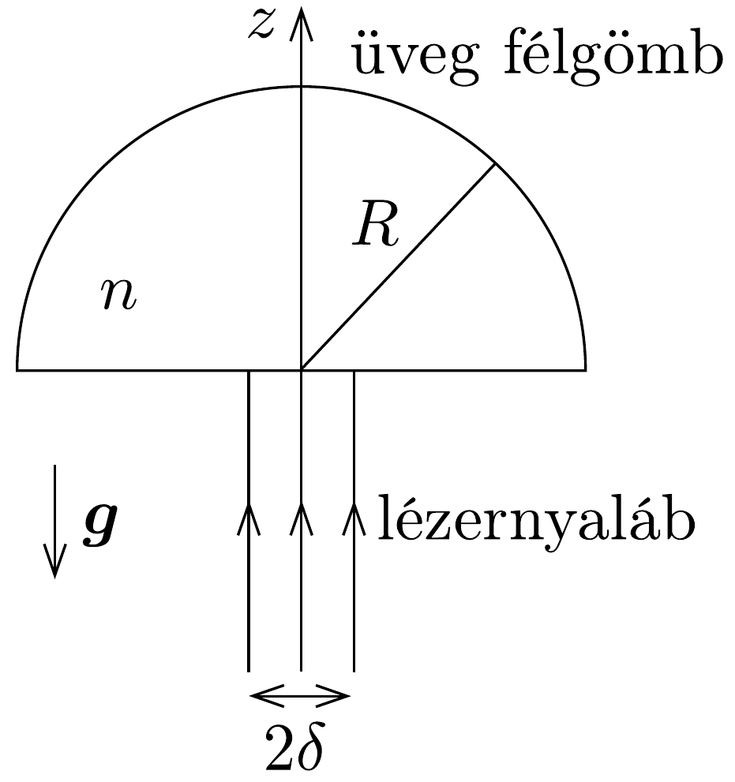

## Feladat 3

Két, egymástól független probléma

A rész: Neutrínótömeg és neutronbomlás
Egy $m_{\mathrm{n}}$ nyugalmi tömegú, a laboratóriumi koordináta-rendszerben álló, szabad neutron el tud bomlani három, egymással kölcsönhatásban nem álló részecskére: egy protonra, egy elektronra és egy antineutrínóra. A proton nyugalmi tömege $m_{\mathrm{p}}$, az antineutrínó $m_{\nu}$ nyugalmi tömegéről pedig feltesszük, hogy nem nulla, de sokkal kisebb, mint az elektron $m_{\mathrm{e}}$ nyugalmi tömege. A vákuumbeli fénysebességet jelölje $c$. A mért értékek a következők:
\[
\begin{gathered}
m_{\mathrm{n}}=939,56563 \mathrm{MeV} / \mathrm{c}^{2}, \quad m_{\mathrm{p}}=938,27231 \mathrm{MeV} / \mathrm{c}^{2} \\
m_{\mathrm{e}}=0,5109907 \mathrm{MeV} / \mathrm{c}^{2}
\end{gathered}
\]
A továbbiakban minden energia és sebesség a laboratóriumi rendszerben értendő. Legyen a bomlás során keletkező elektron teljes energiája $E$.
a) Határozzuk meg az $E$ energia legnagyobb lehetséges $E_{\text {max }}$ értékét és az antineutrínó $v_{\mathrm{m}}$ sebességét abban az esetben, amikor $E=E_{\max }$ ! Mindkét választ a részecskék nyugalmi tömegei és a fénysebesség segítségével adjuk meg. Felhasználva, hogy $m_{\nu}<7,3 \mathrm{eV} / \mathrm{c}^{2}$, számítsuk ki numerikusan $E_{\text {max }}$ és $v_{\mathrm{m}} / c$ értékét 3 értékes tizedesjegy pontossággal!

B rész: Lebegtetés fénnyel
Egy $R$ sugarú, $m$ tömegú, átlátszó üveg félgömb törésmutatója $n$. A félgömbön kívül a közeg törésmutatója 1-gyel egyenlő. A félgömb sík lapjának középső részére, a felületre merőlegesen egyenletes eloszlású, monokromatikus, párhuzamos lézerfénynyaláb esik a 263. ábrán látható módon. A nehézségi gyorsulás értéke $g$. A kör keresztmetszetú lézernyaláb $\delta$ sugara sokkal kisebb, mint $R$. Mind az üveg félgömb, mind pedig a lézernyaláb a $z$ tengelyre nézve hengerszimmetrikus.

Az üveg félgömb semennyit nem nyel el a lézerfényből. A felületét egy átlátszó anyag megfelelő vékonyrétegével vonták be oly módon, hogy az üvegbe belépő és
az onnan kilépő fény visszaverődése elhanyagolhatóan kicsi legyen. A visszaverődésmentes felületi rétegen áthaladó lézerfény optikai úthossza ugyancsak elhanyagolható.
b) Elhanyagolva a $(\delta / R)^{3}$ és a még magasabb hatványú tagokat határozzuk meg, hogy mekkora $P$ lézerteljesítmény szükséges az üveg félgömb súlyának kiegyensúlyozásához!

Útmutatás: $\cos \varphi \approx 1-\varphi^{2} / 2$, ha $\varphi \ll 1$.
