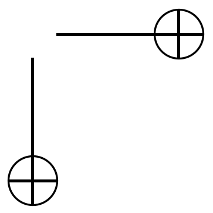
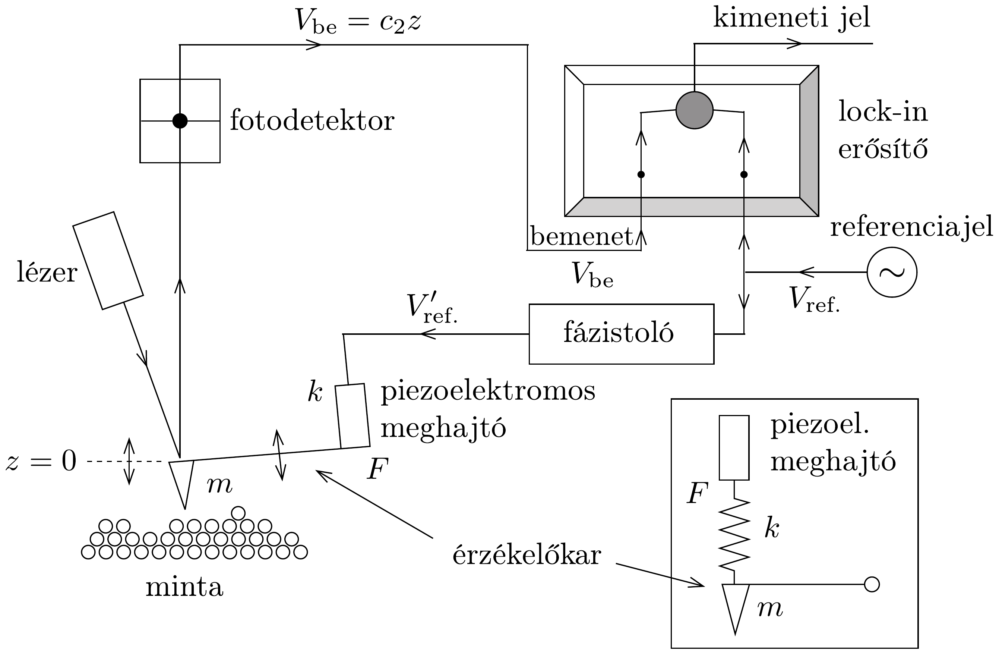

## Feladat 3

Atomieró-mikroszkóp

Az atomieró-mikroszkóp (Atomic force microscope, AFM) a nanotudomány igen hatékony eszköze. Az AFM érzékelőkarjának elmozdulását egy fotóérzékelő

detektálja, az érzékelőkarról visszavert lézersugár segítségével, ahogyan a 268. ábrán látható. (Az ábra jobb alsó sarkában látható kinagyított rész a piezoelektromos meghajtó és az érzékelőkar közötti csatolás egyszerúsített mechanikai modelljét mutatja.) Az érzékelőkar csak függőleges irányban képes mozogni, és a kar $z$ elmozdulása az idő függvényében a következő differenciálegyenlettel írható le:
\[
m \frac{\mathrm{~d}^{2} z}{\mathrm{~d} t^{2}}+b \frac{\mathrm{~d} z}{\mathrm{~d} t}+k z=F,
\]
ahol $m$ a kar tömege, $k=m \omega_{0}^{2}$ az érzékelőkart jellemző rugóállandó, $b$ egy kicsiny csillapítási állandó, melyre teljesül, hogy $\omega_{0} \gg(b / m)>0$, és végül $F$ a piezoelektromos meghajtó által keltett külső gerjesztő erő.

\section*{A rész}
a) Ha a gerjesztő erő $F(t)=F_{0} \sin (\omega t)$ alakú, akkor a (04-2) egyenlet $z(t)$ megoldása $z(t)=A \sin (\omega t-\phi)$ alakban írható, ahol $A>0$ és $0 \leq \phi \leq \pi$. Fejezzük ki az $A$ amplitúdót valamint a $\operatorname{tg} \phi$ mennyiséget az $F_{0}, m, \omega, \omega_{0}$ és $b$ paraméter függvényében! Határozzuk meg az amplitúdót és a $\phi$ fázist az $\omega=\omega_{0}$ rezonanciafrekvencián!
b) A 268. ábrán szereplő lock-in erősítőben létrejön a bemeneti jelnek és a $V_{\text {ref. }}=V_{\mathrm{r}} \sin (\omega t)$ úgynevezett lock-in referenciajelnek a szorzata, és az erósító kimenetén a szorzatnak csak az egyenáramú (DC) komponense jelenik meg. Tegyük föl, hogy a bemeneti jel $V_{\mathrm{be}}=V_{\mathrm{B}} \sin \left(\omega_{\mathrm{B}} t-\phi_{\mathrm{B}}\right)$ alakú. Az itt szereplő $V_{\mathrm{R}}, V_{\mathrm{B}}$, és $\phi_{\mathrm{B}}$ mennyiségek mindegyike adott pozitív állandó. Határozzuk meg, hogy milyen
$\omega(>0)$ frekvencia mellett kapunk nem zérus kimenő jelet! Adjuk meg a nem zérus, egyenáramú $(D C)$ kimenő jel nagyságát leíró formulát ezen a frekvencián!
c) A fázistolón átjutó, eredetileg $V_{\text {ref. }}=V_{\mathrm{r}} \sin \omega t$ alakú lock-in referenciajel alakját a fázistoló egység után a $V_{\text {ref. }}^{\prime}=V_{\mathrm{r}} \sin (\omega t+\pi / 2)$ formula írja le. A $V_{\text {ref. }}^{\prime}$. feszültség hatására a piezoelektromos meghajtó az érzékelőkart $F=c_{1} V_{\text {ref. }}^{\prime}$ erővel gerjeszti. Ezután a fotoérzékelő az érzékelőkar $z$ elmozdulását $V_{\mathrm{be}}=c_{2} z$ alakú feszültségjellé alakítja. A formulákban szereplő $c_{1}$ és $c_{2}$ mennyiségek állandók. Határozzuk meg a nem zérus, egyenáramú $(D C)$ kimenő jel nagyságát leíró formulát az $\omega=\omega_{0}$ frekvencián!
d) Az érzékelőkar tömegének kicsiny $\Delta m$ megváltozása $\Delta \omega_{0}$-lal eltolja a rezonanciafrekvenciát. Ennek következtében az eredeti, rezonanciafrekvenciához tartozó $\phi$ fázis is $\Delta \phi$-vel eltolódik. Határozzuk meg azt a $\Delta m$ tömegváltozást, melynek hatására $\Delta \phi=\pi / 1800$ nagyságú fáziseltolódás jön létre! Tipikusan ilyen nagyságú a fázistolásmérések pontossága. Az érzékelőkart jellemző fizikai paraméterek értéke a következő̈: $m=1,0 \cdot 10^{-12} \mathrm{~kg}, k=1,0 \mathrm{~N} / \mathrm{m}$ és $(b / m)=1,0 \cdot 10^{3} \mathrm{~s}^{-1}$. Használjuk az $|x| \ll 1$ esetén érvényes $(1+x)^{a} \approx 1+a x$ és $\operatorname{tg}(\pi / 2+x) \approx-1 / x$ formulákat!

B rész
Mostantól kezdve azt az esetet vizsgáljuk, amikor az A részben tárgyalt gerjesztő erőn kívül még a 268 ábrán látható minta is hat valamilyen erővel az érzékelőkarra.
$e$ ) Annak ismeretében, hogy a minta által kifejtett $f(h)$ eró csak a minta felszíne és az érzékelőkar közötti $h$ távolságtól függ, meghatározható az érzékelő kar egyensúlyi helyzetének új $h_{0}$ értéke. A $h=h_{0}$ érték közelében az erő az $f(h) \approx f\left(h_{0}\right)+c_{3}\left(h-h_{0}\right)$ alakban írható fel, ahol $c_{3}$ állandó, nem függ $h$-tól. Fejezzük ki az új $\omega_{0}^{\prime}$ rezonanciafrekvenciát $\omega_{0}, m$ és $c_{3}$ segítségével!
f) A mintát a mikroszkópban vízszintesen mozgatva pásztázzuk a minta felszínét. Az érzékelőkar túje, melynek töltése $Q=6 e$, egy $q=e$ töltésü, a felszín alatt bizonyos mélységben csapdába került (térben lokalizált) elektron közelébe jut. A csapdázott elektron környékén pásztázva a felszínt, a rezonanciafrekvencia maximálisan észlelhető eltolódása $\Delta \omega_{0}\left(=\omega_{0}^{\prime}-\omega_{0}\right)$, ami jóval kisebb, mint $\omega_{0}$. Fejezzük ki a csapdázott elektron és az érzékelőkar közötti $d_{0}$ távolságot maximális frekvenciaeltolódás esetén az $m, q, Q, \omega_{0}, \Delta \omega_{0}$ mennyiségek és a $k_{\mathrm{e}}$ Coulombállandó segítségével! Határozzuk meg $d_{0}$ számértékét nm-ben $\Delta \omega_{0}=20 \mathrm{~s}^{-1}$ frekvenciaeltolódás mellett!

Az érzékelőkar fizikai paraméterei: $m=1,0 \cdot 10^{-12} \mathrm{~kg}$ és $k=1,0 \mathrm{~N} / \mathrm{m}$. Az érzékelőkar tújében, valamint a minta felületén tekintsünk el a polarizációs effektusoktól. Fizikai állandók: $k_{\mathrm{e}}=1 / 4 \pi \varepsilon_{0}=9,0 \cdot 10^{9} \mathrm{~N} \cdot \mathrm{~m}^{2} / \mathrm{C}^{2}$ és $e=-1,6 \cdot 10^{-19} \mathrm{C}$.
