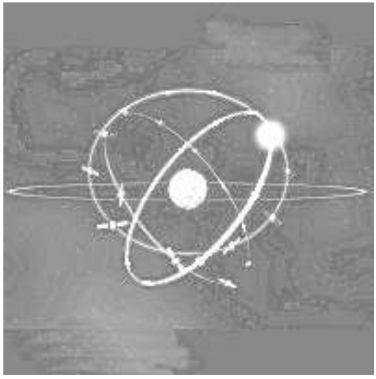
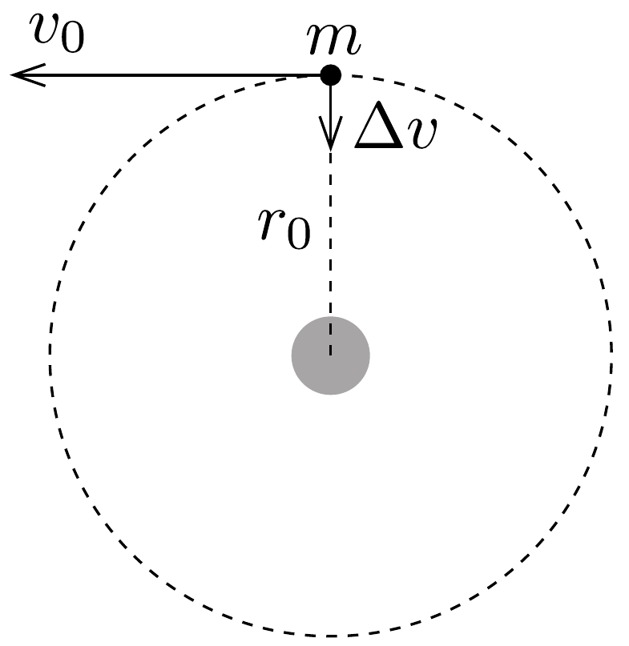
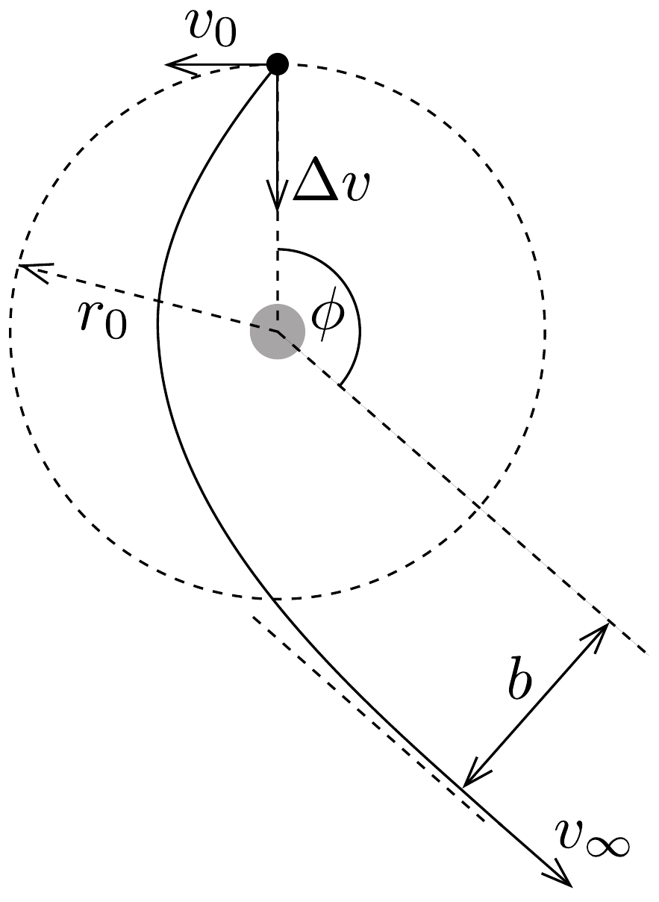
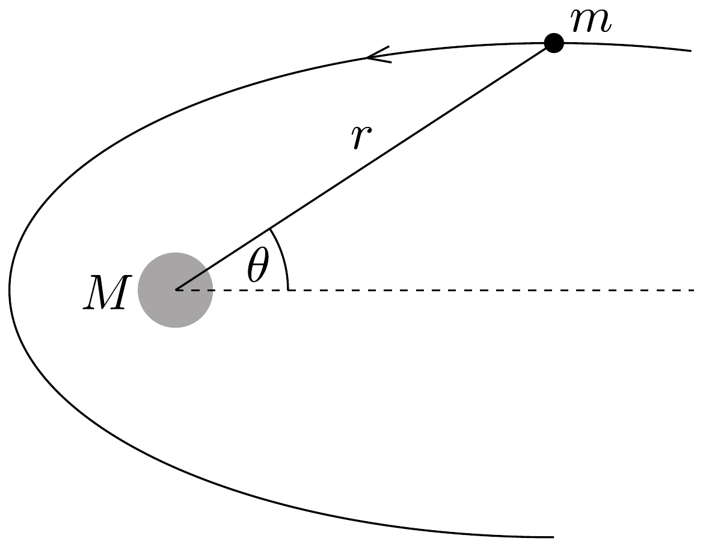

## Feladat 1

Egy szerencsétlenül járt mühold

A mesterséges égitestek manőverezés során leggyakrabban repülésük irányában változtatják meg sebességüket, azaz felgyorsítanak, hogy magasabb pályákra kerüljenek, vagy lefékeznek, hogy visszatérjenek a légkörbe. Ezzel szemben ebben a feladatban most kizárólag olyan pályamódosításokat vizsgálunk, melyeknek során a mesterséges égitest sugárirányú

lökéssel módosítja sebességét.

A numerikus eredmények meghatározásához használjuk a következő értékeket: a Föld sugara $R_{\mathrm{F}}=6,37 \cdot 10^{6} \mathrm{~m}$, a nehézségi gyorsulás a Föld felszínén $g=$ $9,81 \mathrm{~m} / \mathrm{s}^{2}$, és a sziderikus nap hosszát tekintsük $T_{0}=24,0$ órának.

Tekintsünk egy $m$ tömegú távközlési müholdat, amely $r_{0}$ sugarú geostacionárius pályán kering pontosan az Egyenlító egy pontja fölött. A mühold manőverezó hajtómúvének megfelelő lökéseivel állt a pontos pályára.
1. kérdéscsoport
1.1. Számoljuk ki $r_{0}$ számszerú értékét!
1.2. Adjuk meg a múhold $v_{0}$ sebességét mint a $g, R_{\mathrm{F}}$ és $r_{0}$ paraméterek függvényét, valamint határozzuk meg a sebesség számszerú értékét!
1.3. Határozzuk meg a múhold $L_{0}$ perdületét (impulzusmomentumát), valamint $E_{0}$ teljes mechanikai energiáját mint a $v_{0}, m, g$ és $R_{\mathrm{F}}$ paraméterek függvényét!
2. kérdéscsoport

Amint a múhold elérte a geostacionárius pályát (lásd a 272. ábrát), stabilizálta helyzetét, és munkára kész állapotba került, a földi irányítóközpont hibájának következtében a manőverező hajtómú rövid időre újra bekapcsolódott. A hajtómú a múholdat a Föld irányába lökte meg, és annak ellenére, hogy a földi irányítóközpont szinte azonnal reagált, és kikapcsolta a hajtómúvet, a múhold sebessége egy nem kívánt $\Delta v$ értékkel módosult. A lökést a $\beta=\Delta v / v_{0}$ lökési paraméterrel jellemezzük. A manőver időtartama jóval rövidebb, mint a mühold keringésének bármilyen más jellemző ideje, tehát a lökés pillanatszerúnek tekinthető. Tegyük föl, hogy $\beta<1$.
2.1. Határozzuk meg az új pályát jellemző mennyiségeket, azaz a pálya poláris egyenletében szereplő $\ell$ paramétert (semi-latus-rectum = „fél meróleges távolság”) és az $\varepsilon$ excentricitást az $r_{0}$ és $\beta$ paraméterek függvényében (segítséget lásd a feladat végén)!

2.2. Határozzuk meg az új pálya fốtengelye és a véletlen pályamódosítás helyvektora közötti $\alpha$ szöget! (A helyvektor kezdőpontja a Föld középpontja.)
2.3. Határozzuk meg a pálya földközeli, illetve földtávoli pontjának $r_{\text {min }}$, illetve $r_{\text {max }}$ távolságát a Föld középpontjától mint az $r_{0}$ és $\beta$ paraméterek függvényét, valamint adjuk meg a kifejezések számszerú értékét $\beta=1 / 4$ esetén!
2.4. Határozzuk meg a módosult pálya $T$ keringési idejét mint a $T_{0}$ és $\beta$ paraméterek függvényét, és adjuk meg a keringési idő számszerú értékét $\beta=1 / 4$ esetén!
3. kérdéscsoport
3.1. Határozzuk meg azt a legkisebb $\beta_{\text {esc }}$ lökési paramétert, amely mellett a múhold elhagyja a Föld gravitációs terét!
3.2. Ebben az esetben határozzuk meg a műhold pályájának a Földet legjobban megközelítő pontjának $r_{\text {min }}^{\prime}$ távolságát a Föld középpontjától mint az $r_{0}$ paraméter függvényét!
4. kérdéscsoport

Tegyük föl, hogy $\beta>\beta_{\text {esc }}$.
4.1. Határozzuk meg a $v_{0}$ és $\beta$ paraméterek függvényeként, hogy mekkora $v_{\infty}$ sebessége marad a múholdnak, ha végtelen messzire eltávolodik a Földtől!
4.2. Határozzuk meg a végtelen távoli mozgást jellemző $b$ „impakt paramétert” mint az $r_{0}$ és $\beta$ paraméter függvényét! (Lásd: 273. ábra.)
4.3. Határozzuk meg a végtelen távoli mozgás irányának $\phi$ szögét, mint a $\beta$ paraméter függvényét! (Lásd: 273, ábra.) Adjuk meg a szög számszerú értékét a $\beta=\frac{3}{2} \beta_{\text {esc }}$ esetre!

Segítség: A távolság négyzetének reciprokával csökkenő, centrális erótérben mozgó testek ellipszis, parabola vagy hiperbola pályán mozognak. Az $m \ll M$ közelítés mellett a centrális gravitációs teret létrehozó $M$ tömeg a pálya egyik fókuszában van. A koordináta-rendszer kezdőpontját ebben a pontban felvéve, a fenti pályák általános, polárkoordinátás egyenlete (lásd a 274. ábrát)

274. ábra.
\[
r(\theta)=\frac{\ell}{1-\varepsilon \cos \theta}
\]
alakú, ahol az $\ell$ pozitív állandó a görbe paramétere (semi-latus-rectum = fél merőleges távolság, a fókuszponton átmenő, nagytengelyre meróleges húr fele), $\varepsilon$ pedig a pálya excentricitása. A mozgást jellemzó megmaradó mennyiségekkel kifejezve:
\[
\ell=\frac{L^{2}}{G M m^{2}} \quad \text { és } \quad \varepsilon=\sqrt{1+\frac{2 E L^{2}}{G^{2} M^{2} m^{3}}},
\]
ahol $G$ a gravitációs állandó, $L$ a keringő test perdületének (impulzusmomentumának) nagysága a középpontra vonatkoztatva, $E$ pedig a mechanikai energiája. (A potenciális energia zéruspontja a végtelenben van.)

A következő három esetet különböztethetjük meg:
- (i) Ha $0 \leq \varepsilon<1$, a görbe ellipszis ( $\varepsilon=0$ esetén kör).
- (ii) Ha $\varepsilon=1$, a görbe parabola.
- (iii) Ha $\varepsilon>1$, a görbe hiperbola.
