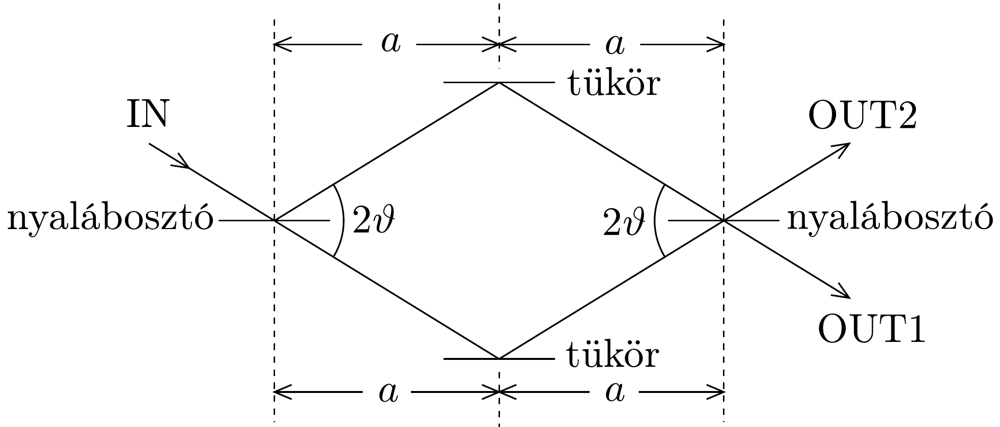
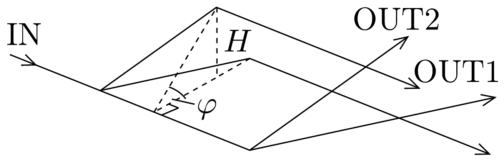

## Feladat 1

A gravitáció hatása egy neutroninterferométerben

Fizikai elrendezés
Collela, Overhauser és Werner híres neutroninterferencia-kísérletének egy olyan idealizált változatát vizsgáljuk, ahol a tükrökről és a nyalábosztókról feltételezzük, hogy tökéletesek. A kísérletben a gravitációnak a neutronok de Broglie-féle hullámtermészetére kifejtett hatását vizsgálták.

Az interferométer elvi felépítése megegyezik a hasonló optikai interferométerek felépítésével, ami a 282, ábrán látható. A neutronok az IN bemeneten át lépnek be az interferométerbe, majd az ábrán látható két utat követik. A neutronokat az OUT1 és OUT2 kimenetek egyikén detektáljuk. A két út rombusz alakú területet zár be, amelynek tipikus mérete néhány $\mathrm{cm}^{2}$.

A neutronok de Broglie-hullámai (tipikus hullámhosszuk $10^{-10} \mathrm{~m}$ ) úgy interferálnak, hogy amikor az interferométer síkja vízszintes, akkor az összes neutron az OUT1 kimeneten lép ki. Azonban, ha az interferométert $\varphi$ szöggel megdöntjük a bejövő neutronok által alkotott tengely körül (lásd a 283. ábrát), akkor a megfigyelő a $\varphi$ szögtől függő módon a neutronok másféle eloszlását észleli az OUT1 és OUT2 kimeneteken.

Geometriai elrendezés
На $\varphi=0$, az interferométer síkja vízszintes; $\varphi=90^{\circ}$ esetén a sík függőleges, és a kimenetek a forgástengely felett helyezkednek el.
1.1. Mekkora a rombusz alakú terület $A$ nagysága, amit az interferométerben haladó két út határol?

1.2. Mekkora az OUT1 kimenet $H$ magassága a forgástengelyen átfektetett vízszintes sík felett?

Fejezzük ki $A$-t és $H$-t a következő mennyiségekkel: $a, \vartheta$ és $\varphi$.
Optikai úthossz
Az optikai úthossz megadható egyszerúen egy számmal is, amit jelöljünk $N_{\text {opt }}$ tal. Ezt a számot a geometriai úthossz (távolság) és a $\lambda$ hullámhossz hányadosaként definiáljuk. Ha a $\lambda$ hullámhossz változik az optikai út mentén, akkor az $N_{\text {opt }}$ számot úgy kaphatjuk meg, hogy a $\lambda^{-1}$ függvényt integráljuk az út mentén.
1.3. Mekkora a két út optikai úthosszának $\Delta N_{\text {opt }}$ különbsége, ha az interferométert $\varphi$ szöggel elfordítjuk? Fejezzük ki választ a következő mennyiségekkel: $a, \vartheta$ és $\varphi$, valamint a neutron $M$ tömegével, a bejövő neutronok $\lambda_{0}$ de Brogliehullámhosszával, a $g$ gravitációs gyorsulással és a $h$ Planck-állandóval.
1.4. Vezessük be a következő térfogati paramétert:
\[
V=\frac{h^{2}}{g M^{2}},
\]
és fejezzük ki a $\Delta N_{\text {opt }}$ különbséget kizárólag $A, V, \lambda_{0}$ és $\varphi$ segítségével! Állapítsuk meg a $V$ térfogat számszerú értékét, felhasználva, hogy $M=1,675 \cdot 10^{-27} \mathrm{~kg}$, $g=9,800 \mathrm{~m} / \mathrm{s}^{2}$ és $h=6,626 \cdot 10^{-34} \mathrm{Js}$ !
1.5. Hány ciklus (periódus) észlelhető az OUT1 kimenetnél, ha $\varphi$ értéke -90°tól 90°-ig növekszik? Egy ciklust úgy értelmezünk, hogy a kimenetnél az intenzitás nagy intenzitásról kicsire csökken, majd visszanő nagyra.

Kísérleti adatok
Egy bizonyos kísérletben az interferométerre jellemző méret: $a=3,600 \mathrm{~cm}$, továbbá $\vartheta=22,10^{\circ}$ és 19,00 teljes ciklus észlelhető.
1.6. Számszerűleg mekkora volt $\lambda_{0}$ ebben a kísérletben?
1.7. Ha egy másik, hasonló kísérletben $\lambda_{0}=0,2000 \mathrm{~nm}$ hullámhosszúságú neutronokat használnánk, és így 30,00 teljes ciklust észlelnénk, milyen nagy lenne az $A$ terület?

Segítség: Ha $|x| \ll 1$, akkor megengedhető, hogy $(1+x)^{\alpha}$ helyett az $1+\alpha x$ közelítést használjuk.
