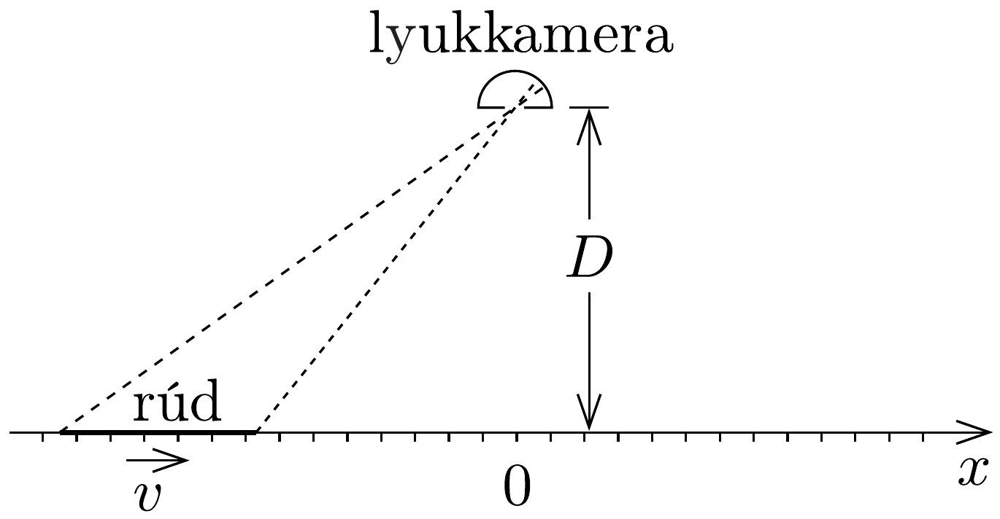

## Feladat 2

Mozgó rúd megfigyelése
\section*{Fizikai elrendezés}

Egy lyukkamerával (camera obscura), melynek nyílása $x=0$-nál, az $x$ tengelytől $D$ távolságra helyezkedik el, képeket készítünk egy mozgó rúdról, olymódon, hogy a kamera nyílását nagyon rövid időre kinyitjuk. Az $x$ tengely mentén egyenlő közü osztások találhatók, ahogy a 284. ábra is mutatja, melyek segítségével a rúd látszólagos hossza leolvasható a kamerával készített képről. A nyugvó rúdról készített egyik képen ez a hossz $L$. A feladatban megfigyelt rúd azonban nincs nyugalomban, hanem állandó $v$ sebességgel mozog az $x$ tengely mentén.

\section*{Alapvető összefüggések}

A lyukkamerával készített képek egyikén a rúd egy rövid darabkája az $\tilde{x}$ helyen látható.
2.1. Határozzuk meg a rúd ugyanezen darabkájának valódi $x$ helyzetét abban az időpillanatban, amikor a kép készült! Az eredményt az $\tilde{x}, D, L, v$ mennyiségek és a $c=3,00 \cdot 10^{8} \mathrm{~m} / \mathrm{s}$ fénysebesség segítségével fejezzük ki, valamint használjuk a
\[
\beta=\frac{v}{c} \quad \text { és } \quad \gamma=\frac{1}{\sqrt{1-\beta^{2}}}
\]
jelöléseket, ha ezekkel egyszerübb alakban adható meg az eredmény.
2.2. Határozzuk meg a fenti kifejezés inverzét is, azaz adjuk meg $\tilde{x}$-t az $x, D$, $L, v$ és $c$ mennyiségek segítségével!

Megjegyzés: A rúd valódi helyzetét abban a vonatkoztatási rendszerben határozzuk meg, amelyben a lyukkamera nyugalomban van.

\section*{A rúd látszólagos hossza}

A lyukkamerával abban a pillanatban készítünk képet a rúdról, amikor a rúd középpontjának valódi helyzete $x_{0}$.
2.3. Az adott mennyiségek segítségével határozzuk meg a rúd látszólagos hosszát ezen a képen!
2.4. Az alábbi lehetőségek közül válasszuk ki, hogyan változik a rúd látszólagos hossza az idő függvényében? A látszólagos hossz
- - először növekszik, elér egy maximális értéket, majd csökken;
- - először csökken, elér egy minimális értéket, majd növekszik;
- - az egész idő alatt csökken;
- - az egész idő alatt növekszik.

Szimmetrikus kép
A lyukkamerával készített képek egyikén a rúd mindkét vége ugyanolyan távolságra látszik a középponttól (origótól).
2.5. Határozzuk meg a rúd látszólagos hosszát ezen a képen!
2.6. Adjuk meg a rúd középpontjának valódi helyzetét abban az időpillanatban, amikor ez a kép készült!
2.7. Hol látható a rúd középpontjának képe a felvételen?

Nagyon korai és nagyon késői képek
A lyukkamérával készítettünk egy nagyon korai képet, amikor a kamerához közeledő rúd még igen távol volt, valamint egy nagyon késői képet, amikor a kamerától távolodó rúd már igen messze volt. Az egyik képen a rúd látszólagos hossza 1,00 m, míg a másikon 3,00 m.
2.8. Az alábbi lehetőségek közül válasszuk ki, hogy melyik hossz melyik képen látható!
- - A látszólagos hossz 1 m a korai képen, és 3 m a késői képen.
- - A látszólagos hossz 3 m a korai képen, és 1 m a késői képen.

2.9. Határozzuk meg a rúd $v$ sebességét!
2.10. Határozzuk meg a rúd $L$ nyugalmi hosszát!
2.11. Határozzuk meg a rúd szimmetrikus képen látható látszólagos hosszúságát!
