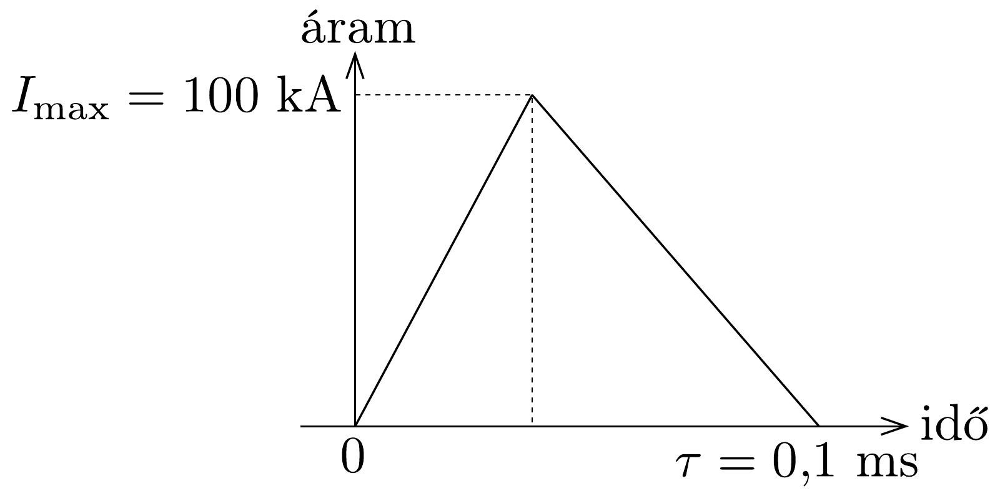

## Feladat 3

Öt független probléma

Ez a feladat öt, egymástól független részből áll. Minden részben csak nagyságrendi becslést kell végezni, nem szükséges pontos választ adni.

Digitális kamera
Tekintsünk egy $N_{\mathrm{p}}=5 \mathrm{Mpix}$ ( $1 \mathrm{Mpix}=10^{6}$ pixel) érzékelőfelületú digitális kamerát. A négyzet alakú, CCD érzékelőlap lineáris mérete (oldala) $L=35 \mathrm{~mm}$. A kamera lencséjének fókusztávolsága: $f=38 \mathrm{~mm}$. A lencsén megjelenő, jól ismert számsorozatot $(2,2,8,4,5,6,8,11,16,22) F$-számoknak (numerikus apertúrának) hívjuk és $F$ \#-tel jelöljük, amit a fókusztávolság és a $D$ lencsenyílás (apertúra) átmérőjének arányaként definiálunk: $F \#=f / D$.
3.1. Adjuk meg a kamera lehető legjobb, csak a lencse által korlátozott $\Delta x_{\min }$ felbontóképességét az érzékelőfelületén! Az eredményt fejezzük ki a $\lambda$ hullámhossz

és $F \#$ (numerikus apertúra) segítségével, majd adjuk meg a felbontóképesség számszerú értékét is $\lambda=500 \mathrm{~nm}$ esetén!
3.2. Adjuk meg a megapixelek szükséges $N$ számát, hogy a CCD érzékelő megfeleljen a fenti optimális felbontóképességnek!
3.3. Időnként a fényképészek úgy próbálják a kamerájukat használni, hogy a lehető legkisebb nyílást (apertúrát) állítják be. Tegyük fel, hogy a fényképezőgépünk $N_{0}=16$ Mpix-es és érzékelőfelületének mérete, valamint lencséjének fókusztávolsága az előzőekkel megegyező. Milyen $F \#$ értéket állítsunk be, hogy a kép minőségét az optika ne korlátozza?
3.4. Tudjuk, hogy az emberi szem szög szerinti felbontóképessége nagyjából $\varphi=2^{\prime}$, és egy tipikus nyomtató minimum 300 dpi (dots per inch, azaz pont/hüvelyk) finomsággal nyomtat, legalább milyen minimális $z$ távolságra tartsuk az oldalt a szemünktől, hogy ne lássuk külön-külön a pontokat?

Adatok: 1 hüvelyk $=25,4 \mathrm{~mm}, 1^{\prime}=2,91 \cdot 10^{-4} \mathrm{rad}$.
Keménytojás
A hútőszekrényből kivett tojás hőmérséklete $T_{0}=4^{\circ} \mathrm{C}$. Ezt a tojást forrásban lévő vízbe tesszük. A víz jól ismert forráspontját jelöljük így: $T_{1}$.
3.5. Mekkora $U$ mennyiségú energiára van szükség ahhoz, hogy az egész tojás kicsapódjon (koagulálódjon)?
3.6. Mekkora $J$ hő́ramsúrúség folyik a tojásba, ha a közepe még hideg?
3.7. Mekkora $P$ fútőteljesítmény melegíti ilyenkor a tojást?
3.8. Ilyen hőátadással mennyi idő alatt lesz kemény a tojás?

Segítség: Használhatjuk a hốvezetés egyszerúsített Fourier-törvényét:
\[
J=\kappa \Delta T / \Delta r,
\]
ahol $\Delta T$ a feladat tipikus $\Delta r$ hosszméretéhez tartozó hőmérséklet-különbség. A $J$ hőáramsűrúség mértékegysége: $\mathrm{Wm}^{-2}$.

Adatok: A tojás súrúsége: $\varrho=10^{3} \mathrm{~kg} / \mathrm{m}^{3}$. A tojás fajhője: $c=4,2 \mathrm{~J} /(\mathrm{K} \cdot$ g). A tojás sugara: $R=2,5 \mathrm{~cm}$. A tojásfehérje kicsapódási hőmérséklete: $T_{\mathrm{c}}=$ 65 °C. Hóvezetési együttható (melyről feltételezhetjük, hogy a folyékony és a szilárd tojásfehérjére ugyanakkora): $\kappa=0,64 \mathrm{~W} /(\mathrm{K} \cdot \mathrm{m})$.

Villámlás
A villámok nagyon leegyszerúsített modelljével foglalkozunk. A villámokat a felhőkben felhalmozódó elektrosztatikus töltések okozzák. A felhők alja rendszerint pozitív töltésú, a tetejük negatív töltésú, és a felhő alatt a talaj negatívan töltött. Ha az elektromos térerősség eléri a levegő átütési értékét, akkor kisülés következik be; ez a villám.

Egy villám idealizált impulzusát, azaz a felhő és a talaj között folyó áramerősséget az idő függvényében a 285. ábra mutatja. A következő kérdésekre ennek az egyszerúsített áramerősség-idő görbének és az alábbi adatoknak a segítségével válaszoljunk.

A felhő alja és a talaj közötti távolság: $h=1 \mathrm{~km}$, a nedves levegő átütési térerőssége: $E_{0}=300 \mathrm{kV} / \mathrm{m}$, a Földet évente elérő villámok teljes száma: $32 \cdot 10^{6}$, a Föld népessége: $6,5 \cdot 10^{9}$ ember ( $=6,5$ Gigaember).
3.9. Mekkora egy villám $Q$ töltése?
3.10. Mekkora átlagos $I$ áram folyik villámláskor a felhő alja és a talaj között?
3.11. Képzeljük el, hogy a viharok egy év alatti összes elektromos energiáját összegyújtjük, majd egyenletesen szétosztjuk az emberek között. Milyen hosszan tudna folyamatosan világítani egy 100 W-os izzólámpa az egy emberre jutó átlagos energiával?

Hajszálerek
Az emberi vért tekintsük olyan összenyomhatatlan, viszkózus folyadéknak, melynek $\mu$ súrúsége megegyezik a vízével, dinamikus viszkozitása pedig $\eta=$ $=4,5 \mathrm{~g} /(\mathrm{m} \cdot \mathrm{s})$. A hajszálérhálózatot egyenes, $r$ sugarú, $L$ hosszúságú hengeres csövekkel modellezzük, és a véráram leírására a Hagen-Poiseuille-féle
\[
\Delta p=R D
\]
törvényt alkalmazzuk, mely a hidrodinamikában hasonló szerepet játszik, mint az elektromosságtanban az Ohm-törvény. A fenti képletben $\Delta p$ az ér (cső) eleje és vége közötti nyomáskülönbség, a $D=S v$ (vér)hozam az ér $S$ keresztmetszetén időegység alatt átáramlott folyadék térfogata, $v$ pedig a véráram sebessége. Az $R$ áramlási ellenállást a következő formula adja meg:
\[
R=\frac{8 \eta L}{\pi r^{4}} .
\]
Nyugalmi állapotban az emberi nagyvérkörben (amely a szív bal pitvarától a jobb kamráig vezet) a vérhozam $D \approx 100 \mathrm{~cm}^{3} \mathrm{~s}^{-1}$. A következő kérdések megválaszolásánál a nagyvérkör leírására olyan modellt használjunk, melyben a hajszálerek párhuzamosan vannak kapcsolva, és mindegyikük $r=4 \mu \mathrm{~m}$ sugarú, $L=1 \mathrm{~mm}$ hosszúságú, és $\Delta p=1$ kPa nyomáskülönbségnek van kitéve.
3.12. Hány hajszálér található az emberi testben?
3.13. Mekkora $v$ sebességgel áramlik a vér a hajszálerekben?

Felhőkarcoló
Egy $H=1000 \mathrm{~m}$ magas felhőkarcoló aljánál a külső levegő hőmérséklete $T_{\text {lent }}=30^{\circ} \mathrm{C}$. Célunk a felhőkarcoló tetejénél mérhető $T_{\text {fent }}$ külső hőmérséklet megállapítása. Tekintsünk egy vékony levegőréteget (ideális nitrogéngáz, adiabatikus kitevője $\kappa=7 / 5$ ), amely lassan $z$ magasságba emelkedik, ahol a nyomás alacsonyabb, valamint tegyük föl, hogy a levegőréteg eközben adiabatikusan tágul, és így hőmérséklete a környező levegőével megegyező értékre csökken.
3.14. Határozzuk meg a $\mathrm{d} T / T$ relatív hőmérséklet-változásnak és a $\mathrm{d} p / p$ relatív nyomásváltozásnak a hányadosát!
3.15. Fejezzük ki a $\mathrm{d} p$ nyomáskülönbséget a $\mathrm{d} z$ magasságváltozás függvényében!
3.16. Mennyi a levegő hőmérséklete a felhőkarcoló tetejénél?

Adatok: A Boltzmann-állandó: $k=1,38 \cdot 10^{-23} \mathrm{~J} / \mathrm{K}$. Egy nitrogénmolekula tömege: $m=4,65 \cdot 10^{-26} \mathrm{~kg}$. A nehézségi gyorsulás: $g=9,80 \mathrm{~m} / \mathrm{s}^{2}$.
