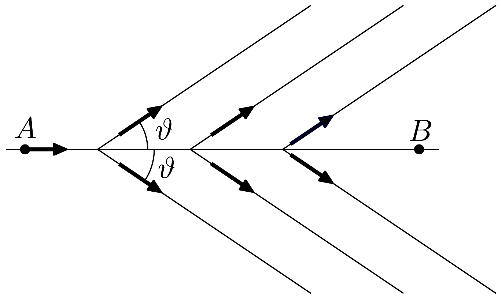
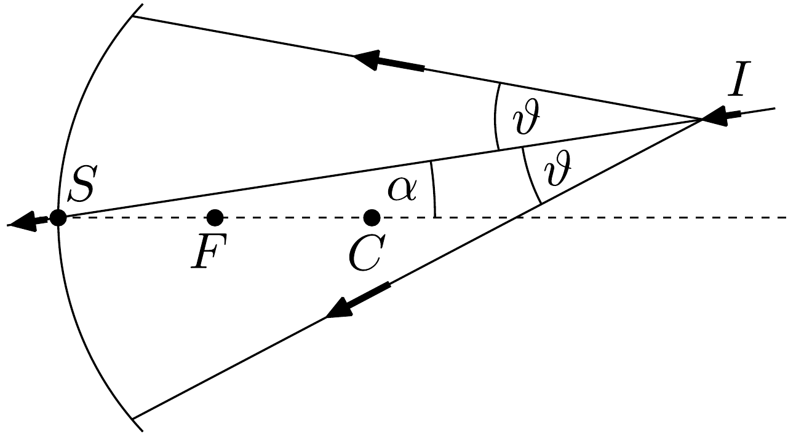

## Feladat 2

Cserenkov-sugárzás és gyürús képalkotáson alapuló számláló

A fény vákuumban $c$ sebességgel terjed. Semmiféle részecske nem mozoghat ennél a $c$ sebességnél gyorsabban. Azonban lehetséges, hogy valamely átlátszó közegben mozgó részecske $v$ sebessége nagyobb, mint a közegbeli $\frac{c}{n}$ fénysebesség, ahol $n$ a közeg (abszolút) törésmutatója. Kísérletileg 1934-ben $P$. A. Cserenkov észlelte, majd elméletileg 1937-ben I. J. Tamm és I. M. Frank bizonyította, hogy ha egy töltött részecske $n$ törésmutatójú, átlátszó közegben $v$ sebességgel mozog és teljesül, hogy $v>\frac{c}{n}$, akkor a részecske fényt bocsát ki; ez az úgynevezett Cserenkov-sugárzás.

A sugárzás iránya a részecske pályájával (297. ábra)
\[
\vartheta=\arccos \frac{1}{\beta n}
\]
szöget zár be, ahol $\beta=\frac{v}{c}$.
2.1. A fenti tény megállapítása céljából tekintsünk egy részecskét, mely egyenes pályán állandó $v>\frac{c}{n}$ sebességgel mozog. A $t=0$ időpontban a részecske az $A$ pontban van, míg a $t_{1}$ pillanatban a $B$ pontban. Mivel a probléma az $A B$ tengelyre nézve forgásszimmetrikus, elegendő csupán egyetlen olyan síkban vizsgálni a fény terjedését, amely tartalmazza az $A B$ tengelyt.

Bármely $A$ és $B$ közötti $C$ pontban a részecske gömbhullámokat bocsát ki, melyek $\frac{c}{n}$ sebességgel terjednek. A hullámfront egy adott $t$ időpillanatban ezen gömbhullámok burkolója (közös érintő görbéje).
XXXIX. olimpia, 2008
2.1.1. Határozzuk meg a hullámfrontot egy $t_{1}$ időpillanatban, és rajzoljuk be a hullámfrontnak egy, a részecske pályáját tartalmazó síkkal való metszetét!
2.1.2. Fejezzük ki a hullámfront metszete és a részecske pályája között mérhető $\varphi$ szöget $n$ és $\beta$ segítségével!
2.2. Tekintsük a $v>\frac{c}{n}$ sebességgel mozgó részecskék nyalábját, melyre teljesül, hogy a nyaláb $I S$ egyenese és a sugárzás kúpja közötti $\vartheta$ szög kicsi. (Lásd a 298. ábrát.) A nyaláb útjában, az $S$ pontban egy $C$ középpontú, $f$ fókusztávolságú homorú gömbtükör helyezkedik el úgy, hogy az $S C$ és az $S I$ egyenesek közötti $\alpha$ szög szintén kicsiny. A tükörről visszavert fény a tükör fókuszsíkjában gyűrú alakú képet alkot. Igazoljuk ezt az állítást egy vázlatos ábra segítségével! Adjuk meg a gyúrú $r$ sugarát és középpontjának $O$ helyét!

Az itt ismertetett elrendezést a gyúrús képalkotáson alapuló Cserenkov-számlálókban (Ring Imaging Cherenkov Counter, RICH) használják, és azt a közeget, amiben a részecskék haladnak, sugárzó közegnek nevezik.

Megjegyzés: Ennek a feladatnak minden kérdésében az $\alpha$ és $\vartheta$ szögben másodvagy ennél magasabb rendú tagokat hanyagoljuk el.
2.3. Egy ismert, $p=10,0 \mathrm{GeV} / c$ impulzusú részecskéket tartalmazó nyaláb háromféle, különböző részecskét tartalmaz: protont, kaont és piont, melyek nyugalmi tömege rendre $m_{\mathrm{p}}=0,94 \mathrm{GeV} / c^{2}, m_{\kappa}=0,50 \mathrm{GeV} / c^{2}$ és $m_{\pi}=0,14 \mathrm{GeV} / c^{2}$. Emlékeztetünk rá, hogy mind $p c$, mind pedig $m c^{2}$ energia dimenziójú mennyiség, és 1 eV az az energia, amelyre egy elektron 1 V feszültséggel való gyorsítás hatására tesz szert. További mértékegységek: $1 \mathrm{GeV}=10^{9} \mathrm{eV}$, valamint $1 \mathrm{MeV}=10^{6} \mathrm{eV}$.

A részecskenyaláb $P$ nyomású levegőn mint sugárzó közegen halad át. A levegő $n$ törésmutatója a következő módon függ (az atmoszférában mért) $P$ nyomástól:
\[
n=1+a P, \quad \text { ahol } \quad a=2,7 \cdot 10^{-4} \mathrm{~atm}^{-1} .
\]
2.3.1. Határozzuk meg mindhárom részecsketípus esetén azt a minimális $P_{\text {min }}$ levegőnyomást, amely fölött a Cserenkov-sugárzás kialakulhat!
2.3.2. Határozzuk meg azt a $P_{1 / 2}$ nyomást, amely mellett a kaonokhoz tartozó gyúrú sugara éppen fele a pionokhoz tartozó gyúrú sugarának! Számoljuk ki ebben
az esetben a $\vartheta_{\kappa}$ és $\vartheta_{\pi}$ szögeket is! Ezen a nyomáson megfigyelhető-e a protonokhoz tartozó gyúrú?
2.4. Most tegyük fel, hogy a részecskenyaláb nem teljesen monokromatikus; a részecskék impulzusa egy $10 \mathrm{GeV} / c$ körül koncentrált, $\Delta p$ félértékszélességú eloszlást alkot. Ennek következtében a gyürúk kiszélesednek, és a $\vartheta$ szög eloszlásának félértékszélessége $\Delta \vartheta$. A sugárzó közeg (levegő) nyomása a 2.3.2. pontban meghatározott $P_{1 / 2}$ érték.
2.4.1. Határozzuk meg $\frac{\Delta \vartheta_{\kappa}}{\Delta p}$ és $\frac{\Delta \vartheta_{\pi}}{\Delta p}$-t, azaz a $\frac{\Delta \vartheta}{\Delta p}$ hányados értékét kaon és pion esetén!
2.4.2. Amennyiben a két gyúrú közötti $\vartheta_{\pi}-\vartheta_{\kappa}$ szögeltérés nagyobb, mint a félértékszélességek $\Delta \vartheta=\Delta \vartheta_{\kappa}+\Delta \vartheta_{\pi}$ összegének 10 -szerese $\left(\vartheta_{\pi}-\vartheta_{\kappa}>10 \Delta \vartheta\right)$, akkor a két gyűrút jól el lehet különíteni egymástól. Határozzuk meg azt a maximális $\Delta p$ értéket, amely mellett a két gyúrú még jól elkülöníthető!
2.5. Cserenkov a nevéről elnevezett jelenséget először egy vízzel telt palackban figyelte meg, mely radioaktív forrás közelében helyezkedett el. Szemével érzékelte, hogy a palackban lévő víz fényt bocsát ki.
2.5.1. Határozzuk meg azt a $T_{\text {min }}$ minimális mozgási energiát, amely mellett egy $m$ nyugalmi tömegú, vízben haladó részecske Cserenkov-sugárzást bocsát ki! A víz törésmutatója $n=1,33$.
2.5.2. Tudjuk, hogy a Cserenkov által használt sugárforrás vagy $m_{\alpha}=$ $=3,8 \mathrm{GeV} / c^{2}$ nyugalmi tömegú $\alpha$-részecskéket (azaz héliumatommagokat), vagy $m_{\mathrm{e}}=0,51 \mathrm{MeV} / c^{2}$ nyugalmi tömegú $\beta$-részecskéket (azaz elektronokat) bocsát ki. Határozuk meg $T_{\min }$ számszerú értékét $\alpha$ - és $\beta$-részecskék esetén!

Felhasználva, hogy a radioaktív sugárforrások által kibocsátott részecskék mozgási energája soha nem haladja meg a néhány MeV-ot, döntsük el, hogy melyik részecske hozta létre a Cserenkov által először megfigyelt sugárzást!
2.6. Az előző kérdésekben a Cserenkov-effektusnak a kibocsátott fény hullámhosszától való függését nem vettük figyelembe. Most tekintetbe vesszük azt a tényt, hogy a Cserenkov-sugárzásnak széles folytonos spektruma van, mely tartalmazza a látható (0,4 μm-től 0,8 μm-es hullámhosszig terjedő) tartományt is. Azt is tudjuk, hogy a látható fény tartományában a $\lambda$ hullámhossz növelésével a sugárzó közeg $n$ törésmutatója lineárisan csökken $(n-1)$-nek 2\%-ával.
2.6.1. Tekintsünk egy pontosan 10, 0 GeV/ $c$ impulzusú pionokból álló nyalábot, amely 6 atm nyomású levegőben halad. Határozzuk meg a látható tartomány két végpontjához tartozó $\Delta \vartheta$ szögeltérést!
2.6.2. Az előző eredmény alapján tanulmányozzuk kvalitatíven (nem számszerúen) a diszperzió hatását egy olyan pionnyaláb által létrehozott gyűrús képen, melyben a részecskék impulzusa a $p=10 \mathrm{GeV} / c$ érték körül $\Delta p=0,3 \mathrm{GeV} / c$ félértékszélességgel oszlik el.
2.6.2.1. Határozzuk meg a gyűrúnek a diszperzió (azaz a törésmutató hullámhossz függése) miatt bekövetkező kiszélesedését, valamint a gyürúnek a nyalábot alkotó részecskék impulzusinhomogenitásából fakadó kiszélesedését!
2.6.2.2. Hogyan változik a gyűrú színe, miközben a gyürú belső élétől a külső él felé haladunk?
