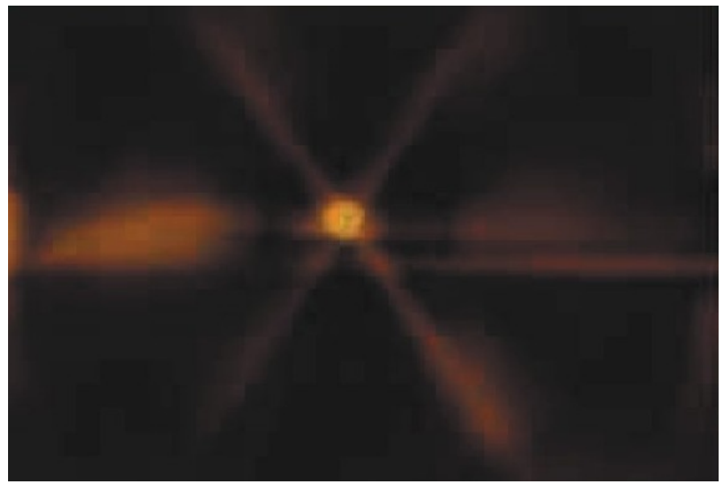
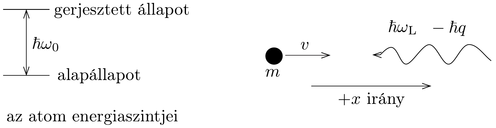
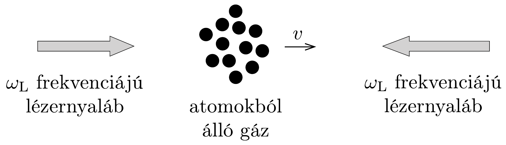

## Feladat 2

Lézeres Doppler-hütés és optikai melasz

Ennek a feladatnak az a célja, hogy egyszerú elméleti megfontolással megértsük a „lézeres hútés” és az „optikai melasz" jelenségeket. Ez azt jelenti, hogy semleges atomok (általában alkáli fémek) nyalábját egymással szemben haladó, azonos frekvenciájú lézersugarakkal hútjük. Ezért kapott 1997-ben fizikai Nobeldíjat S. Chu, P. Phillips és C. Cohen-Tannoudji.

A 311. ábra nátriumatomokat ábrázol (a fényes pont középen), melyek három, egymásra merőleges lézersugárpár kereszteződésében vannak csapdázva. A csapda területét szokás optikai melasznak (optical molasses) nevezni, mivel a disszipatív optikai erő a melaszon áthaladó testekre ható viszkózus erőre emlékeztet.

Ebben a feladatban egy foton és egy atom egyszerú kölcsönhatását és a disszipációs mechanizmust fogjuk vizsgálni egy dimenzióban.

\section*{I. rész: A lézeres hütés alapjai}

Tekintsünk egy $m$ tömegú atomot, amely a $+x$ irányban, $v$ sebességgel mozog. Az egyszerúség kedvéért vizsgáljuk a problémát egy dimenzióban, azaz ne foglalkozzunk az $y$ és $z$ irányokkal (312. ábra). Az atomnak két belső energiaszintje van. Az alapállapot energiáját nullának tekintjük, a gerjesztett állapot energiája pedig $\hbar \omega_{0}$, ahol $\hbar=h / 2 \pi$. Az atom kezdetben alapállapotban van. Egy lézersugár, melynek a laboratórium koordináta-rendszerében mért körfrekvenciája $\omega_{\mathrm{L}}$, a $-x$ irányban halad, és ütközik egy atommal. Kvantummechanikai szempontból a lézersugár nagyszámú, egyforma fotonból áll, melyek energiája $\hbar \omega_{\mathrm{L}}$ és impulzusa - $\hbar q$. A fotont elnyelheti egy atom, amely azt később spontán kibocsátja; ez a kibocsátás (emisszió) azonos valószínűséggel történhet a $+x$ és a $-x$ irányban. Mivel az atom nemrelativisztukus sebességgel mozog, $v / c \ll 1$, ahol $c$ a fénysebesség. Vegyük figyelembe azt is, hogy $\hbar q / m v \ll 1$, azaz az atom impulzusa sokkal nagyobb egy foton impulzusánál. A válaszokban mindkét mennyiségnek csak az elsőrendú (lineáris) tagjait vegyük figyelembe.

Feltételezzük, hogy a lézer $\omega_{\mathrm{L}}$ körfrekvenciája úgy van hangolva, hogy a mozgó atom rendszeréből nézve rezonanciában van az atom belső átmenetével.

\subsection*{2.1. Elnyelés (abszorpció)}
2.1.1. Adjuk meg a foton elnyelésének (abszorpciójának) rezonanciafeltételét!
2.1.2. Adjuk meg az atom $p_{\mathrm{a}}$ impulzusát az elnyelés után, a laboratórium rendszeréből nézve!
2.1.3. Adjuk meg az atom $\varepsilon_{\mathrm{a}}$ teljes energiáját az elnyelés után, a laboratórium rendszeréből nézve!
2.2. Egy foton spontán kibocsátása (emissziója) a $-x$ irányban

Az ütköző foton elnyelődése (abszorbciója) után valamennyi idővel az atom egy fotont bocsáthat ki (emittálhat) a $-x$ irányba.
2.2.1. Adjuk meg a kibocsátott foton $\varepsilon_{\mathrm{f}}^{-}$energiáját a $-x$ irányú emissziós folyamat után, a laboratórium rendszeréből nézve!
2.2.2. Adjuk meg a kibocsátott foton $p_{\mathrm{f}}^{-}$impulzusát a $-x$ irányú emissziós folyamat után, a laboratórium rendszeréből nézve!
2.2.3. Adjuk meg az atom $p_{\mathrm{a}}^{-}$impulzusát a $-x$ irányú emissziós folyamat után, a laboratórium rendszeréből nézve!
2.2.4. Adjuk meg az atom $\varepsilon_{\mathrm{a}}^{-}$teljes energiáját a $-x$ irányú emissziós folyamat után, a laboratórium rendszeréből nézve!
2.3. Egy foton spontán kibocsátása (emissziója) a $+x$ irányban

Az ütköző foton elnyelődése (abszorbciója) után valamennyi idővel az atom egy fotont bocsáthat ki (emittálhat) a $+x$ irányba.
2.3.1. Adjuk meg a kibocsátott foton $\varepsilon_{\mathrm{f}}^{+}$energiáját a $+x$ irányú emissziós folyamat után, a laboratórium rendszeréből nézve!
2.3.2. Adjuk meg a kibocsátott foton $p_{\mathrm{f}}^{+}$impulzusát a $+x$ irányú emissziós folyamat után, a laboratórium rendszeréből nézve!
2.3.3. Adjuk meg az atom $p_{\mathrm{a}}^{+}$impulzusát a $+x$ irányú emissziós folyamat után, a laboratórium rendszeréből nézve!
2.3.4. Adjuk meg az atom $\varepsilon_{\mathrm{a}}^{+}$teljes energiáját a $+x$ irányú emissziós folyamat után, a laboratórium rendszeréből nézve!
2.4. Átlagos kibocsátás (emisszió) az elnyelés (abszorpció) után

A foton spontán kibocsátása egyforma valószínúséggel történhet a $-x$ vagy a $+x$ irányban. Ezt figyelembe véve:
2.4.1. Adjuk meg a kibocsátott foton $\varepsilon_{\mathrm{f}}$ átlagos energiáját az emissziós folyamat után!
2.4.2. Adjuk meg a kibocsátott foton $p_{\mathrm{f}}$ átlagos impulzusát az emissziós folyamat után!
2.4.3. Adjuk meg az atom $\varepsilon_{\mathrm{a}}$ átlagos teljes energiáját az emissziós folyamat után!
2.4.4. Adjuk meg az atom $p_{\mathrm{a}}$ átlagos impulzusát az emissziós folyamat után!
2.5. Energia- és impulzusátadás

Tekintsünk egy teljes egyfotonos elnyelési-kibocsátási (abszorpciós-emissziós) folyamatot, ahogy azt az eddigiekben tárgyaltuk. A lézersugár és az atom között egy eredő átlagos impulzus- és energiaátadás figyelhető meg.
2.5.1. Adjuk meg az atom $\Delta \varepsilon$ átlagos energiaváltozását egy teljes egyfotonos elnyelési-kibocsátási folyamat után!
2.5.2. Adjuk meg az atom $\Delta p$ átlagos impulzusváltozását egy teljes egyfotonos elnyelési-kibocsátási folyamat után!

\subsection*{2.6. Energia- és impulzusátadás egy $+x$ irányú lézersugárral}

Tekintsünk most egy olyan lézersugarat, amelynek $\omega_{\mathrm{L}}^{\prime}$ a körfrekvenciája és a $+x$ irányban halad, miközben az atom szintén a $+x$ irányban halad $v$ sebességgel. Tételezzük fel, hogy az atom belső átmenete és a lézersugár között az atom rendszeréből nézve teljesül a rezonanciafeltétel.
2.6.1. Adjuk meg az atom $\Delta \varepsilon$ átlagos energiaváltozását egy teljes egyfotonos elnyelési-kibocsátási folyamat után!
2.6.2. Adjuk meg az atom $\Delta p$ átlagos impulzusváltozását egy teljes egyfotonos elnyelési-kibocsátási folyamat után!

\section*{II. rész: Disszipáció és az optikai melasz alapjai}

A természetben a kvantumfolyamatokat elkerülhetetlenül bizonytalanság kíséri. Így az a tény, hogy az atom az elnyelés után véges idővel bocsát ki egy fotont, azzal a következménnyel jár, hogy a rezonanciafeltétel nem teljesül egzaktul, úgy ahogy azt eddig tárgyaltuk. Azaz a lézersugár $\omega_{\mathrm{L}}$ és $\omega_{\mathrm{L}}^{\prime}$ körfrekvenciája bármilyen értéket felvehet, és az elnyelés (abszorpció) mégis bekövetkezhet. Az elnyelés különböző (kvantum)valószínúséggel történik, és - mint ahogy azt sejteni lehet - a legnagyobb valószínúséggel éppen a rezonanciafeltétel egzakt teljesülésekor. Egy foton elnyelése és kibocsátása között átlagosan eltelő időt a gerjesztett állapot élettartamának nevezzük, és így jelöljük: $\Gamma^{-1}$.

Tekintsünk egy $N$ atomból álló, a laboratórium koordináta-rendszeréhez viszonyítva nyugalomban lévő atomhalmazt, és egy rá esố, $\omega_{\mathrm{L}}$ körfrekvenciájú lézersugarat. Az atomok folyamatosan fotonokat nyelnek el és bocsátanak ki, úgy, hogy átlagosan $N_{\mathrm{g}}$ atom van gerjesztett állapotban (és így $N-N_{\mathrm{g}}$ atom alapállapotban). Kvantummechanikai számítás eredményeként adódik, hogy:
\[
N_{\mathrm{g}}=N \frac{\Omega_{\mathrm{R}}^{2}}{\left(\omega_{0}-\omega_{\mathrm{L}}\right)^{2}+\frac{\Gamma^{2}}{4}+2 \Omega_{\mathrm{R}}^{2}},
\]
ahol $\omega_{0}$ az atomi átmenet rezonancia-körfrekvenciája és $\Omega_{\mathrm{R}}$ az úgynevezett Rabifrekvencia; $\Omega_{\mathrm{R}}^{2}$ arányos a lézersugár intenzitásával. Láthatjuk, hogy ez az érték - ahogy már említettük - akkor is különbözik nullától, ha $\omega_{0}$ nem egyezik meg a lézersugár $\omega_{\mathrm{L}}$ körfrekvenciájával. Az előbbi eredményt úgy is kifejezhetjük, hogy időegységenként bekövetkezó elnyelési-kibocsátási (abszorpciós-emissziós) folyamatok száma $N_{\mathrm{g}} \Gamma$.

Tekintsük a 313. ábrán látható fizikai elrendezést, ahol két szemben haladó lézersugár egymással azonos, de amúgy tetszóleges $\omega_{\mathrm{L}}$ körfrekvenciával ütközik az $N$ atomból álló, $+x$ irányban $v$ sebességgel mozgó gáznak.

\subsection*{2.7. A lézer által az atomnyalábra kifejtett erö}
2.7.1. Az eddigi információk alapján határozzuk meg azt az erốt, amit a lézersugár kifejt az atomnyalábra! Használjuk ki, hogy $m v \gg \hbar q$.

\subsection*{2.8. Kis sebességű határeset}

Most tételezzük fel, hogy az atomok sebessége elég kicsi ahhoz, hogy az erő a $v$ sebesség első rendú tagjával közelíthető.

2.8.1. Határozzuk meg a 2.7.1. feladatban meghatározott erő kifejezését ebben a közelítésben!
2.8.2. Adjuk meg annak a feltételét, hogy az eró pozitív (gyorsítja az atomokat)!
2.8.3. Adjuk meg annak a feltételét, hogy az eró nulla!
2.8.4. Adjuk meg annak a feltételét, hogy az eró negatív (lassítja az atomokat)!
2.8.5. Most tegyük fel, hogy az atomok $-v$ sebességgel mozognak (a $-x$ irányba). Adjuk meg annak a feltételét, hogy az eró lassítsa az atomokat!

\subsection*{2.9. Optikai melasz}

Negatív eró esetében egy disszipatív súrlódó erốt kapunk. Tegyük fel, hogy kezdetben, amikor $t=0$, a gáz atomjai $v_{0}$ sebességgel mozognak.
2.9.1. A Kis sebességre érvényes közelítésben határozzuk meg az atomok sebességét azután, hogy a lézersugarak $\tau$ ideje be vannak kapcsolva!
2.9.2. Most tételezzük fel, hogy a gáz atomjai kezdetben $T_{0}$ hőmérsékleten termikus egyensúlyban vannak. Határozzuk meg a $T$ hőmérsékletet azután, hogy a lézersugarak $\tau$ ideje be vannak kapcsolva!

A modell azonban nem teszi lehetővé tetszőlegesen kicsi hőmérséklet elérését.
