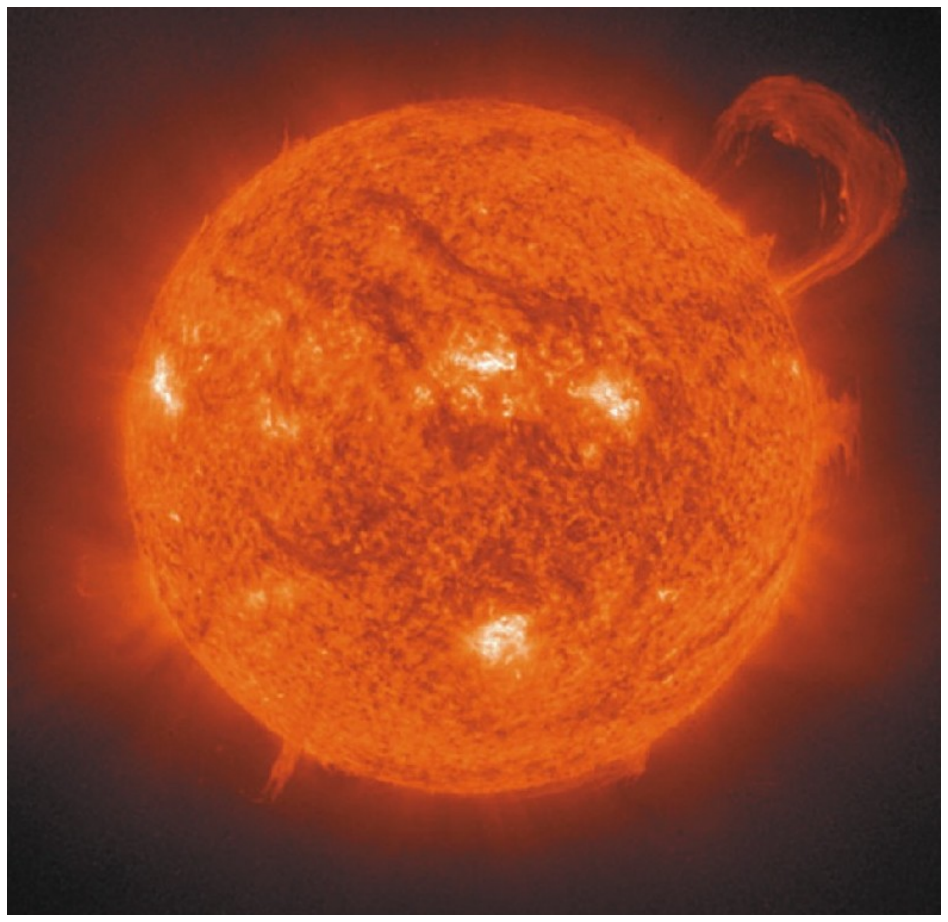
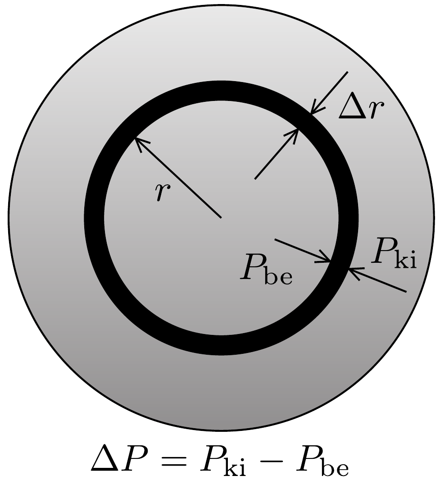

## Feladat 3

Miért olyan nagyok a csillagok?
A csillagok forró gázgömbök, melyek ragyogását a belsejükben lezajló magfúzió adja. Leggyakoribb esetben e folyamat során hidrogénból hélium keletkezik. Ebben a problémában klasszikus mechanikai, illetve kvantummechanikai fogalmak, valamint elektrosztatikai, termodinamikai összefüggések segítségével keressük a választ arra a kérdésre, hogy a gázgömbnek miért csak egy bizonyos mérete fölött indul be a fúziós reakció. Sőt, a hidrogén fúziójához szükséges kritikus tömeg és sugár értékét is meghatározzuk. A 314, ábrán a Napot láthatjuk.

\section*{Fizikai állandók:}
gravitációs állandó: $G=6,7 \cdot 10^{-11} \mathrm{~m}^{3} \mathrm{~kg}^{-1} \mathrm{~s}^{2}$;
Boltzmann-állandó: $k=1,4 \cdot 10^{-23} \mathrm{~J} \mathrm{~K}^{-1}$;
Planck-állandó: $h=6,6 \cdot 10^{-34} \mathrm{~m}^{2} \mathrm{~kg} \mathrm{~s}^{-1}$;
proton tömege: $m_{\mathrm{p}}=1,7 \cdot 10^{-27} \mathrm{~kg}$;
elektron tömege: $m_{\mathrm{e}}=9,1 \cdot 10^{-31} \mathrm{~kg}$;

elemi töltés: $q=1,6 \cdot 10^{-19} \mathrm{C}$;
vákuum permittivitás: $\varepsilon_{0}=8,9 \cdot 10^{-12} \mathrm{C}^{2} \mathrm{~N}^{-1} \mathrm{~m}^{-2}$;
Nap sugara: $R_{\mathrm{N}}=7,0 \cdot 10^{8} \mathrm{~m}$;
Nap tömege: $M_{\mathrm{N}}=2,0 \cdot 10^{30} \mathrm{~kg}$.

\subsection*{3.1. Csillagok központi hőmérsékletének klasszikus becslése}

Tegyük fel, hogy a csillagot formáló gáz tiszta ionizált hidrogén, azaz elektronok és protonok azonos arányú keveréke, mely ideális gázként viselkedik. A klasszikus fizika törvényei szerint két proton fúziójához az szükséges, hogy $10^{-15}$ méternél közelebb kerüljenek egymáshoz, mivel csak ilyen kis távolság esetén válik a rövidtávú magerő meghatározóvá. Azonban ahhoz, hogy ilyen közel kerüljenek egymáshoz, le kell győzniük a Coulomb-taszítást. Tegyük fel, hogy két klasszikus, pontszerú részecskének tekintett proton $v_{\text {rms }}$ nagyságú, egymással ellentétes irányú sebességgel halad egymás felé egy egyenes mentén, és frontálisan ütközik. Itt $v_{\text {rms }}$ a termodinamikai átlagsebesség (sebességnégyzet átlagának a gyöke; az index az angol root-mean-square kifejezésre utal).
3.1.1 Határozzuk meg azt a kritikus $T_{\mathrm{c}}$ hőmérsékletet, amely esetén két ütköző proton közötti minimális $d_{\mathrm{c}}$ távolság éppen $10^{-15} \mathrm{~m}$ ! A keresett értéket, és ebben a feladatban minden további számszerú eredményt két értékes jegyre adjunk meg.

\subsection*{3.2. Annak igazolása, hogy az előző hőmérsékletbecslés hibás}

Ahhoz, hogy ellenőrizzük előző becslésünk megbízhatóságát, még egy független módszerre van szükségünk a csillagok központi hőmérsékletének meghatározására. Egy valódi csillag felépítése meglehetősen bonyolult, de néhány egyszerúsítő feltevés használatával a lényeget könnyen megérthetjük. A csillagok egyensúlyban vannak, ami azt jelenti, hogy se nem tágulnak, se nem húzódnak össze, mert a befelé mutató gravitációs eró egyensúlyt tart a kifelé mutató nyomással (315. ábra). Egy, a középponttól $r$ távolságban lévő gázréteg hidrosztatikai egyensúlyát a
\[
\frac{\Delta P}{\Delta r}=-\frac{G M_{r} \varrho_{r}}{r^{2}}
\]
egyenlet fejezi ki, ahol $P$ a gáz nyomása, $G$ a gravitációs állandó, $M_{r}$ a csillag $r$ sugarú gömbön belül eső részének tömege, $\varrho_{r}$ pedig a gázréteg súrúsége.

A csillag központi hőmérsékletére nagyságrendi becslést kaphatunk, ha a paramétereknek a középpontban és a csillag felszínén felvett értékét használjuk, tehát a következő közelítésekkel élünk:
\[
\Delta P \approx P_{0}-P_{\mathrm{c}},
\]
ahol $P_{\mathrm{c}}$ a központi, $P_{0}$ pedig a felületi nyomás. Mivel $P_{\mathrm{c}} \gg P_{0}$, feltehetjük, hogy
\[
\Delta P \approx-P_{\mathrm{c}} .
\]
Ugyanezzel a közelítéssel élve, a „rétegvastagságra” az adódik, hogy
\[
\Delta r \approx R,
\]
ahol $R$ a csillag (teljes) sugara, valamint
\[
M_{r} \approx M_{R}=M,
\]
ahol $M$ a csillag teljes tömege.
A súrúség közelíthető a középpontban felvett értékével,
\[
\varrho_{r} \approx \varrho_{\mathrm{c}} .
\]
Feltehetjük továbbá, hogy a nyomás az ideális gáztörvényből számolható.
3.2.1. Határozzuk meg a csillag középpontjában a $T_{\mathrm{c}}$ hőmérsékletet kizárólag a csillag sugarának, tömegének, valamint fizikai állandók segítségével!

A fenti modell érvényességéhez vizsgáljuk meg a kapott eredmény egy egyszerú következményét:
3.2.2. A 3.2.1. pontban kapott egyenlőség alapján adjuk meg a vizsgált csillagokra az $M / R$ arány becsült értékét kizárólag fizikai állandók és $T_{\mathrm{c}}$ függvényében!
3.2.3. A $T_{\mathrm{c}}$ hómérsékletnek a 3.1.1 pontban meghatározott értéke alapján határozzuk meg számszerúen a csillagok $M / R$ arányának jósolt értékét!
3.2.4. Most számoljuk ki a Nap esetén az $M_{\mathrm{Nap}} / R_{\mathrm{Nap}}$ arányt, és ellenőrizük, hogy ez az érték sokkal kisebb, mint a 3.2.3. pontban meghatározott érték!
3.3. Csillagok központi hőmérsékletének kvantummechanikai becslése

A 3.2.4. pontban talált nagy eltérés azt sejteti, hogy $T_{\mathrm{c}}$-nek a 3.1.1 pontban adott becslése nem helyes. Az ellentmondás kvantummechanikai effektusok figyelembevételével oldható fel. Eszerint a protonok hullámként viselkednek, és egyetlen proton a $\lambda_{\mathrm{p}}$ de Broglie-hullámhosszával azonos nagyságrendú területen „van szétkenve”. Ez azt jelenti, hogy ha a protonok között elért $d_{\mathrm{c}}$ minimális távolság a $\lambda_{\mathrm{p}}$ hullámhossz közelébe esik, akkor a két részecske kvantummechanikai értelemben „átfedésbe kerül”, és így képesek a fúzióra.
3.3.1. Feltéve, hogy a $v_{\text {rms }}$ sebességgel haladó protonok esetén a fúzió feltétele $d_{\mathrm{c}}=\lambda_{\mathrm{p}} / 2^{1 / 2}$, határozzuk meg $T_{\mathrm{c}}$ kifejezését csupán fizikai állandók segítségével!
3.3.2. Határozzuk meg a $T_{\mathrm{c}}$ hómérsékletre a 3.3.1. pontban kapott kifejezés numerikus értékét!
3.3.3. A 3.3.2. pontban kapott érték valamint a 3.2.2. pontban levezetett kifejezés segítségével határozzuk meg az $M / R$ arány becsült numerikus értékét csillagokra! Ellenőrizzük, hogy ez az érték közel esik-e a megfigyelésekből származó $M_{\text {Nap }} / R_{\text {Nap }}$ arányhoz!

Valóban, az úgynevezett fósorozatba eső csillagok (melyekben hidrogén fúziója zajlik, „normális” csillagok) nagyon tág tömeghatárok között megfelelnek a fenti becslésnek.

\subsection*{3.4. Csillagok tömeg/sugár aránya}

Az előző feladatban tapasztalt egyezés azt sejteti, hogy a Nap középponti hőmérsékletének becslésére a kvantummechanikai gondolatmenet helyes.
3.4.1. Az előzó eredményt felhasználva mutassuk meg, hogy minden olyan csillag esetén, melyben hidrogénfúzió zajlik, az $M$ tömeg és $R$ sugár aránya állandó, mely kizárólag univerzális fizikai konstansoktól függ! Határozzuk is meg ezt az $M / R$ arányt ezekre a csillagokra!

\subsection*{3.5. A legkisebb csillagok tömege és sugara}

A 3.4.1. pontban kapott eredményből arra következtethetnénk, hogy bármely tömeggel létezhetnek hidrogénfúziós ciklusban lévő csillagok, feltéve, hogy az összefüggés feltétele teljesül. Ez a következtetés azonban helytelen.

A hidrogénfúziós ciklusban lévő csillagokban található gáz ideális gázként viselkedik. Ez azt jelenti, hogy az elektronok közötti $d_{\mathrm{e}}$ tipikus távolság átlagos értéke nagyobb, mint az elektronok $\lambda_{\mathrm{e}}$ de Broglie-hullámhossza. Ellenkező esetben ugyanis az elektronok egy úgynevezett degenerált állapotban lennének, és a csillag másképp viselkedne. Felhívjuk a figyelmet arra a tényre, hogy a vizsgált csillagtípusban lévő protonokat és elektronokat másként kezeljük. Protonok esetén a de Broglie-hullámok átfedése szükséges ahhoz, hogy a fúzió létrejöhessen, míg elektronok esetén a de Broglie hullámok nem fedhetnek át, mert különben az elektronokat nem kezelhetnénk ideális gázként.

A valóságban a csillagok belsejében lévő gáz sűrúsége a középpont felé haladva nő. Ennek ellenére ebben a nagyságrendi becslésben tegyük fel, hogy a vizsgált csillag súrúsége állandó. Ezen kívül felhasználhatjuk, hogy $m_{\mathrm{p}} \gg m_{\mathrm{e}}$.
3.5.1. Határozzuk meg az $n_{\mathrm{e}}$ átlagos elektronszám-sűrúséget a csillag belsejében!
3.5.2. Határozzuk meg az elektronok közötti $d_{\mathrm{e}}$ tipikus távolságot a csillag belsejében!
3.5.3. A $d_{\mathrm{e}} \geq \lambda_{\mathrm{e}} / 2^{1 / 2}$ feltétel használatával határozzuk meg egyenlettel a legkisebb olyan csillag sugarát, mely hidrogénfúziós ciklusban lehet! (Ezek az ún. normál csillagok.) Tekintsük úgy, hogy a csillag középpontjában mért hőmérséklet a csillagban bárhol mérhető hőmérséklet tipikus értéke.
3.5.4. Határozzuk meg a lehető legkisebb normál csillag sugarának számértékét méterben is és a Nap sugarának egységében is!
3.5.5. Határozzuk meg a lehető legkisebb normál csillag tömegének számértékét kilogrammban is, és Naptömegegységben is!

\subsection*{3.6. Héliumfúzió öregebb csillagokban}

Ahogy a csillagok öregednek, majdnem az összes, magjukban lévő hidrogént héliummá alakították, így a további fénykibocsátás érdekében arra kényszerülnek, hogy elkezdjék a hélium fuzionálását nehezebb elemekké. A héliummag két protonból és két neutronból áll, így a töltése kétszerese, a tömege kb. négyszerese a protonénak. Láttuk korábban, hogy a proton fúziójának feltétele $d_{\mathrm{c}}=\lambda_{\mathrm{p}} / 2^{1 / 2}$.
3.6.1. Adjuk meg a megfeleló feltételt a héliummagokra vonatkozóan, és határozzuk meg a héliummagok $v_{\mathrm{He}}$ négyzetes átlagsebességét, valamint a héliumfúzióhoz szükséges $T_{\mathrm{He}}$ hőmérsékletet!
