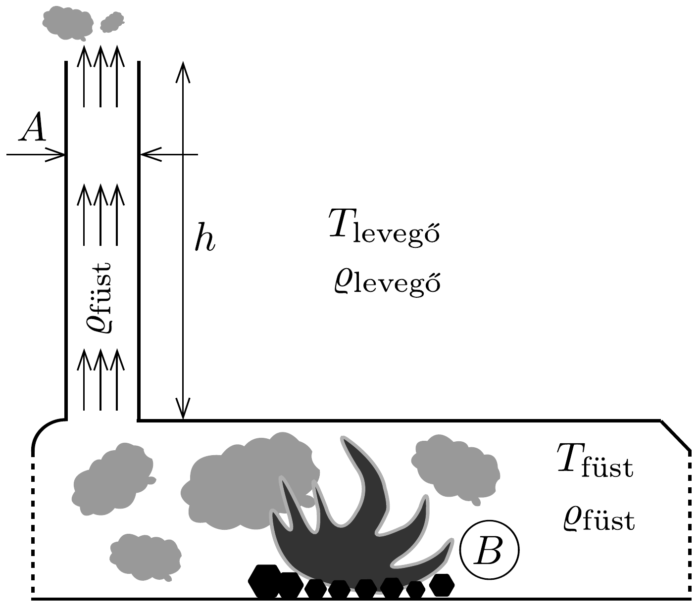
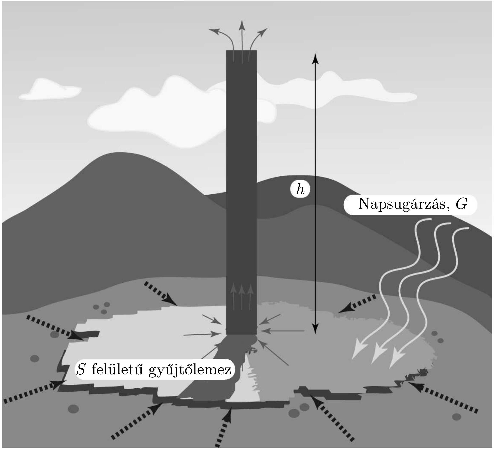

## Feladat 2

Kéményfizika
Bevezetés
Egy kazánból a légnemú égéstermék (füst, gáz) egy $A$ keresztmetszetú, $h$ magasságú kéményen keresztül jut ki a $T_{\text {levegő }}$ hőmérsékletú légkörbe (320. ábra). A kazán égésterének, valamint az égés során keletkezett füstnek a hőmérséklete $T_{\text {füst }}$. A kazánban időegység alatt keletkezett légnemú égéstermék térfogata $B$.

Használjuk a következő közelítéseket:
- - A kazánban a gázok áramlási sebessége elhanyagolhatóan kicsi.
- - Az égéstermék (füst) sürúsége megegyezik az ugyanolyan nyomású és hómérsékletú levegő sűrúségével, továbbá a kazánban lévó gáz ideálisnak tekinthető.
- - A külső levegő nyomása a hidrosztatikus nyomás törvénye szerint változik a magasság függvényében; a külső levegő sűrúségének magasságtól való függése elhanyagolható.
- - Az égéstermék áramlása megfelel a Bernoulli-törvénynek, mely szerint a következő összeg:
\[
\frac{1}{2} \varrho v^{2}(z)+\varrho g z+p(z)=\text { állandó }
\]
az áramlási tér minden pontjában. A képletben $\varrho$ az égéstermék súrúsége, $v(z)$ az áramlás sebessége, $p(z)$ pedig a nyomás $z$ magasságban.
- - Az égéstermék súrúségének változása a kémény teljes hosszában elhanyagolható.

\subsection*{2.1. Részfeladat}
2.1.1. Mekkora az a minimális magasság, mely mellett a kémény hatékonyan múködik, azaz az összes keletkező égésterméket képes a légkörbe kijuttatni? Az eredményt $B, A, T_{\text {levegő }}, g=9,81 \mathrm{~m} / \mathrm{s}^{2}$ és $\Delta T=T_{\text {füst }}-T_{\text {levegö }}$ függvényében adjuk meg.

Fontos: a összes további kérdés megválaszolásánál tételezzük fel, hogy a kémény magassága megegyezik ezzel a minimális mérettel.
2.1.2. Tegyük fel, hogy két, pontosan azonos kazánhoz azonos célra két kéményt építenek. A kémények keresztmetszete megegyezik, de különböző földrajzi helyre tervezik őket; az egyiket hideg éghajlatra, ahol a levegő átlagos hőmérséklete $-30^{\circ} \mathrm{C}$, a másikat pedig meleg vidékre, ahol a levegő átlaghőmérséklete 30 °C. Mindkét esetben a kazán belső hőmérséklete 400 °C. A hidegebb helyen lévő kémény minimális magassága 100 m-nek adódik. Milyen magas a másik kémény?
2.1.3. Mekkora a kéményben áramló gáz sebessége? Készítsünk vázlatos grafikont az áramló gáz sebességéről a magasság függvényében, feltételezve, hogy a kémény keresztmetszete nem változik a magassággal! Jelöljük meg a grafikonon azt a magasságot, ahol az égéstermék belép a kéménybe!
2.1.4. Hogyan változik a kéményben az égéstermék (gáz) nyomása a magasság függvényében?

Naperőmű
A kéményben áramló gáz energiájának hasznosításával naperómúvet (napkéményt) lehet létrehozni. Az elrendezést a 321. ábra szemlélteti. A Nap felmelegíti az $S$ felületú gyújtőlemez alatt elhelyezkedő levegőt. A gyújtőlemez szélénél a levegő szabadon áramolhat be a lemez alá. Miközben a felmelegített levegő a kéményen keresztül felfelé távozik (vékony, folytonos nyilak), hideg levegő áramlik a gyújtőlemez alá a széleken (vastag, pontozott nyilak), és így a napkéményben folytonos levegőáramlás alakul ki. Az áramló levegő egy turbinát hajt meg

a kéményben, amely elektromos energiát termel. A napsugárzás időegységre és vízszintes területegységre vonatkoztatott energiáját jelölje $G$. Tegyük fel, hogy a gyújtőlemezre jutó összes napsugárzás a lemez alatt lévő levegő melegítésére fordítódik. Jelölje a levegő (egységnyi tömegre vonatkoztatott) fajhőjét $c$, és hanyagoljuk el $c$ hőmérsékletfüggését. A napkémény hatásfokát a kéményben áramló gáz mozgási energiájának és a gyújtőlemez alatt lévớ levegő által elnyelt besugárzási energiának a hányadosaként értelmezzük.

\subsection*{2.2. Részfeladat}
2.2.1. Mennyi a napkémény hatásfoka?
2.2.2. Grafikonon ábrázoljuk a hatásfok kémény magasságától való függését!

\section*{A Manzanares-ben müködő napkémény}

Az elsó napkémény a spanyolországi Manzanares közelében épült. A kémény magassága 195 m, sugara 5 m. A gyüjtőlemez 244 m átmérőjú körlap. A tipikus múködési körülmények mellett a napkéményben lévő levegő fajhője $1012 \mathrm{~J} /(\mathrm{kg} \cdot \mathrm{K})$, a forró levegő súrúsége megközelítőleg $0,9 \mathrm{~kg} / \mathrm{m}^{3}$, a külső levegő átlaghőmérsék-
lete pedig $T_{\text {levegő }}=295 \mathrm{~K}$ Manzanares-ben. Az egységnyi vízszintes felületre eső napsugárzás intenzitása nappal, egy átlagos napsütéses napon $150 \mathrm{~W} / \mathrm{m}^{2}$.

\subsection*{2.3. Részfeladat}
2.3.1. Mennyi a Manzanares-ben épült napkémény hatásfoka? Adjuk meg az eredményt számszerúen is!
2.3.2. Mekkora teljesítménnyel múködik a Manzanares-ben épült napkémény?
2.3.3. Mennyi energiát állít elő a Manzanares-ben épült napkémény egy átlagos napsütéses napon?

\subsection*{2.4. Részfeladat}
2.4.1. Határozzuk meg, mennyivel emelkedik a napkéményben a kémény torkolatánál belépő (meleg) levegő hőmérséklete a külső (hideg) levegő hőmérsékletéhez képest! Adjuk meg az általános formulát, majd értékeljük ki a Manzanares-ben múködő napkémény adataival!
2.4.2. Hány kilogramm/szekundum a Manzanares-ben múködő napkémény levegőhozama, vagyis mennyi az időegység alatt átáramló levegő tömege?
