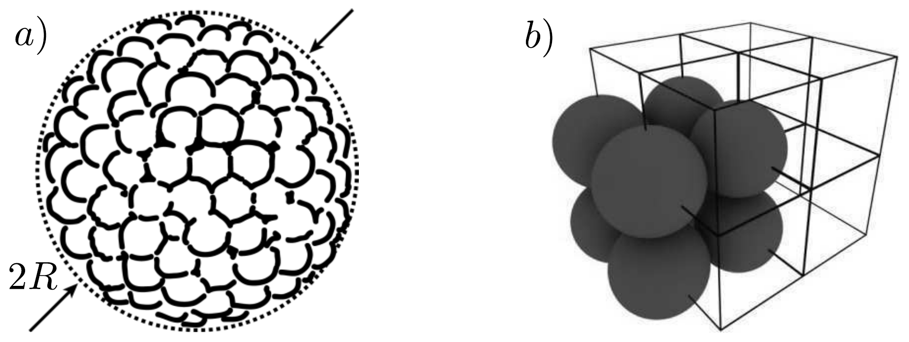
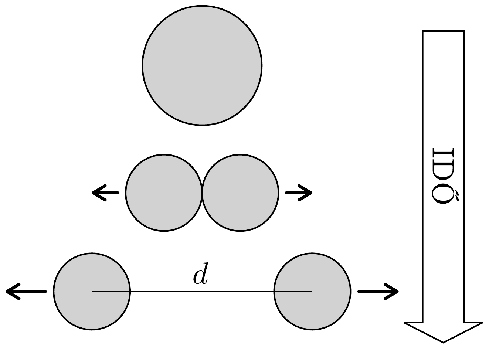
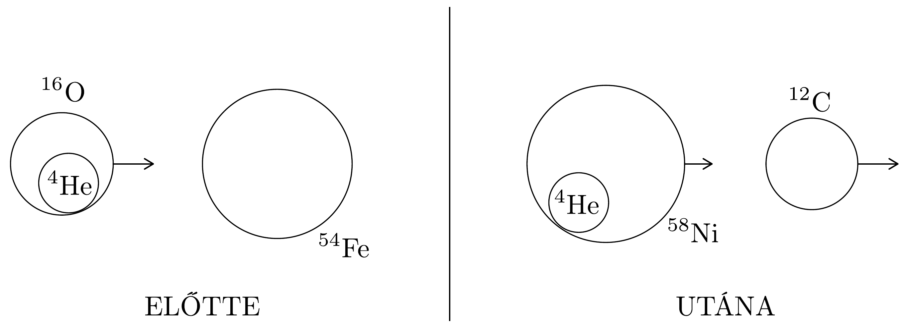

## Feladat 3

Egyszerü atommagmodell
\section*{Bevezetés}

Bár az atommagok kvantummechanikai objektumok, az alaptulajdonságaikra (mint például sugarukra, kötési energiájukra) vonatkozó fenomenologikus törvények néhány egyszerú feltételezésből megkaphatók:
(i) az atommagok nukleonokból (protonokból és neutronokból) állnak;
(ii) a nukleonokat összetartó erős kölcsönhatás nagyon rövid hatótávolságú (csak szomszédos nukleonok között lép fel);
(iii) egy adott atommagban a protonok száma $(Z)$ közel azonos a neutronok számával $(N)$, azaz $Z \approx N \approx A / 2$, ahol $A$ az összes nukleon száma (tömegszám), ha $A \gg 1$.

Fontos: a 3.1-3.4. részfeladat mindegyikében használjuk ezeket a feltételezéseket! A 3.5. részfeladat az előzőktől függetlenül megoldható.

\subsection*{3.1. Az atommag mint szorosan illeszkedő nukleonok rendszere}

Egy egyszerú modellben az atommag úgy tekinthető, mint egy gömb, mely egymáshoz szorosan illeszkedő nukleonokból áll (322, a) ábra), ahol a nukleonok $r_{\mathrm{n}}=0,85 \mathrm{fm}$ sugarú merev golyók ( $1 \mathrm{fm}=10^{-15} \mathrm{~m}$ ). A nukleáris kölcsönhatás csak az egymással közvetlenül érintkező két nukleon között van jelen. Az atommag teljes $V$ térfogata nagyobb, mint az azt alkotó nukleonok $A V_{\mathrm{n}}$ össztérfogata, ahol $V_{\mathrm{n}}=\frac{4}{3} r_{\mathrm{n}}^{3} \pi . \mathrm{Az} f=A V_{\mathrm{n}} / V$ arányt kitöltési tényezőjének hívják, és azt adja meg, hogy az atommag térfogatának hányadrészét tölti ki nukleáris anyag.
3.1.1. Határozzuk meg az $f$ kitöltési tényezőt, feltételezve, hogy a nukleonok egyszerú köbös (simple cubic, SC) rácsba rendeződnek. Az egyszerú köbös rácsban a nukleonok egy végtelen kockarács csúcspontjaiban találhatóak. (Lásd 322. b) ábra.)

Fontos: Minden további kérdésben tételezzük fel, hogy az atommagok kitöltési tényezóje megegyezik a most kiszámolt értékkel! Ha nem sikerült megoldani az előző kérdést, akkor a továbbiakban számoljunk az $f=1 / 2$ értékkel!
3.1.2. Becsüljük meg az $A$ tömegszámú ( $A$ nukleont tartalmazó) atommag átlagos $\varrho_{\mathrm{m}}$ tömegsúrúségét, $\varrho_{\mathrm{c}}$ töltéssűrúségét valamint $R$ sugarát! Egy nukleon átlagos tömege $1,67 \cdot 10^{-27} \mathrm{~kg}$.
3.2. Az atommag kötési energiája (térfogati és felületi tagok)

Az atommag kötési energiája az ốt alkotó, különálló nukleonokra való szétbontásához szükséges energia. A kötési energia legjelentősebb része a szomszédos nukleonok között múködő vonzó nukleáris kölcsönhatásból származik. Az atommag belsejében található nukleonokhoz rendelhető kötési energiajárulék $a_{V}=$ $15,8 \mathrm{MeV}\left(1 \mathrm{MeV}=1,602 \cdot 10^{-13} \mathrm{~J}\right)$. Az atommag felületén lévó nukleonok járuléka közelítőleg ennek a fele, $a_{V} / 2$.

Fejezzük ki az $A$ tömegszámú atommag $E_{\mathrm{b}}$ kötési energiáját $A, a_{V}$ és $f$ segítségével, figyelembe véve a felületi korrekciót is!
3.3. A kötési energia elektrosztatikus (Coulomb) tagja

Ismert, hogy az $R$ sugarú, a térfogatában $Q_{0}$ elektromos töltéssel egyenletesen feltöltött gömb elektrosztatikus energiája:
\[
U_{\mathrm{C}}=\frac{3 Q_{0}^{2}}{20 \pi \varepsilon_{0} R}, \quad \text { ahol } \quad \varepsilon_{0}=8,85 \cdot 10^{-12} \mathrm{C}^{2} \mathrm{~N}^{-1} \mathrm{~m}^{-2} .
\]
3.3.1. A fenti formula felhasználásával határozzuk meg az atommag elektrosztatikus energiáját! Az atommagban található protonok saját magukra nem hatnak (Coulomb-eróvel), csak a többi protonra. Ezt a tényt úgy vehetjük figyelembe, hogy a végső formulában a $Z^{2} \rightarrow Z(Z-1)$ átírást hajtjuk végre. Ebben és a következő feladatokban használjuk ezt a korrekciót!
3.3.2. Adjuk meg a kötési energia teljes kifejezését, mely tartalmazza a fő (térfogati) tagot, valamint a felületi- és Coulomb-korrekciót!
3.4. Nehéz atommagok bomlása

A bomlás olyan nukleáris folyamat, amely során egy atommag könnyebb alkotóelemekre (kisebb atommagokra) esik szét. Tegyük fel, hogy egy $A$ tömegszámú atommag két azonos részre bomlik, a 323. ábrán látható módon.

3.4.1. Határozzuk meg a bomlástermékek együttes mozgási energiáját ( $E_{\text {kin }}$ t), feltételezve, hogy a két könnyebb atommag középpontjának távolsága $d \geq$ $2 R(A / 2)$, ahol $R(A / 2)$ a bomlás során képződött atommagok sugara! Kezdetben a bomló atommag nyugalomban volt.
3.4.2. Feltételezve, hogy $d=2 R(A / 2)$, határozzuk meg a 3.4.1. pontban $E_{\text {kin-re }}$ kapott kifejezés értékét $A=100,150,200$ és 250 esetén MeV egységben! A fenti modell alapján becsüljük meg, hogy mely $A$ tömegszám esetén lehetséges bomlás!

\subsection*{3.5. Transzferreakciók}
3.5.1. Magfizikában az atommagok és a magreakciók energiáit tömeg egységekben szokás megadni. Például egy nem mozgó (nulla sebességú), ámde az alapállapothoz képest $E_{\text {exc }}$ energiával gerjesztett atommag tömege $m=m_{0}+E_{\text {exc }} / c^{2}$, ahol $m_{0}$ a mag nyugalmi tömege alapállapotban. A ${ }^{16} \mathrm{O}+{ }^{54} \mathrm{Fe} \rightarrow{ }^{12} \mathrm{C}+{ }^{58} \mathrm{Ni}$ magreakció az egyik példája az úgynevezett „transzferreakcióknak”, amikor az egyik atommag egy része („klaszter”) bejut a másik atommagba (lásd a 324. ábrát). Esetünkben az átkerülő rész egy $\alpha$ részecske ( ${ }^{4} \mathrm{He}$-klaszter). A transzferreakciók akkor játszódnak le maximális valószínűséggel, ha a kirepüló reakciótermék (esetünkben a $\left.{ }^{12} \mathrm{C} \mathrm{mag}\right)$ sebessége nagyság és irány szerint megegyezik a becsapódó lövedékmag (esetünkben a ${ }^{16} \mathrm{O}$ ) sebességével. Az ${ }^{54} \mathrm{Fe}$ céltárgy kezdetben nyugalomban van. A reakcióban az ${ }^{58}$ Ni magasan gerjesztett állapotba kerül.

Az alábbi táblázat a reakciótermékek nyugalmi tömegeit adja meg alapállapotukban atomi tömegegységben (u), ahol $1 \mathrm{u}=1,6605 \cdot 10^{-27} \mathrm{~kg}$

\begin{tabular}[t]{|l|l|l|}
\hline 1. & $M\left({ }^{16} \mathrm{O}\right)$ & 15,994 91 u \\
\hline 2. & $M\left({ }^{54} \mathrm{Fe}\right)$ & 53,939 62 u \\
\hline 3. & $M\left({ }^{12} \mathrm{C}\right)$ & 12,00000 u \\
\hline 4. & $M\left({ }^{58} \mathrm{Ni}\right)$ & $57,93535 \mathrm{u}$ \\
\hline
\end{tabular}

Határozzuk meg ennek az ${ }^{58}$ Ni állapotának gerjesztési energiáját (és fejezzük

ki MeV egységekben), ha a lövedék ${ }^{16} \mathrm{O}$ mag mozgási energiája 50 MeV! A fény sebessége $c=3 \cdot 10^{8} \mathrm{~m} / \mathrm{s}$.
3.5.2. A 3.5.1. részben tárgyalt, gerjesztett állapotú ${ }^{58} \mathrm{Ni}$ mag alapállapotba jut („legerjesztődik”), miközben kibocsát egy gamma-fotont a mozgásának irányában. Tárgyaljuk ezt a bomlást abban a vonatkoztatási rendszerben, amelyben az ${ }^{58}$ Ni mag nyugalomban van, és határozzuk meg az ${ }^{58}$ Ni mag visszalökődési energiáját (vagyis azt a mozgási energiát, amivel az ${ }^{58} \mathrm{Ni}$ mag rendelkezik a foton kibocsátása után). Mekkora a foton energiája ebben a vonatkoztatási rendszerben? Mekkora a foton energiája a laboratóriumi koordináta-rendszerben (azaz mekkora foton energiát mérne az a detektor, amelyet az ${ }^{58}$ Ni mag mozgásának irányába állítanának be)?
