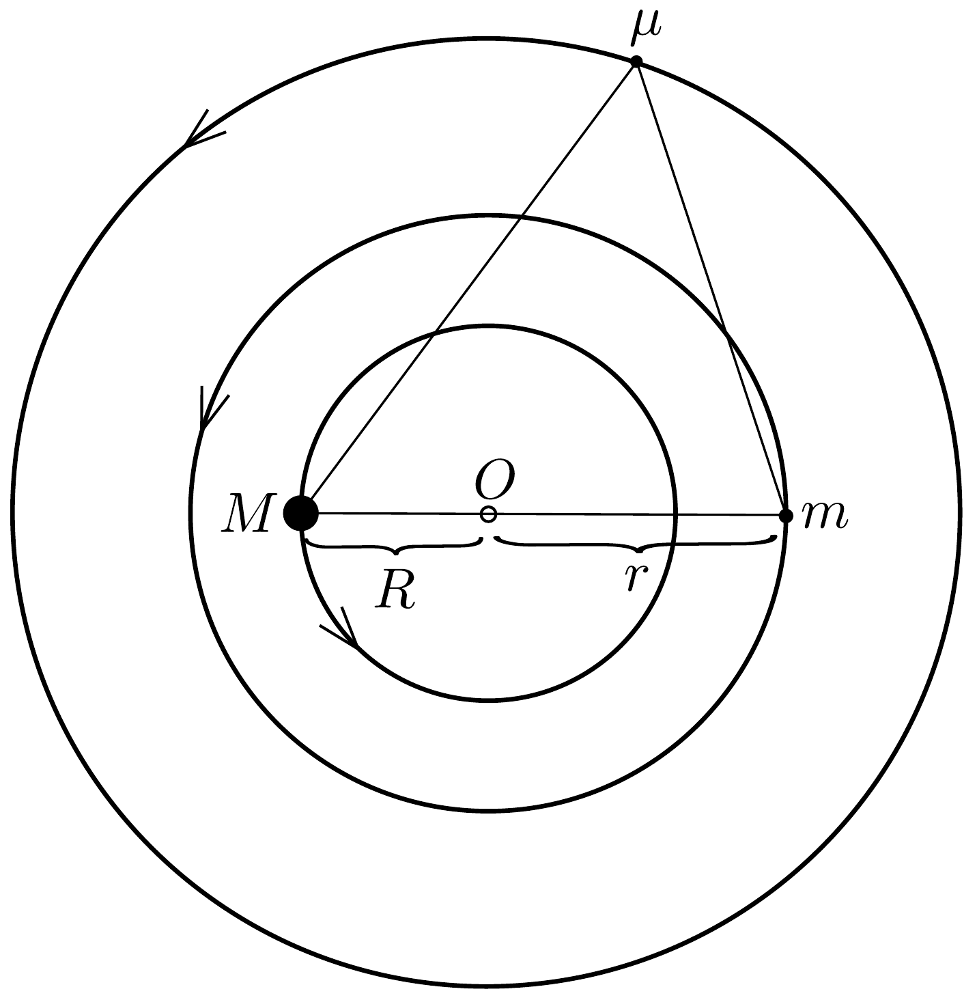
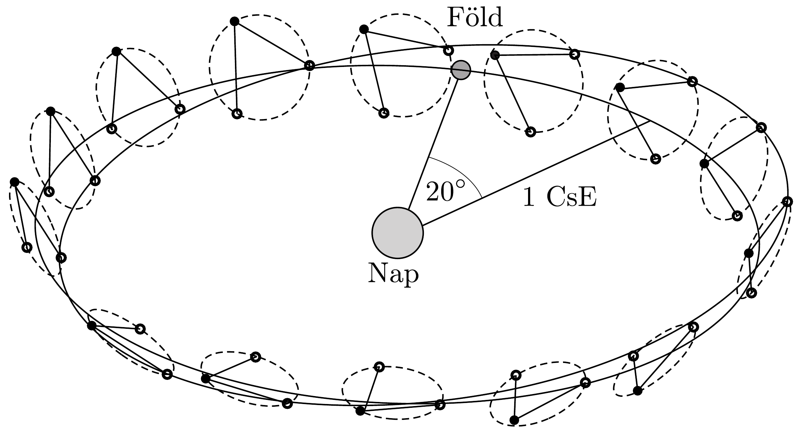
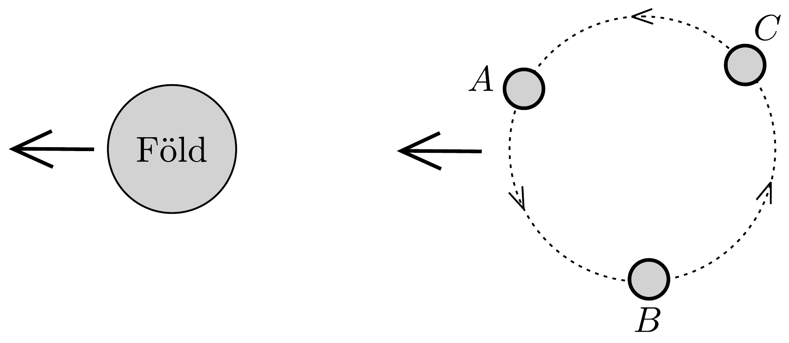

## Feladat 1

Egy háromtest-probléma és a LISA
1.1. $M$ és $m$ két egymást vonzó tömegpont, melyek $R$, illetve $r$ sugarú körpályán mozognak a közös tömegközéppontjuk körül. Fejezzük ki az $M$ és $m$ tömegpontokat összekötó szakasz $\omega_{0}$ szögsebességét $R, r, M, m$ és a $G$ gravitációs állandó segítségével!
1.2. Egy harmadik, infinitezimálisan kicsi $\mu$ tömegú testet úgy helyezünk el, hogy azonos síkban, körpályán mozogjon a közös tömegközéppont körül, és maradjon nyugalomban az $M$ és $m$ tömegú testekhez képest, ahogy a 328. ábrán látható. Tegyük fel, hogy ez a test nem esik egy egyenesbe az $M$ és $m$ testekkel.

Fejezzük ki a következő mennyiségeket $R$ és $r$ függvényében:
- 1.2.1. $\mu$ és $M$ távolságát,
- 1.2.2. $\mu$ és $m$ távolságát,
- 1.2.3. $\mu$ és a tömegközéppont távolságát!
- 1.3. Tekintsük az $M=m$ esetet. A $\mu$ testet kicsit kitérítjük radiális irányban (az $O-\mu$ egyenes mentén). Mekkora $\mu$ egyensúlyi helyzet körüli rezgésének körfrekvenciája $\omega_{0}$-lal kifejezve? Tegyük fel, hogy $\mu$ perdülete megmarad ${ }^{22}$.

\footnotetext{
${ }^{22}$ Ez a feltételezés még a korlátozott háromtest-problémában (amikor az egyik test tömege

A Laser Interferometry Space Antenna (LISA) három egyforma ürhajó együttese a kisfrekvenciás gravitációs hullámok detektálására. A három úrhajó egy szabályos háromszög csúcsaiban helyezkedik el, ahogy a $329{ }^{23}$ és 330, ábrán látható. Az oldalak (más néven „karok”) kb. 5,0 millió km hosszúak. A LISA-együttes egy, a Földéhez hasonló pályán 20°-kal lemaradva követi a Nap körül a Földet. Mindegyik úrhajó egy saját, kicsit döntött pályán kering a Nap körül. Ennek eredményeként a három űrhajó keringeni látszik a közös középpontjuk körül, évente egy fordulatot megtéve.

Az ürhajók folyamatosan lézerjeleket bocsátanak ki és fogadnak egymás között. A gravitációs hullámokat úgy mutatják ki, hogy a karok hosszának kicsiny változásait detektálják interferometriás módszerekkel. Gravitációs hullámok pl.

\footnotetext{
elhanyagolhatóan kicsi a másik kettőé mellett) sem igaz, sót még a kis test mechanikai energiája sem marad meg. Ezt a részkérdést a teljesség kedvéért tartottunk meg.
${ }^{23}$ Forrás: D. A. Shaddock, „An Overview of the Laser Interferometer Space Antenna”, Publications of the Astronomical Society of Australia, 2009, 26, pp. 128-132.

úgy keletkezhetnek, hogy nagy tömegü testek (pl. fekete lyukak) ütköznek a szomszédos galaxisokban.
1.4. A három úrhajó síkjában mekkora egy úrhajó relatív sebessége egy másik ürhajóhoz képest?
