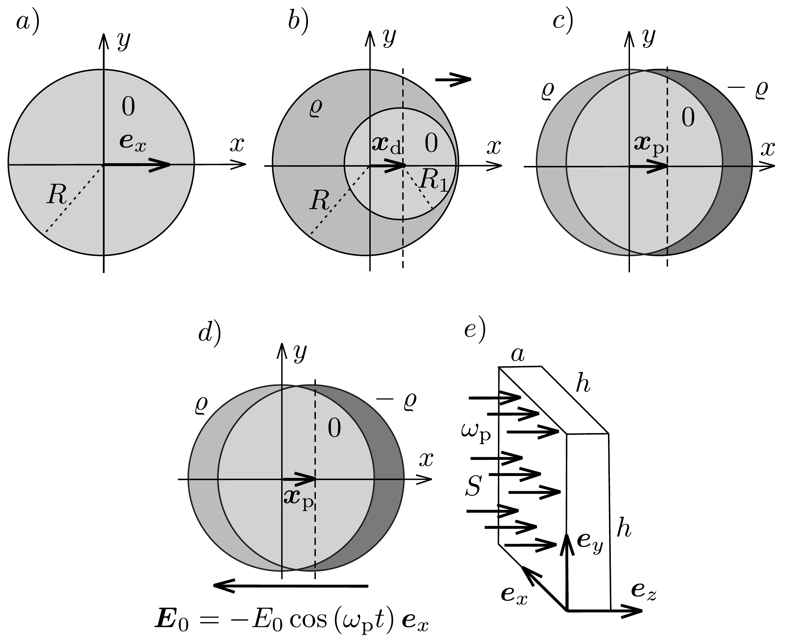

## Feladat 2

Plazmonos gőzfejlesztő készülék

Bevezetés
Ebben a feladatban egy hatékony, kísérletileg is múködő gőzfejlesztési eljárást fogunk tanulmányozni. Víz és benne eloszlatott, nanométeres méretú, gömb alakú ezüstgolyócskák (literenként csak körülbelül $10^{13}$ darab) keverékét fókuszált fénynyalábbal világítjuk meg. A fény egy részét a nanogolyócskák elnyelik, így felmelegednek és közvetlen környezetükben gőzt keltenek anélkül, hogy a teljes vízmennyiséget felmelegítenék. A keletkező gőz buborékok formájában távozik a rendszerből. Jelenleg a folyamat még nem minden részletében tisztázott, de a felmelegedés jelensége a fémes nanogolyócskák elektronjainak együttes oszcillációján alapuló fényelnyeléssel magyarázható. A berendezést plazmonos gőzfejlesztőnek nevezzük.

Egyetlen, gömb alakú, ezüst nanogolyócska
Ebben a részfeladatban tekintsünk egy $R=10,0 \mathrm{~nm}$ sugarú, gömb alakú ezüst nanogolyócskát, melynek középpontja a koordináta-rendszerünk origójában van rögzítve, ahogy az a 348. a) ábrán látható. Minden bekövetkező mozgás, erőhatás és erốtér párhuzamos a vízszintes $x$ tengellyel (amely az $\boldsymbol{e}_{x}$ irányvektorral adható meg). A nanogolyócska vezetési elektronjai a golyócska teljes térfogatában szabadon mozoghatnak anélkül, hogy bármelyik ezüstatomhoz kötődnének. Az ezüstatomok pozitív ionokként vannak jelen a golyócskában, mindegyik egyegy elektronnal járul hozzá a szabad töltéshordozókhoz.

Az ezüst moláris tömege $M_{\mathrm{Ag}}=1,079 \cdot 10^{-1} \mathrm{~kg} / \mathrm{mol}$, sürúsége $\varrho_{\mathrm{Ag}}=1,049 \times$ $\times 10^{4} \mathrm{~kg} / \mathrm{m}^{3}$, fajhő̈je $c_{\mathrm{Ag}}=2,40 \cdot 10^{2} \mathrm{~J} /(\mathrm{kg} \mathrm{K})$.

2.1. Határozzuk meg a következő mennyiségeket: a nanogolyócska $V$ térfogata és $M$ tömege; a nanogolyócskában található ezüstionok $N$ száma és $\varrho$ töltéssúrúsége; valamint a szabad elektronok $n$ számsűrúsége (koncentrációja), összes $Q$ töltése és összes $m_{0}$ tömege!

Elektromos mezó egy töltött gömbön belüli töltéssemleges tartományban

Ebben a részfeladatban tegyük fel, hogy minden anyag relatív permittivitása $\varepsilon=1$. Homogén, $\varrho$ töltéssúrúségú, $R$ sugarú gömb belsejében $-\varrho$ töltéssúrúség hozzáadásával egy kisebb, $R_{1}$ sugarú, töltéssemleges tartományt hozunk létre, melynek középpontja az $R$ sugarú gömb középpontjához képest $\boldsymbol{x}_{\mathrm{d}}=x_{\mathrm{d}} \boldsymbol{e}_{x}$ vektorral el van tolva (lásd a 348.b) ábrát).
2.2. Mutassuk meg, hogy a töltéssemleges tartományban az elektromos tér homogén és $\boldsymbol{E}=A\left(\varrho / \varepsilon_{0}\right) \boldsymbol{x}_{\mathrm{d}}$ alakú! Határozzuk meg az $A$ szorzótényezó értékét!

A kitérített elektronfelhőre ható visszatérítő erổ
A következőkben a szabad elektronok együttes mozgását vizsgáljuk. Ennek érdekében modellezzük a szabad elektronok összességét egyetlen, negatívan töltött, homogén $-\varrho$ töltéssűrúségú, $\boldsymbol{x}_{\mathrm{p}}$ középpontú gömbbel, amely az $x$ tengely mentén mozoghat az origóhoz rögzített középpontú, pozitív töltésú gömbhöz (ezüstionok) képest (lásd a 348, c) ábrát). Tegyük fel, hogy egy külsó $\boldsymbol{F}_{\text {külső }}$ eró hatására az elektronfelhő $\boldsymbol{x}_{\mathrm{p}}=x_{\mathrm{p}} \boldsymbol{e}_{x}$ vektorral elmozdul eredeti helyzetéből, ahol $x_{\mathrm{p}} \ll R$. A nanogolyócska - a két szélén megjelenő kicsiny töltéstől eltekintve - a belsejében töltéssemleges marad.
2.3. Fejezzük ki $\boldsymbol{x}_{\mathrm{p}}$ és $n$ felhasználásával a következő két mennyiséget: az elektronfelhőre ható $\boldsymbol{F}$ visszatérítő erőt, valamint az elektronfelhő elmozdítása során végzett $W_{\text {el }}$ munkát!

Ezüst nanogolyócska időben állandó, külső elektromos térben
Egy nanogolyócskát vákuumban $\boldsymbol{E}_{0}=-E_{0} \boldsymbol{e}_{x}$ homogén elektromos térbe helyezünk, melynek hatására az elektronfelhő $\boldsymbol{F}_{\text {külső }}$ erőhatást érezve kicsiny $x_{\mathrm{p}}$ távolsággal elmozdul, ahol $\left|x_{\mathrm{p}}\right| \ll R$.
2.4. Határozzuk meg az elektronfelhő $x_{\mathrm{p}}$ elmozdulását $E_{0}$ és $n$ felhasználásával! Határozzuk meg az elmozdulás közben a nanogolyócska közepén átmenő $(y, z)$ síkon keresztülhaladó, $-\Delta Q$ töltést $R, n$ és $x_{\mathrm{p}}$ függvényében!

Az ezüst nanogolyócska helyettesítő kapacitása és induktivitása
Mind időben állandó, mind változó $\boldsymbol{E}_{0}$ elektromos térben a nanogolyócska modellezhető egy megfeleló elektromos áramkörrel. A helyettesítő képbeli kapacitás meghatározható, ha a $\Delta Q$ töltés szétválasztásához szükséges $W_{\mathrm{el}}$ munkát megfeleltetjük egy $\pm \Delta Q$ töltéssel ellátott kondenzátor energiájának. A töltésszétválasztás a helyettesítő képben $V_{0}$ feszültséget eredményez a fegyverzetek között.
2.5.1. Fejezzük ki a rendszer helyettesítő képének $C$ kapacitását $\varepsilon_{0}$ és $R$ felhasználásával, és számítsuk ki numerikus értékét!
2.5.2. $E_{0}$ és $R$ felhasználásával fejezzük ki azt a $V_{0}$ feszültséget, amit a helyettesítő képbeli kondenzátorra kellene kapcsolni ahhoz, hogy $\Delta Q$ töltése legyen!

Időfüggő $\boldsymbol{E}_{0}$ elektromos tér esetén az elektronfelhő mozgásba jön, sebességét jelölje $\boldsymbol{v}=v \cdot \boldsymbol{e}_{x}$ (lásd a 348. d) ábrát). Ennek következtében az elektronok $W_{\text {kin }}$ mozgási energiára tesznek szert és a rögzített $y z$-síkon átfolyó $I$ erősségú áramot okoznak. Az elektronfelhő mozgási energiája megfeleltethető egy $I$ árammal átjárt $L$ induktivitás energiájának.
2.6.1. Fejezzük ki a $W_{\text {kin }}$ és $I$ mennyiségeket $v$ felhasználásával!
2.6.2. Fejezzük ki a helyettesítő képbeli $L$ induktivitást a golyócska $R$ sugarának, az elektron $e$ töltésének és $m_{\mathrm{e}}$ tömegének, valamint az $n$ elektronszám-súrúség felhasználásával, majd számítsuk ki numerikus értékét!

Az ezüst nanogolyócska plazmon rezonanciája
Az eddigiekből következik, hogy az egyensúlyi helyzetéből kitérített, majd elengedett elektronfelhő mozgása egy, a rezonanciafrekvenciával oszcilláló, ideális LC-körrel modellezhető. Az elektronfelhő ilyen mozgását plazmonrezonanciának hívják, a rezgés $\omega_{\mathrm{p}}$ körfrekvenciája pedig az úgynevezett plazmon-körfrekvencia.
2.7.1. Határozzuk meg az elektronfelhő $\omega_{p}$ plazmon-körfrekvenciáját az elektron $e$ töltésének, $m_{\mathrm{e}}$ tömegének, az $n$ elektronszám-súrúség és az $\varepsilon_{0}$ vákuumpermittivitás felhasználásával!
2.7.2. Számítsuk ki $\omega_{\mathrm{p}}-\mathrm{t}$ rad/s egységekben, valamint az $\omega=\omega_{\mathrm{p}}$ körfrekvenciájú fény $\lambda_{\mathrm{p}}$ hullámhosszát nm egységekben!

\section*{Plazmonfrekvenciájú fénnyel megvilágított ezüst nanogolyócska}

A feladat további részében a nanogolyócskát $S=\frac{1}{2} \varepsilon_{0} E_{0}^{2}=1,00 \mathrm{MW} / \mathrm{m}^{2}$ intenzitású, $\omega_{\mathrm{p}}$ plazmon-körfrekvenciájú, monokromatikus fénnyel világítjuk meg. Mivel a hullámhossz nagy $\left(\lambda_{\mathrm{p}} \gg R\right)$, tekinthetjük úgy, hogy a nanogolyócska homogén, időben harmonikusan változó $\boldsymbol{E}_{0}=-E_{0} \cos \left(\omega_{\mathrm{p}} t\right) \boldsymbol{e}_{x}$ elektromos térben helyezkedik el. Az $\boldsymbol{E}_{0}$ tér hatására az elektronfelhő $\boldsymbol{x}_{\mathrm{p}}$ középpontja is ugyanazon frekvenciával, $\boldsymbol{v}=\mathrm{d} \boldsymbol{x}_{\mathrm{p}} / \mathrm{d} t$ sebességgel, állandó $x_{0}$ amplitúdóval rezegni kezd. Az elektronok eme rezgőmozgása a fény elnyeléséhez vezet. A nanogolyócska által befogott energia egy része a golyócska belsejében Joule-hővé alakul, a maradék része pedig szórt fény formájában újra kisugárzódik.

A Joule-hốt a szabad elektronoknak az ezüstionokkal való ritka, véletlenszerú, rugalmatlan ütközései okozzák. Az ütköző elektron a teljes mozgási energiáját elveszíti, ami az ezüstionok rezgéseivé (azaz hóvé) alakul. Az ilyen ütközések közötti átlagos időtartam $\tau \gg 1 / \omega_{\mathrm{p}}$, ahol ezüst nanogolyócskára számoljunk a $\tau=5,24 \cdot 10^{-15}$ s értékkel.
2.8.1. Fejezzük ki a nanogolyócskában fejlődő Joule-hő keletkezési ütemének (teljesítményének) $P_{\text {hó }}$ időátlagolt értékét és az áramerősség négyzetének $\left\langle I^{2}\right\rangle$ időátlagát úgy, hogy a kifejezések expliciten tartalmazzák az elektronfelhő sebességnégyzetének $\left\langle v^{2}\right\rangle$ időátlagát!
2.8.2. Határozzuk meg a nanogolyócska helyettesítő képének ohmikus ellenállását, amely kapcsolatot teremt a fejlődő Joule-hó teljesítménye és az elektronfelhő $I$ áramerőssége között! Számítsuk ki a numerikus értékét is!

A beesó fénynyalábban a rezgő elektronfelhőn való szóródás (újrakibocsátás) következtében valamekkora $P_{\text {szórt }}$ időátlagolt teljesítmény formájában veszteség lép fel. $P_{\text {szórt }}$ nagysága függ a szórócentrum $x_{0}$ amplitúdójától, $Q$ töltésétől, $\omega_{\mathrm{p}}$ körfrekvenciájától, valamint a fény tulajdonságaitól (a $c$ fénysebességtől és a vákuum $\varepsilon_{0}$ permittivitásától). E négy változóval kifejezve $P_{\text {szórt }}$ a következő formulával adható meg:
\[
P_{\text {szórt }}=\frac{Q^{2} x_{0}^{2} \omega_{\mathrm{p}}^{4}}{12 \pi \varepsilon_{0} c^{3}} .
\]
2.9. $P_{\text {hô }}$ analógiájára határozzuk meg a fényszórásnak megfelelő ekvivalens $P_{\text {szórt }}$ ohmikus ellenállást $P_{\text {szórt }}$ felhasználásával! Számítsuk ki a numerikus értékét is!

Az előbbiekben tárgyalt helyettesítő áramköri elemeket sorosan RLC-körbe kapcsolva, majd az áramkört (a beeső fény $E_{0}$ térerőssége által meghatározott amplitúdójú) $V=V_{0} \cos \left(\omega_{\mathrm{p}} t\right)$ váltakozó feszültségre kapcsolva megkapjuk az oszcilláló térbe helyezett ezüst nanogolyócska modelljét.
2.10.1. Ismert adatok felhasználásával határozzuk meg a $P_{\text {hó }}$ és $P_{\text {szórt }}$ időátlagolt teljesítményveszteségek kifejezéseit, valamint az $\omega=\omega_{\mathrm{p}}$ körfrekvenciájú beesó fény $E_{0}$ amplitúdóját!
2.10.2. Határozzuk meg $E_{0}, P_{\text {hǒ }}$, és $P_{\text {szórt }}$ numerikus értékét!

\section*{Gőzfejlesztés fénnyel}

Az ezüst nanogolyócskákat $n_{\mathrm{ng}}=7,3 \cdot 10^{15} \mathrm{~m}^{-3}$ koncentrációban elkeverjük vízben, majd a keveréket egy téglatest alakú, $h \times h \times a=10 \times 10 \times 10 \mathrm{~cm}^{3}$ méretú, átlátszó tartályba töltjük, végül a rendszert meróleges beeséssel plazmonfrekvenciájú, $S=1,00 \mathrm{MW} / \mathrm{m}^{2}$ intenzitású fénnyel világítjuk meg (lásd a 348 . e) ábrát!). A víz hőmérséklete $T_{\text {hő }}=20^{\circ} \mathrm{C}$, és a megfigyelésekkel összhangban feltehetjük, hogy stacionárius állapotban a nanogolyócskák Joule-hője teljes egészében $T_{\text {gő }}=110$ °C hőmérsékletú gőz keletkezésére fordítódik, a teljes víztömeg hőmérsékletének növelése nélkül.

A plazmonos gőzfejlesztő készülék termodinamikai hatásfokát az
\[
\eta=\frac{P_{\text {gö́z }}}{P_{\text {összes }}}
\]
hányadosként definiáljuk, ahol $P_{\text {gőz }}$ az egész tartályban a gőz fejlesztésére fordítódó hőteljesítmény, $P_{\text {összes }}$ pedig a tartályra esó fény összes teljesítménye.

Bármely kiszemelt nanogolyócskát az idő legnagyobb részében víz helyett gőz veszi körül, ezért tárgyalható úgy, mintha vákuumban helyezkedne el.
2.11.1. Számítsuk ki numerikusan a plazmonos gőzfejlesztő készülék által az időegység alatt előállított vízgőz $m_{\text {gőz }}$ tömegét a plazmonfrekvenciájú, $S$ intenzitású fénnyel való besugárzás folyamán!
2.11.2. Számítsuk ki numerikusan a plazmonos gőzfejlesztő készülék $\eta$ termodinamikai hatásfokát!
