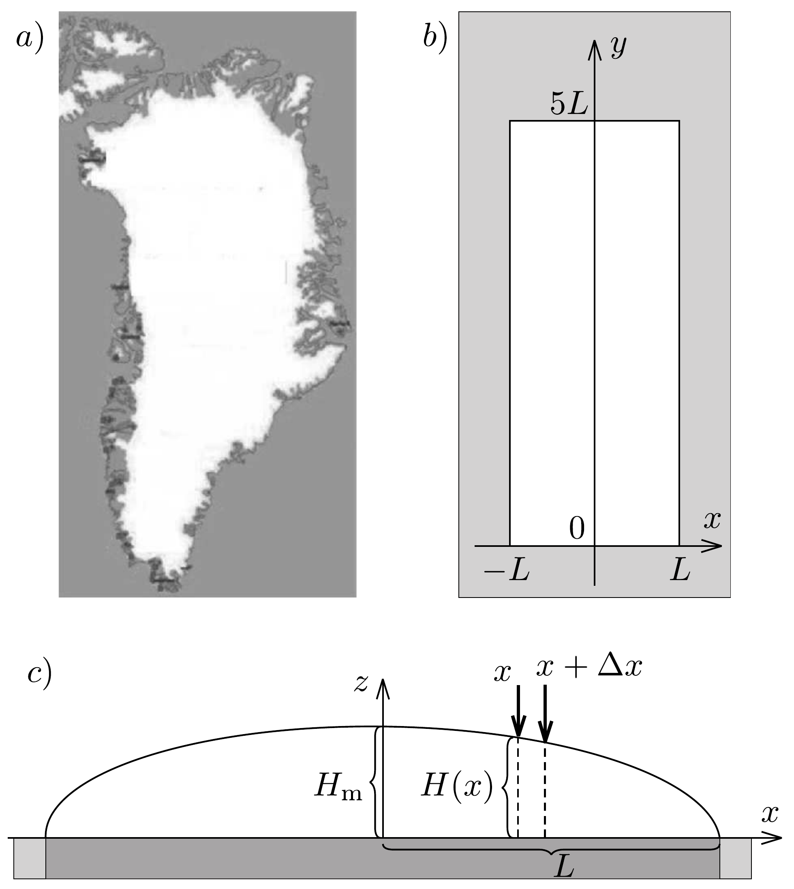
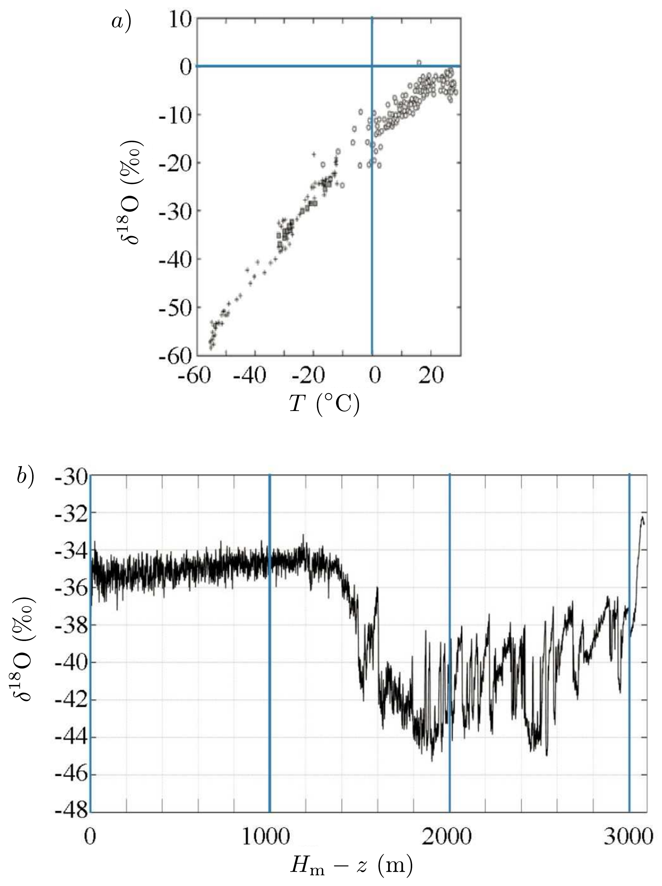

## Feladat 3

A grönlandi jégsapka

Bevezetés
Ez a feladat a grönlandi jégsapkáról, a világ második legnagyobb összefüggó jégtakarójáról szól, ami a 349.a) ábrán látható. Egyszerúsített modellünkben Grönlandot egy $2 L$ szélességú és $5 L$ hosszúságú téglalapnak tekintjük, ahol a földfelszín a tengerszinttel azonos magasságban van, és a területét teljes mértékben összenyomhatatlan jég borítja (349.b) ábra). A jég $\varrho_{\text {jég }}$ súrúségét tekintsük állandónak. A jégsapka $H(x)$ magassága nem függ az $y$ koordinátától, és a magasság nulláról a maximális $H_{\mathrm{m}}$ értékig nő, ahogy a parttól, $(x= \pm L)$ a téglalap északdéli felezővonaláig (az $y$ tengelyig, a „jégválasztóig”) haladunk, és hirtelen nulla értékre esik $y=0$-ban és $y=5 L$-ben. Ez a magasságprofil a 349.c) ábrán látható.

Két hasznos összefüggés
Ebben a részben felhasználhatjuk a következő integrált:
\[
\int_{0}^{1} \sqrt{1-x} \mathrm{~d} x=\frac{2}{3}
\]
és az $(1+x)^{a} \approx 1+a x$ közelítést, amely $|a x| \ll 1$ esetén érvényes.
A jégsapka magasságprofilja
Rövid időskálán a jégsapka egy összenyomhatatlan hidrosztatikai rendszer, melyben a $H(x)$ magasságprofil időben állandó.

3.1. Adjuk meg a jégtakaró belsejében a $p(x, z)$ nyomást, mint a földfelszíntől (tengerszinttől) mért $z$ magasság és a jégválasztó vonaltól mért $x$ távolság függvényét! Hanyagoljuk el a légköri nyomást.

Most tekintsünk egy rögzített, egyensúlyban lévő, függőleges jégréteget, amely a kis méretú, vízszintes $\Delta x \Delta y$ alaplap fölött helyezkedik el, $x$ és $x+\Delta x$ között, ahogy ezt a szaggatott vonalak mutatják a 349.c) ábrán. A $\Delta y$ mérete nem számít. A jégréteg befelé és kifelé esó oldalának magasságkülönbsége miatt e két függőleges oldalon ható eredő erók vízszintes komponensei különböznek. Ezt a $\Delta F$ különbséget a vízszintes alaplapon ható $\Delta F=S_{\mathrm{b}} \Delta x \Delta y$ súrlódási erő kompenzálja, amelyet a földfelszín fejt ki a $\Delta x \Delta y$ területú alapra, ahol $S_{\mathrm{b}}=100 \mathrm{kPa}$.
3.2.1. Igazoljuk, hogy rögzített $x$ esetén, ha $\Delta x \rightarrow 0$, akkor $S_{\mathrm{b}}=k H \mathrm{~d} H / \mathrm{d} x$, és adjuk meg $k$-t!
3.2.2. Vezessük le a magasságprofilt megadó $H(x)$ kifejezést a $\varrho_{\text {jég }}, g, L, S_{\mathrm{b}}$, valamint a jégválasztótól mért $x$ távolság függvényében! Az eredményből látható, hogy a jégsapka $H_{\mathrm{m}}$ legnagyobb magassága a $H_{\mathrm{m}} \sim L^{1 / 2}$ szerint skálázódik az $L$ félszélességgel.
3.2.3. Határozzuk meg azt a $\gamma$ kitevốt, ami szerint a jégsapka teljes $V_{\text {jég }}$ térfogata skálázódik a téglalap alakú sziget $A$ területével, azaz $V_{\text {jég }} \sim A^{\gamma}$ !

\section*{A jégsapka dinamikája}

Hosszabb időskálán a jég egy viszkózus, összenyomhatatlan folyadék, amely a gravitáció hatására a középső résztől a tengerparti rész felé áramlik. Ebben a modellben a $H(x)$ jégprofil stacionárius alakja dinamikusan valósul meg; a középső területeken hóesés hatására növekvő jégmennyiséget a part mentén bekövetkező hóolvadás kompenzálja. A jégsapka alakjával kapcsolatban továbbra is használjuk a 349,b) és 349,c) ábrán szereplő egyszerúsítéseket, és még alkalmazzuk a következő feltevéseket is modellünkben:
- 1. A jég az $(x, z)$ síkban áramlik, és a jégválasztó vonaltól (az $y$ tengelytől) távolodik.
- 2. Középen a hóesések miatti jégképződés $c$ sebessége (méter/év) állandó.
- 3. A jég csak a partmenti $x= \pm L$ területeken, olvadás útján hagyja el a szigetet.
- 4. A jég áramlási sebességének $v_{x}=\mathrm{d} x / \mathrm{d} t$ vízszintes ( $x$ irányú) komponense a $z$ magasságtól független.
- 5. A jég áramlási sebességének $v_{z}=\mathrm{d} z / \mathrm{d} t$ függőleges ( $z$ irányú) komponense $x$-től független.

Vizsgáljuk csak azt az $|x| \ll L$ középső tartományt a jégsapka tetején, ahol a jégtakaró vastagsága alig változik, közel állandónak tekinthető, azaz $H(x) \approx$ $\approx H_{\mathrm{m}}$.
3.3. A tömegmegmaradást használva határozzuk meg a jég áramlásának $v_{x}$ vízszintes sebességkomponensét a $c, x$ és $H_{\mathrm{m}}$ mennyiségek függvényében!

A jég összenyomhatatlanságának feltevéséből, (tehát abból, hogy a jég $\varrho_{\text {jég }}$ súrúsége állandó), és a tömegmegmaradásból az alábbi összefüggés következik a jég áramlási sebességének komponenseire:
\[
\frac{\mathrm{d} v_{x}}{\mathrm{~d} x}+\frac{\mathrm{d} v_{z}}{\mathrm{~d} z}=0 .
\]
3.4. Adjuk meg, hogyan függ a jégfolyam sebességének $v_{z}$ függőleges komponense a $z$ magasságtól!

Egy kis jégdarab, amely kezdetben a jégfelszín ( $x_{i}, H_{\mathrm{m}}$ ) pontjában található, az idő múlásával a jégáram részeként egy $z(x)$ pályán (trajektórián) mozog a függőleges $(x, z)$ síkban.
3.5. Vezessük le ennek a pályának a $z(x)$ egyenletét!

Kor- és éghajlat-indikátorok a mozgó jégsapkában
A jégfolyam $v_{x}(x)$ és $v_{z}(z)$ sebességkomponensei alapján megbecsülhető egy adott $H_{\mathrm{m}}-z$ mélységben található jégdarab $\tau(z)$ kora.
3.6. Adjuk meg a közvetlenül a jégválasztónál $(x=0)$ az alapkőzettől mért $z$ magasságban található jégdarab $\tau(z)$ korát!

Grönland jégtáblájának mélyére fúrva az egymásra fagyott múltbéli hórétegeken áthatoló jégmagok (hosszú, henger alakú jégtömbök) emelhetők ki. Az ilyen jégmagok analizálásával feltárhatók a múltbeli éghajlatváltozások, melyek egyik legjobb indikátora a $\delta^{18} \mathrm{O}$ mennyiség, amit a
\[
\delta^{18} \mathrm{O}=\frac{R_{\text {jég }}-R_{\text {ref }}}{R_{\text {ref }}} 1000 \% 0
\]
kifejezés definiál, ahol $R=\left[{ }^{18} \mathrm{O}\right] /\left[{ }^{16} \mathrm{O}\right]$ jelöli az oxigén két stabil izotópjának, a ${ }^{18} \mathrm{O}$-nak és a ${ }^{16} \mathrm{O}$-nak a relatív gyakoriságát. Az $R_{\text {ref }}$ referenciaérték az Egyenlítő környéki óceáni vizekben található izotóp-összetételen alapszik.

A grönlandi megfigyelések szerint a hórétegekben a $\delta^{18} \mathrm{O}$ érték jó közelítéssel lineárisan változik a hőmérséklettel (lásd a 350, a) ábrát). Feltéve, hogy ez az összefüggés mindig igaz volt, egy jégmagból $H_{\mathrm{m}}-z$ mélységben nyert $\delta^{18} \mathrm{O}$ érték jó becslést szolgáltathat a Grönland környékén ezelőtt $\tau(z)$ idővel uralkodó $T$ hőmérséklet értékére.

Egy $H_{\mathrm{m}}=3060 \mathrm{~m}$ hosszú grönlandi jégmagon végzett $\delta^{18} \mathrm{O}$ mérések kimutatták, hogy 1492 m mélységben a $\delta^{18} \mathrm{O}$ érték hirtelen ugrik (350, b) ábra), jelezve az utolsó jégkorszak végét. A jégkorszak 120000 éve kezdődött (ez az időpont 3040 m-es mélységnek felel meg), a jelenlegi jégkorszak-közti időszak pedig 11700 éve kezdődött (ami 1492 m mélységnek feleltethető meg). Tegyük fel, hogy ez a két időszak különböző jégképződési sebességgel írható le: $c_{\mathrm{jk}}$ (a jégkorszakban) és $c_{\mathrm{ig}}$ (a jégkorszak-közti, ún. interglaciális időszakban). Feltehetjük azt is, hogy $H_{\mathrm{m}}$ értéke állandó volt az utóbbi 120000 évben.
3.7.1. Határozzuk meg a $c_{\mathrm{jk}}$ és $c_{\mathrm{ig}}$ jégképződési sebességeket!
3.7.2. A 350. ábra adatait felhasználva határozzuk meg a jégkorszakból a jégkorszak utáni időszakba történő átmenetkor bekövetkezett hőmérsékletváltozást!

A tengerszint emelkedése a grönlandi jégsapka olvadása miatt
A grönlandi jégtakaró teljes elolvadása az óceánok vízszintjének globális emelkedéséhez vezetne. E szintemelkedés durva becsléseként egyszerúen feltehetjük, hogy a Föld óceánjainak teljes felületén, $A_{\text {óceán }}=3,61 \cdot 10^{14} \mathrm{~m}^{2}$-en, mindenhol ugyanannyival emelkedik meg a vízszint.
3.8. Számítsuk ki a grönlandi jégtakaró teljes elolvadása esetén bekövetkező átlagos vízszintemelkedést, ha annak jelenlegi területe $A_{\mathrm{G}}=1,71 \cdot 10^{12} \mathrm{~m}^{2}$ és $S_{\mathrm{b}}=100 \mathrm{kPa}$ !

A nagy tömegú grönlandi jégsapka gravitációsan vonzóerőt fejt ki a környező óceánra. Ha a jégtakaró elolvad, ez a lokális dagály megszűnik és Grönland közelében a tengerszint lesüllyed. Ez az effektus részben ellensúlyozza az előbb kiszámolt szintemelkedést.

A gravitációs vonzás vízszintre gyakorolt hatása nagyságának megbecsléséhez modellezzük a grönlandi jégtakarót egy földfelszínen elhelyezkedő, a teljes grönlandi jégtakaróval megegyező tömegü, pontszerú testtel. Koppenhága a Föld felszíne mentén mérve 3500 km-re fekszik ettől a pontszerú testtől. Feltehető, hogy a Föld a pontszerú test nélkül gömbszimmetrikus és egész felszínét,

$A_{\text {Föld }}=5,10 \cdot 10^{14} \mathrm{~m}^{2}$-t óceán borítja. A Föld forgásából származó minden effektus elhanyagolható.
3.9. A modell keretein belül határozzuk meg a $h_{\mathrm{CPH}}-h_{\mathrm{OPP}}$ különbséget, azaz a tengerszintek különbségét Koppenhága $\left(h_{\mathrm{CPH}}\right)$ és a Grönlanddal a földátmérő mentén átellenben (azaz a Grönlandtól legtávolabb) lévő földrajzi pont ( $h_{\mathrm{OPP}}$ ) között!

Fizikai állandók táblázata

\begin{tabular}[t]{|l|l|}
\hline Víz moláris tömege & $M_{\text {víz }}=1,801 \cdot 10^{-2} \mathrm{~kg} \mathrm{~mol}^{-1}$ \\
\hline Víz súrúsége & $\varrho_{\text {víz }}=0,998 \cdot 10^{3} \mathrm{~kg} \mathrm{~m}^{-3}$ \\
\hline Víz fajhője & $c_{\text {víz }}=4,181 \cdot 10^{3} \mathrm{~J} \mathrm{~kg}^{-1} \mathrm{~K}^{-1}$ \\
\hline Víz forráshóje & $L_{\text {víz }}=2,260 \cdot 10^{6} \mathrm{~J} \mathrm{~kg}^{-1}$ \\
\hline Víz forráspontja & $T_{100}=100^{\circ} \mathrm{C}=373,15 \mathrm{~K}$ \\
\hline Jég, gleccser súrúsége & $\varrho_{\text {jég }}=0,917 \cdot 10^{3} \mathrm{~kg} \mathrm{~m}^{-3}$ \\
\hline Góz fajhője & $c_{\text {gõz }}=2,080 \cdot 10^{3} \mathrm{~J} \mathrm{~kg}^{-1} \mathrm{~K}^{-1}$ \\
\hline Föld tömege & $m_{\mathrm{F}}=5,97 \cdot 10^{24} \mathrm{~kg}$ \\
\hline Föld sugara & $R_{\mathrm{F}}=6,38 \cdot 10^{6} \mathrm{~m}$ \\
\hline Nap tömege & $m_{\mathrm{N}}=1,99 \cdot 10^{30} \mathrm{~kg}$ \\
\hline Nap sugara & $R_{\mathrm{N}}=6,96 \cdot 10^{8} \mathrm{~m}$ \\
\hline A Nap-Föld átlagos távolság & $a_{\mathrm{NF}}=1,5 \cdot 10^{11} \mathrm{~m}$ \\
\hline
\end{tabular}
