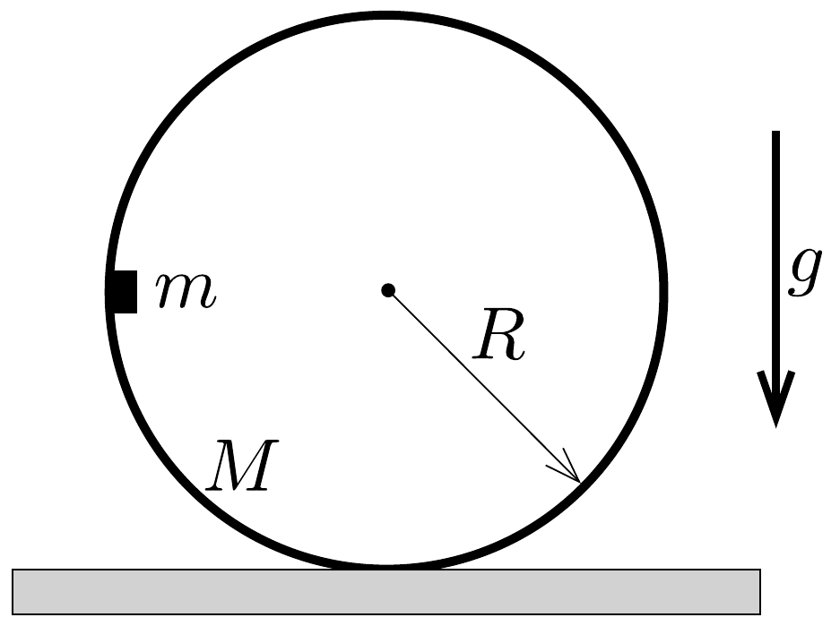
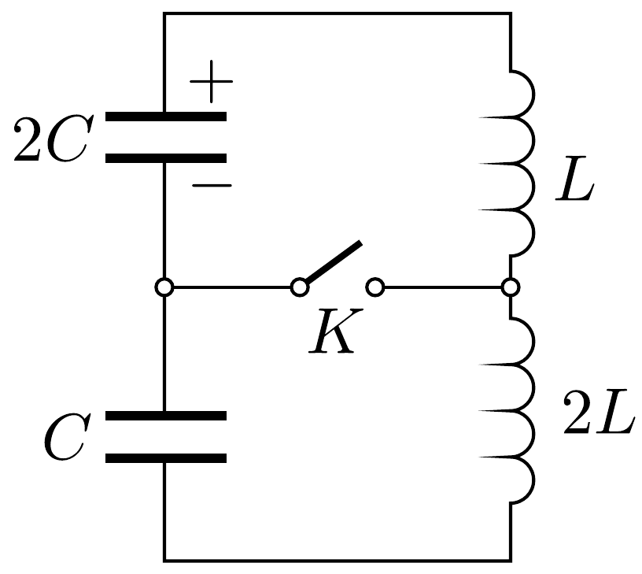

## Feladat 1

Három független feladat

A rész
Egy kicsi, $m$ tömegú testet óvatosan egy $M$ tömegǘ, $R$ sugarú, vékony falú, hengeres csó belső falára helyezünk. Kezdetben a cső nyugalomban van egy vízszintes sík felületen, a kis test pedig $R$ magasságban helyezkedik el a sík fölött, ahogy a 354. ábrán látható.

Határozzuk meg a kis test és a henger között ható erőt abban a pillanatban, amikor a kis test áthalad a pályája legalacsonyabb pontján! Tegyük fel, hogy a kis test és a henger között nincs súrlódás, a henger viszont megcsúszás nélkül mozog a sík felületen. A nehézségi gyorsulás $g$.

B rész
Egy $r=5,00 \mathrm{~cm}$ sugarú szappanbuborékot, melyben kétatomos ideális gáz van és falának vastagsága $h=10,0 \mu \mathrm{~m}$, vákuumba helyezünk. A szappanhártya felületi feszültsége $\sigma=4,00 \cdot 10^{-2} \mathrm{~N} / \mathrm{m}$ és súrúsége $\varrho=1,10 \mathrm{~g} / \mathrm{cm}^{3}$.
1) Vezessük le a buborékban lévő gáz moláris hőkapacitásának kifejezését egy olyan folyamatra, amelyben a gázt olyan lassan melegítjük, hogy a buborék mindvégig egyensúlyban van! Adjuk meg a numerikus eredményt is!
2) Vezessük le és számítsuk ki a buborék sugárirányú rezgésének $\omega$ körfrekvenciáját azt feltételezve, hogy a buborék falának hőkapacitása sokkal nagyobb, mint a buborékban lévő gáz hőkapacitása! Azt is feltételezzük, hogy a buborék belsejében a termikus egyensúly sokkal gyorsabban alakul ki, mint a rezgés periódusideje.

Segítség: Laplace bizonyította, hogy egy görbült határfelület külső és belső oldala között a felületi feszültség következtében nyomáskülönbség van, ami $\Delta p=$ $=2 \sigma / r$.

C rész
Kezdetben a 355. ábrán látható kapcsolásban a $K$ kapcsoló nyitott, a $2 C$ kapacitású kondenzátor töltése $q_{0}$, a $C$ kapacitású kondenzátor töltetlen. Az $L$ és $2 L$ induktivitású tekercseken nem folyik áram. A kondenzátor elkezd kisülni, és abban a pillanatban, amikor a tekercsek árama maximális lesz, a $K$ kapcsolót hirtelen bekapcsoljuk. Határozzuk meg a kapcsolón ezután átfolyó $I_{\max }$ maximális áramerősséget!

