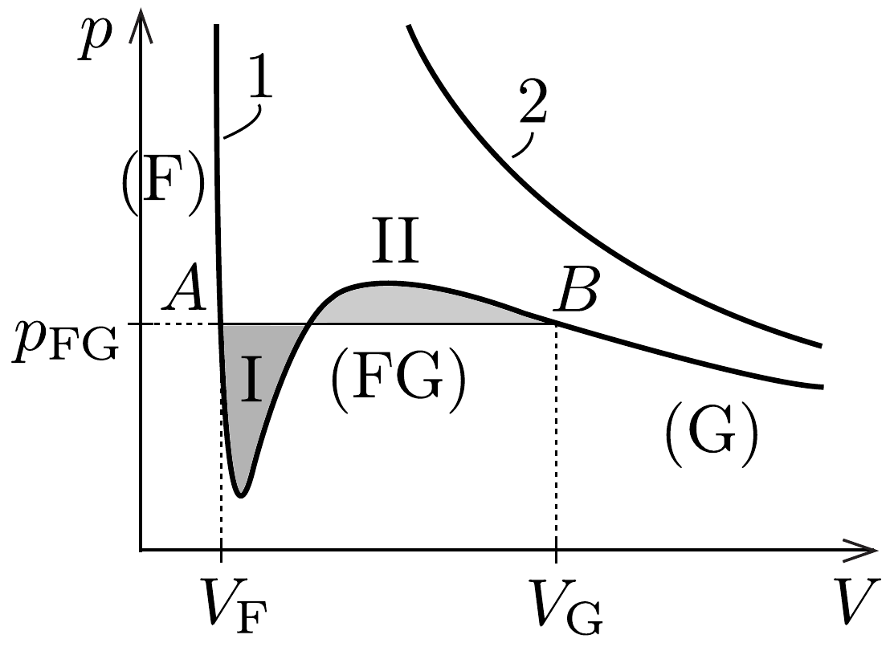
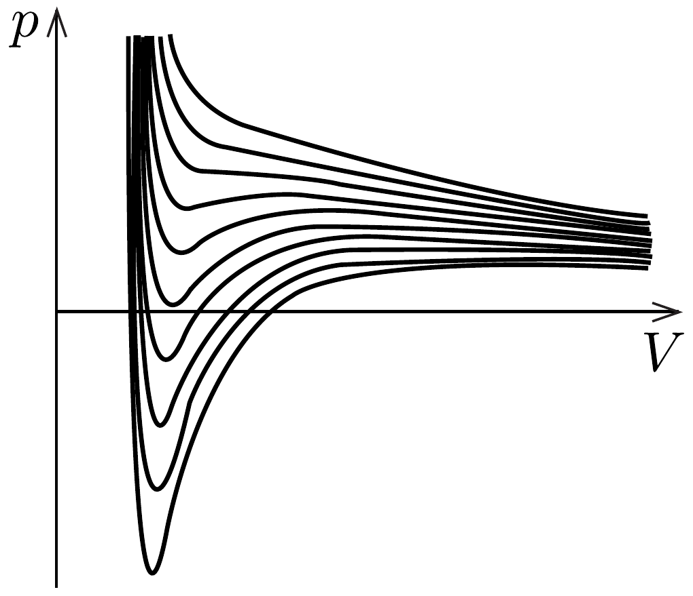
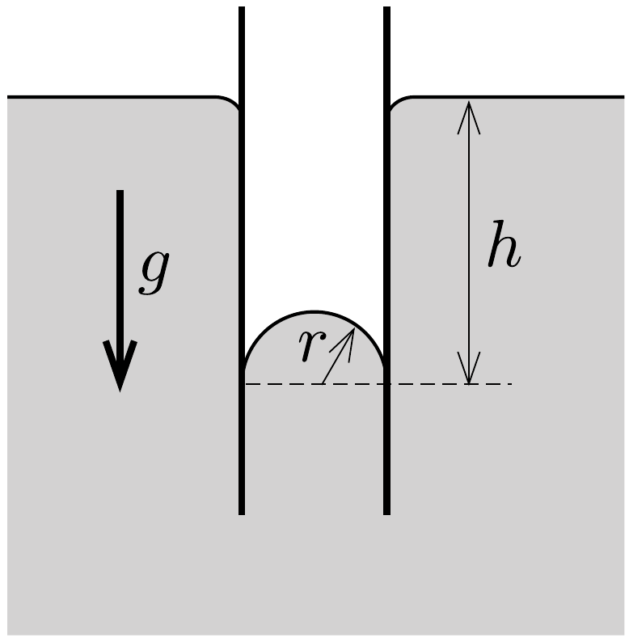

## Feladat 2

A Van der Waals-állapotegyenlet

Az ideális gázok jól ismert állapotegyenlete ugyan kielégíti a Clapeyron-Mengyelejev-törvényt, azonban a következó fontos fizikai hatásokat elhanyagolja. Először, a valódi gázrészecskék mérete nem nulla; másodszor, a részecskék kölcsönhatnak egymással. Ebben a feladatban mindenütt egy mól vizet vizsgálunk.

A rész. Reális gáz állapotegyenlete
A részecskék véges méretének figyelembevételével a gáz állapotegyenlete
\[
p(V-b)=R T,
\]
ahol $p, V, T$ rendre a gáz nyomását, moláris térfogatát és hómérsékletét jelöli, $R$ az univerzális gázállandó, $b$ pedig egy konstans, mellyel bizonyos térfogatot levonunk.
2.A.1. Becsüljük meg a $b$ konstans értékét, és fejezzük ki a molekulák $d$ átmérőjével!

A molekulák közötti vonzó kölcsönhatás figyelembevételére Van der Waals a következó állapotegyenletet javasolta, amely jól leírja a közegeket mind folyadék-, mind gázfázisban:
\[
\left(p+\frac{a}{V^{2}}\right)(V-b)=R T .
\]
Az egyenletben szereplő $a$ egy másik konstans.
Bizonyos $T_{\mathrm{k}}$ kritikus hőmérséklet alatti $T$ hőmérsékletek esetén a (14-1) egyenlet izotermái a 356. ábra 1-es görbéjéhez hasonló, nem monoton függvények. Ezeket Van der Waals-izotermáknak nevezzük. Ugyanezen az ábrán a 2-es görbe az
ideális gáz megfelelő izotermáját mutatja. A valódi izotermák a Van der Waalsizotermáktól abban különböznek, hogy az $A B$ szakaszon a nyomás értéke konstans, melyet $p_{\mathrm{FG}}$ jelöl. A konstans szakasz a $V_{\mathrm{F}}$ és $V_{\mathrm{G}}$ térfogattal jelölt állapotok között helyezkedik el, ahol a két térfogat rendre a folyadék-, illetve a gázfázis móltérfogatát jelöli. A termodinamika második fótételét felhasználva J. Maxwell megmutatta, hogy a $p_{\mathrm{FG}}$ nyomás az az érték, amely mellett az ábrán látható I és II területek megegyeznek.

A hőmérséklet növelésével (357. ábra) az izotermák $A B$ konstans szakasza egyetlen ponttá zsugorodik össze, amikor a hőmérséklet, illetve a nyomás elér egy bizonyos $T_{\mathrm{k}}$, illetve $p_{\mathrm{FG}}=p_{\mathrm{k}}$ értéket. A $p_{\mathrm{k}}$ és $T_{\mathrm{k}}$ értékeket, melyek kísérletileg nagy pontossággal mérhetők, kritikus értékeknek nevezzük.

2.A.2. Fejezzük ki a Van der Waals-egyenletben szereplő $a$ és $b$ paraméter értékét $T_{\mathrm{k}}$ és $p_{\mathrm{k}}$ segítségével!
2.A.3. Víz esetében $T_{\mathrm{k}}=647 \mathrm{~K}$ és $p_{\mathrm{k}}=2,2 \cdot 10^{7} \mathrm{~Pa}$. Adjuk meg víz esetén az $a_{\text {víz }}$ és $b_{\text {víz }}$ paraméterek numerikus értékét!
2.A.4. Becsüljük meg a vízmolekulák $d_{\text {víz }}$ átmérőjét!

B rész. Gáz- és folyadékfázis tulajdonságai
A feladatnak ebben a részében $T=100^{\circ} \mathrm{C}$ hőmérsékletú víz tulajdonságait vizsgáljuk gáz, illetve folyadék fázisban. Jól ismert, hogy ezen a hőmérsékleten
a telített vízgőz nyomása $p_{\mathrm{FG}}=p_{0}=1,0 \cdot 10^{5} \mathrm{~Pa}$, a víz moláris tömege pedig $\mu=1,8 \cdot 10^{-2} \frac{\mathrm{~kg}}{\mathrm{~mol}}$.

Gázfázis
Észszerú feltételezés, hogy gázhalmazállapotban fennáll a $V_{\mathrm{G}} \gg b$ egyenlőtlenség.
2.B.1. Fejezzük ki a $V_{\mathrm{G}}$ térfogatot az $R, T, p_{0}$ és $a$ mennyiségek segítségével!

Az ideális gáz állapotegyenletét használva kicsit más $V_{\mathrm{G} 0}$ móltérfogat adódik, ami jól közelíti a fenti móltérfogatot.
2.B.2. Határozzuk meg a gőz móltérfogatának a molekulák közötti vonzóerő hatására bekövetkező relatív csökkenését, azaz a
\[
\frac{\Delta V_{\mathrm{G}}}{V_{\mathrm{G} 0}}=\frac{V_{\mathrm{G}}-V_{\mathrm{G} 0}}{V_{\mathrm{G} 0}}
\]
mennyiséget!
Ha a rendszer térfogatát $V_{\mathrm{G}}$ alá csökkentjük, akkor a gőz általában elkezd lecsapódni. Azonban ha a gáz igen tiszta, akkor mechanikai szempontból metastabil állapotban is maradhat (ezt túlhútött gőznek nevezzük). A metastabil állapot végső határa a $V_{\mathrm{G}, \text { min }}$ móltérfogat. Állandó hőmérsékleten a túlhütött gőz létezésének a feltétele:
\[
\frac{\Delta p}{\Delta V}<0 .
\]
2.B.3. Adjuk meg egyenlettel, és számoljuk ki numerikusan, hogy a telített vízgőz térfogata legfeljebb hányadrészére csökkenthető túlhútéssel, azaz határozzuk meg a $\frac{V_{\mathrm{G}}}{V_{\mathrm{G}, \text { min }}}$ hányadost!

Folyadékfázis
A víz folyékony halmazállapotában a Van der Waals-állapotegyenlet használatakor észszerú feltételezés, hogy a $p \ll a / V^{2}$ feltétel teljesül.
2.B.4. Fejezzük ki a víz $V_{\mathrm{F}}$ móltérfogatát folyadék-halmazállapotban az $a, b$, $R$ és $T$ mennyiségek segítségével!

Feltételezve, hogy $b R T \ll a$, határozzuk meg a víz következő jellemzőit. Ne lepődjünk meg, ha a kapott értékek némelyike nem egyezik a táblázatokban is megtalálható, jól ismert értékekkel.
2.B.5. Fejezzük ki a víz $\varrho_{\mathrm{F}}$ sűrúségét folyadékfázisban a $\mu, a, b, R$ mennyiségek segítségével, és határozzuk meg a súrúség numerikus értékét is!
2.B.6. Fejezzük ki az
\[
\alpha=\frac{1}{V_{\mathrm{F}}} \frac{\Delta V_{\mathrm{F}}}{\Delta T}
\]
térfogati hőtágulás együtthatót az $a, b, R$ mennyiségekkel, és adjuk meg az együttható numerikus értékét is!
2.B.7. Fejezzük ki a víz (tömegegységre vonatkoztatott) $L$ párolgáshőjét a $\mu$, $a, b, R$ mennyiségek segítségével, és adjuk meg a párolgáshő numerikus értékét!
2.B.8. Egyetlen molekulavastagságú vízréteget vizsgálva becsüljük meg a víz $\sigma$ felületi feszültségét!

C rész. Folyadék-gáz rendszer
A Maxwell-szabály segítségével (a területek egyenlőségét kifejező egyszerú integrálással), a Van der Waals-állapotegyenlet felhasználásával valamint a $B$ részben alkalmazott közelítések figyelembevételével megmutatható, hogy a telített vízgőz $p_{\mathrm{FG}}$ nyomásának a $T$ hőmérséklettől való függése
\[
\ln p_{\mathrm{FG}}=A+\frac{B}{T}
\]
alakú, ahol az $A$ és $B$ konstansok a következőképpen fejezhetők ki az $a$ és $b$ paraméterekkel:
\[
A=\ln \left(\frac{a}{b^{2}}\right)-1, \quad B=-\frac{a}{b R} .
\]
W. Thomson megmutatta, hogy a telített vízgőz nyomása függ a folyadékfelszín görbületétől is. Tekintsünk ugyanis egy folyadékot, mely nem nedvesíti egy kapilláriscső falát (az illeszkedési szög 180°). Ha a kapillárist a folyadékba merítjük, akkor a folyadékszint a felületi feszültség miatt a csőben lejjebb száll (lásd a 358. ábrát).

2.C.1. Fejezzük ki a görbült folyadékfelszín fölötti telített vízgőz nyomásának kicsiny $\Delta p_{\mathrm{T}}$ megváltozását a vízgőz $\varrho_{\mathrm{G}}$ súrúsége, a folyadék $\varrho_{\mathrm{F}}$ sűrúsége, a $\sigma$ felületi feszültség valamint a felszín $r$ görbületi sugara segítségével!

A 2.B.3. részben vizsgált metastabil állapotot sok kísérleti elrendezésben használják, például az elemi részecskék detektálására szolgáló ködkamrában is. A túlhútött állapot természeti jelenségeknél is megfigyelhető, például a hajnali harmatképződésnél. A túlhütött vízgőz folyadékcseppeket formálva csapódik ki. A nagyon kis méretú vízcseppek gyorsan elpárolognak, azonban a kellően nagyok tovább növekedhetnek.
2.C.2. Tegyük fel, hogy este $T_{0}=20{ }^{\circ} \mathrm{C}$ hőmérsékleten a levegőben lévő vízgőz telített, és hajnalra a környezet hómérséklete kismértékben, $\Delta T=5^{\circ} \mathrm{C}$ kal csökken. Feltételezve, hogy a pára nyomása nem változik, becsüljük meg azt a minimális sugarat, amelynél nagyobb vízcseppek mérete növekszik! Használjuk a víz felületi feszültségének irodalmi értékét: $\sigma=7,3 \cdot 10^{-2} \mathrm{~N} / \mathrm{m}$.
