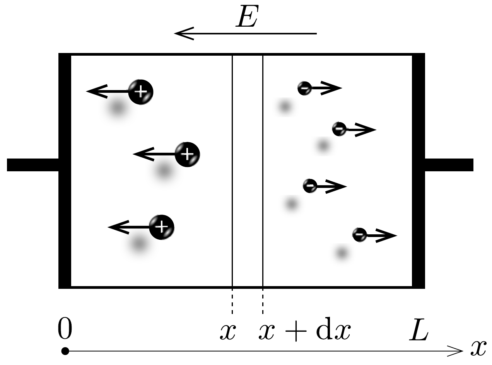

## Feladat 3

A gázkisülés legegyszerübb modellje
Egy gázon átfolyó elektromos áramot gázkisülésnek nevezik. Sokféle gázkisülés van: a fénycsövekben, a hegesztéshez használt ívkisülés, és a villámokból jól ismert szikrakisülések.

\section*{A rész. Nem önfenntartó gázkisülés}

A feladatnak ebben a részében az úgynevezett nem önfenntartó gázkisülést tanulmányozzuk. Ahhoz, hogy folyamatos gázkisülés jöjjön létre, egy külső ionizálóra van szükség, amely térfogat- és időegységenként $Z_{\text {ext }}$ darab, egyszeresen ionizált ionból és szabad elektronból álló párt hoz létre.

Amikor a külső ionizálót bekapcsoljuk, az elektronok és ionok száma nőni kezd. Az elektron- és ionsúrúség határtalan növekedésének a rekombináció szab gátat: ebben a folyamatban egy szabad elektron és egy ion semleges atommá rekombinálódik. A térfogat- és időegységenként lejátszódó rekombinációk $Z_{\text {rek }}$ számát a következő kifejezés adja meg:
\[
Z_{\mathrm{rek}}=r n_{\mathrm{e}} n_{\mathrm{i}},
\]
ahol az $r$ állandó az úgynevezett rekombinációs együttható, és $n_{\mathrm{e}}$, illetve $n_{\mathrm{i}}$ az elektron-, illetve az ionsúrúséget jelenti.

Tegyük fel, hogy a külső ionizálót a $t=0$ pillanatban kapcsoljuk be, és ekkor az elektronok és az ionok kezdeti súrúsége egyaránt nulla. Ezután az elektronok $n_{\mathrm{e}}(t)$ súrúsége a $t$ idő függvényében a következőképp változik:
\[
n_{\mathrm{e}}(t)=n_{0}+a \operatorname{th}(b t),
\]
ahol $a$ és $b$ állandók, th $x$ pedig a tangens hiperbolikusz függvény.
3.A.1. Határozzuk meg és fejezzük ki $n_{0}, a, b$ értékét $Z_{\text {ext }}$ és $r$ függvényében!

Tegyük fel, hogy két külső ionizálónk van. Ha csak az egyiket kapcsoljuk be, az elektronsúrúség a gázban $n_{e 1}=12 \cdot 10^{10} \mathrm{~cm}^{-3}$ egyensúlyi értéket ér el. Ha csak a másikat kapcsoljuk be, akkor viszont az egyensúlyi elektronsűrúség $n_{\mathrm{e} 2}=$ $=16 \cdot 10^{10} \mathrm{~cm}^{-3}$.
3.A.2. Határozzuk meg a gázban kialakuló egyensúlyi $n_{\mathrm{e}}$ elektronsűrúséget, ha egyszerre mindkét külső ionizálót bekapcsoljuk!

A következőkben feltételezzük, hogy a külső ionizáló hosszú ideje be van kapcsolva, a folyamatok stacionáriussá váltak, azaz nem függnek az idốtól. A töltéshordozók által keltett elektromos teret hagyjuk teljesen figyelmen kívül.

Tegyük fel, hogy a gáz egy csőben van két párhuzamos, $A$ területú vezetőlemez között, melyek távolsága egymástól $L \ll \sqrt{A}$. A lemezek közé kapcsolt
$U$ feszültség elektromos teret hoz létre. Tegyük fel, hogy mindkét fajta töltéshordozó súrúsége közel állandó a csőben. Tegyük fel, hogy az elektronok (jelöljük e indexszel) és az ionok (jelöljük i indexszel) is ugyanakkora $v$ rendezett sebességre tesznek szert az $E$ elektromos tér hatására:
\[
v=\beta E,
\]
ahol a $\beta$ állandó neve mobilitás vagy mozgékonyság.
3.A.3. Fejezzük ki a csőben folyó $I$ elektromos áramot $U, \beta, L, A, Z_{\text {ext }}, r$ és az $e$ elemi töltés függvényében!
3.A.4. Határozzuk meg és fejezzük ki a gáz $\varrho_{\text {gáz }}$ fajlagos ellenállását $\beta, L$, $Z_{\text {ext }}, r$ és $e$ függvényében kellően kicsi feszültség esetén!

B rész. Önfenntartó gázkisülés
A feladat ezen részében az önfenntartó gázkisüléssel foglalkozunk, és megmutatjuk, hogyan válik a csőben az áram önfenntartóvá.

A következő részben a külső ionizálás ugyanazzal a $Z_{\text {ext }}$ ionizációs rátával müködik tovább. Hanyagoljuk el a töltéshordozók által keltett elektromos teret, így az elektromos tér homogén a csőben. Ezen kívül a rekombináció is teljesen elhanyagolható.

Az önfenntartó gázkisülésben van két fontos folyamat, amit eddig nem vettünk figyelembe. Az első folyamat a szekunder elektronok kibocsátása, a második pedig az elektronlavinák kialakulása. A szekunderelektron-kibocsátás akkor történik, ha ionok ütköznek a negatív elektródnak (katód), és a kilökött elektronok a pozitív elektród (anód) felé mozognak. Az egységnyi idó alatt kilökött elektronok $\dot{N}_{\mathrm{e}}$ számának és az egységnyi idő alatt a katódba csapódó ionok $\dot{N}_{\mathrm{i}}$ számának aránya a szekunderelektron-kibocsátási együttható:
\[
\gamma=\frac{\dot{N}_{\mathrm{e}}}{\dot{N}_{\mathrm{i}}} .
\]

Az elektronlavinák kialakulását a következőképp magyarázhatjuk. Az elektromos tér felgyorsítja az elektronokat, melyek mozgási energiája elég nagy lesz ahhoz, hogy ütközéskor újabb atomokat ionizáljanak. Ennek következtében jelentősen megnő az anód felé haladó szabad elektronok száma. Ezt a jelenséget az $\alpha$ Townsend-együtthatóval írjuk le, ami megadja az elektronok számának $\mathrm{d} N_{\mathrm{e}}$ növekedését miközben $N_{\mathrm{e}}$ elektron áthalad $\mathrm{d} \ell$ távolságon:
\[
\frac{\mathrm{d} N_{\mathrm{e}}}{\mathrm{~d} \ell}=\alpha N_{\mathrm{e}} .
\]

A teljes $I$ áram a cső bármely keresztmetszetén az $I_{\mathrm{i}}(x)$ ionáramból és az $I_{\mathrm{e}}(x)$ elektronáramból áll, melyek állandósult állapotban függenek a 359, ábrán látható $x$ koordinátától. Az $I_{\mathrm{e}}(x)$ elektronáram az $x$ tengely mentén a következőképp változik:
\[
I_{\mathrm{e}}(x)=C_{1} \mathrm{e}^{A_{1} x}+A_{2},
\]

ahol $A_{1}, A_{2}$ és $C_{1}$ állandók.
3.B.1. Határozzuk meg és fejezzük ki $A_{1}, A_{2}$ értékét $Z_{\text {ext }}, \alpha, e, L$ és $A$ függvényében!

Az $I_{\mathrm{i}}(x)$ ionáram az $x$ tengely mentén a következő kifejezés szerint változik:
\[
I_{\mathrm{i}}(x)=B_{1} e^{B_{2} x}+C_{2},
\]
ahol $B_{1}, B_{2}$ és $C_{2}$ állandók.
3.B.2. Határozzuk meg és fejezzük ki $B_{1}, B_{2}$ értékét $Z_{\text {ext }}, \alpha, e, L, A$ és $C_{1}$ függvényében!
3.B.3. Adjuk meg az $I_{\mathrm{i}}(x)$-re vonatkozó peremfeltételt, ha $x=L$ !
3.B.4. Adjuk meg az $I_{\mathrm{i}}(x)$ és $I_{\mathrm{e}}(x)$-re vonatkozó peremfeltételt, ha $x=0$ !
3.B.5. Határozzuk meg és fejezzük ki az $I$ teljes áram értékét $Z_{\text {ext }}, \alpha, \gamma, e, L$ és $A$ függvényében! Tegyük fel, hogy ez az érték véges marad.

Legyen az $\alpha$ Townsend-együttható állandó. Ha a cső hossza nagyobbá válik, mint egy kritikus érték, azaz $L>L_{\text {krit }}$, a külső ionizálás kikapcsolható, és a kisülés önfenntartóvá válik.
3.B.6. Határozzuk meg és fejezzük ki $L_{\text {krit }}$ értékét $Z_{\text {ext }}, \alpha, \gamma, e, L$ és $A$ függvényében!
