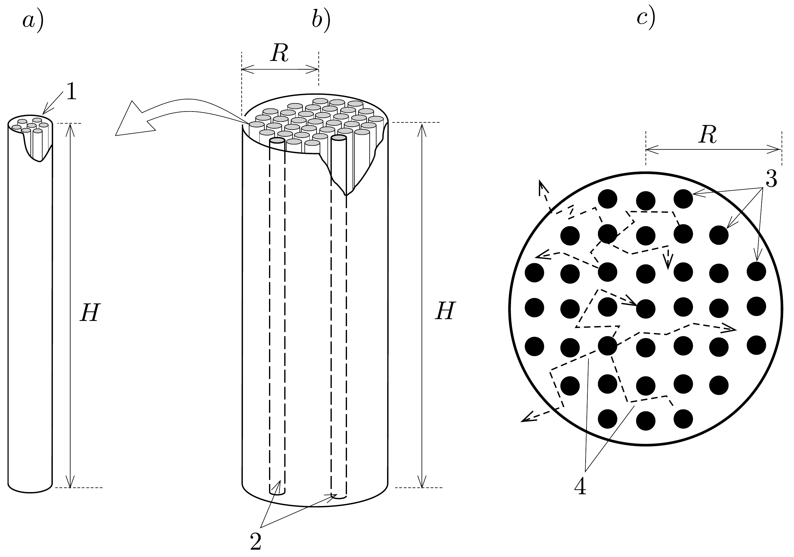
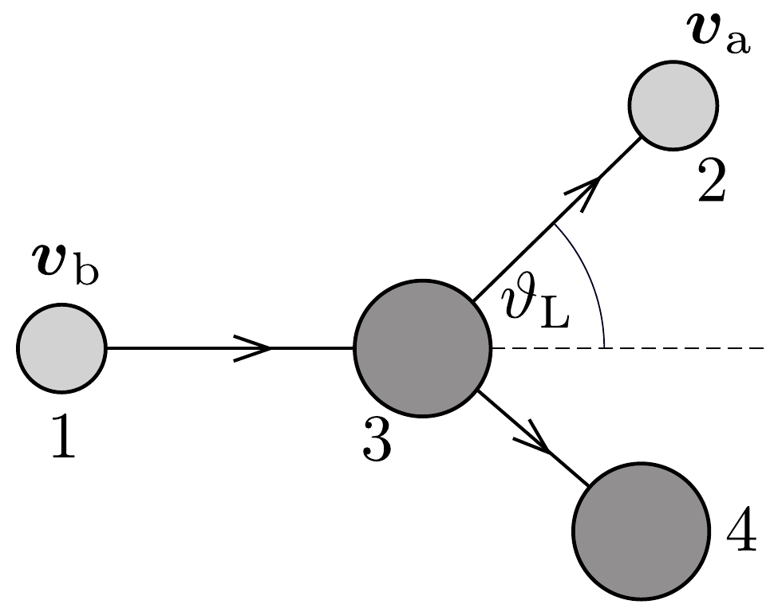

## Feladat 3

Nukleáris reaktor tervezése
Az urán a természetben $\mathrm{UO}_{2}$ formájában fordul elő, és az uránatomoknak csupán 0,720\%-a ${ }^{235} \mathrm{U}$. Neutron hatására a ${ }^{235} \mathrm{U}$ könnyen elhasad, melynek során 2-3, nagy mozgási energiájú hasadványneutron is kibocsátódik. Ennek a hasadásnak a valószínúsége megnő, ha a hasadást kiváltó neutronok mozgási energiája kicsi. Tehát a hasadványneutronok mozgási energiájának csökkentésével a ${ }^{235} \mathrm{U}$ magok
hasadási láncreakciója idézhető elő. Ez képezi az energiatermelő nukleáris reaktor (NR) elvét.

Egy tipikus NR egy $H$ magasságú, $R$ sugarú hengeres tartályból áll, ami az ún. moderátoranyaggal van feltöltve. Ebben tengelyirányban hengeres csövek, az ún. üzemanyag-kazetták helyezkednek el négyzetrácsba rendezve, melyek belsejében $H$ magasságú, szilárd állapotban lévő, természetes $\mathrm{UO}_{2}$ üzemanyagrudak találhatók. A kazettából kilépő hasadványneutronok ütköznek a moderátorral, így energiát veszítenek, hogy aztán a környezó kazettákat a hasításhoz szükséges kicsi energiával érjék el. A 367, ábrán csak a feladat szempontjából releváns alkatrészek láthatók (pl. a szabályozórudak és a hútőközeg nem). Az $a$ ) ábra egy üzemanyag-kazetta nagyított képét (1 - üzemanyagrúd), a $b$ ) az NR képét (2 üzemanyag-kazetta) és a $c$ ) az NR felülnézeti képét (3 - az üzemanyag-kazetták négyzetrácsba rendezve; 4 - tipikus neutronpályák) mutatja. A hasadás miatt az üzemanyagrudakban fejlődő hő a hosszirányban áramló hútőközegnek adódik át. Ebben a feladatban az üzemanyagrudakban ( $A$ rész), a moderátorban ( $B$ rész) és a hengeres geometriájú NR-ben ( $C$ rész) zajló fizikai folyamatokat tanulmányozzuk.

A rész. Az üzemanyagrúd
$\mathrm{UO}_{2}$ adatai: móltömege $M=0,271 \mathrm{~kg} \mathrm{~mol}^{-1}$, súrúsége $\varrho=1,060 \mathrm{~kg} \mathrm{~m}^{-3}$, olvadáspontja $T_{\text {olv }}=3,138 \cdot 10^{3} \mathrm{~K}$, hốvezetési tényező̈je $\lambda=3,280 \mathrm{~W} \mathrm{~m}^{-1} \mathrm{~K}^{-1}$.
3.A.1. Tekintsük a következő hasadási reakciót, melyben egy álló ${ }^{235} \mathrm{U}$ elnyel
egy elhanyagolható mozgási energiájú neutront:
\[
{ }^{235} \mathrm{U}+{ }^{1} \mathrm{n} \rightarrow{ }^{94} \mathrm{Zr}+{ }^{140} \mathrm{Ce}+2{ }^{1} \mathrm{n}+\Delta E .
\]
Becsüljük meg a hasadás során felszabaduló teljes $\Delta E$ energiát MeV-ben! Az atommagtömegek: $m\left({ }^{235} \mathrm{U}\right)=235,044 \mathrm{u}, m\left({ }^{94} \mathrm{Zr}\right)=93,9063 \mathrm{u}, m\left({ }^{140} \mathrm{Ce}\right)=$ $=139,905 \mathrm{u}, m\left({ }^{1} \mathrm{n}\right)=1,00867 \mathrm{u}$ és $1 \mathrm{u}=931,502 \mathrm{MeV} c^{-2}$. A töltés megmaradásával ne foglalkozzunk.
3.A.2. Adjunk becslést a természetes $\mathrm{UO}_{2}$-ban lévó ${ }^{235} \mathrm{U}$ atomok térfogategységre esó $N$ számára!
3.A.3. Tegyük fel, hogy a neutronfluxus-súrúség az üzemanyagban homogén, nagysága $\varphi=2,000 \cdot 10^{18} \mathrm{~m}^{-2} \mathrm{~s}^{-1}$. Egy ${ }^{235} \mathrm{U}$ atommag hasadási hatáskeresztmetszete (a céltárgyatommag effektív keresztmetszete) $\sigma_{\mathrm{f}}=5,400 \cdot 10^{-26} \mathrm{~m}^{2}$. Határozzuk meg az üzemanyagrúdban térfogategységenként fejlődő hő $Q$ keletkezési ütemét $\left(\mathrm{W} / \mathrm{m}^{3}-\right.$ ben $)$, ha a hasadásból származó energia $80,00 \%$-a alakul hővé! $1 \mathrm{MeV}=1,602 \cdot 10^{-13} \mathrm{~J}$.
3.A.4. Az üzemanyagrúd közepének $\left(T_{\mathrm{c}}\right)$ és felületének $\left(T_{\mathrm{s}}\right)$ hőmérséklete közötti különbség állandósult állapotban $T_{\mathrm{c}}-T_{\mathrm{s}}=k F(Q, a, \lambda)$ alakban írható fel, ahol $k=\frac{1}{4}$ egy dimenziótlan állandó, $\lambda$ az $\mathrm{UO}_{2}$ hóvezetési tényezóje, $a$ pedig az üzemanyagrúd sugara. Határozzuk meg $F(Q, a, \lambda)$-t dimenzióanalízissel!
3.A.5. A hútőközeg kívánt hőmérséklete $5,770 \cdot 10^{2} \mathrm{~K}$. Adjunk becslést az üzemanyagrúd $a$ sugarának $a_{\mathrm{u}}$ felső határára!

B rész. A moderátor
Tekintsünk egy kétdimenziós, rugalmas ütközést egy 1 u tömegú neutron és egy $A \cdot$ u tömegú moderátoratom között. Az ütközés előtt mindegyik moderátoratomot tekintsük nyugvónak a laboratóriumi vonatkoztatási rendszerben (LR). Jelölje $\boldsymbol{v}_{\mathrm{b}}$ és $\boldsymbol{v}_{\mathrm{a}}$ a neutron sebességvektorát rendre az ütközés előtt és után az LR-ben. Legyen $\boldsymbol{v}_{\mathrm{m}}$ a tömegközépponti (TK) vonatkoztatási rendszer sebességvektora az LR-hez képest, $\vartheta$ pedig a neutron szóródási szöge a TK-rendszerben. Az ütközésekben résztvevő összes részecske nemrelativisztikus sebességgel mozog.
3.B.1. A 368. ábrán látható az ütközés vázlata az LR-ben, ahol $\vartheta_{\mathrm{L}}$ a szóródási szög. Az ábrán 1 - a neutron az ütközés előtt, 2 - a neutron az ütközés után, 3 - moderátoratom az ütközés előtt, 4 - moderátoratom az ütközés után.

Vázoljuk fel az ütközést a TK rendszerében! Tüntessük fel a részecskék sebességvektorát az 1-es, 2-es és 3-as állapotokban $\boldsymbol{v}_{\mathrm{b}}, \boldsymbol{v}_{\mathrm{a}}$ és $\boldsymbol{v}_{\mathrm{m}}$ segítségével! Jelöljük be a $\vartheta$ szóródási szöget is!
3.B.2. Adjuk meg a neutron $v$, illetve a moderátoratom $V$ ütközés utáni sebességét a TK-rendszerben $A$ és $v_{b}$ segítségével!
3.B.3. Fejezzük ki a $G(\alpha, \vartheta)=E_{\mathrm{a}} / E_{\mathrm{b}}$ mennyiséget, ahol $E_{\mathrm{b}}$ és $E_{\mathrm{a}}$ a neutron LR-beli mozgási energiája rendre az ütközés előtt és után, valamint
\[
\alpha \equiv\left(\frac{A-1}{A+1}\right)^{2}!
\]

3.B.4. Tegyük fel, hogy az előző kifejezés érvényes $\mathrm{D}_{2} \mathrm{O}$ molekulára is. Számítsuk ki a neutron lehetséges legnagyobb relatív energiaveszteségét, azaz az $f_{\mathrm{v}} \equiv \frac{E_{\mathrm{b}}-E_{a}}{E_{\mathrm{b}}}$ mennyiséget, $\mathrm{D}_{2} \mathrm{O}(20 \mathrm{u})$ moderátor esetén.

C rész. A nukleáris reaktor
Ahhoz, hogy az NR-t állandó $\psi$ neutronfluxussal múködtessük (állandósult állapot), az elszökő neutronokat a reaktorban keletkező többletneutronoknak pótolniuk kell. Egy hengeres geometriájú reaktornál a neutronok szökési üteme $k_{1}\left[(2,405 / R)^{2}+(\pi / H)^{2}\right] \psi$, a többletneutronok keletkezési üteme pedig $k_{2} \psi$. A $k_{1}$ és $k_{2}$ állandók az NR anyagi tulajdonságaitól függenek.
3.C.1. Tekintsünk egy NR-t, melyre $k_{1}=1,021 \cdot 10^{-2} \mathrm{~m}$ és $k_{2}=8,787 \times$ $\times 10^{-3} \mathrm{~m}^{-1}$. Figyelembe véve, hogy adott térfogat mellett szeretnénk minimalizálni a szökési ütemet a hatékony üzemelés érdekében, határozzuk meg az NR méreteit állandósult állapotban!
3.C.2. Az üzemanyag-kazetták négyzetrácsba vannak rendezve (367c) ábra), a legközelebbi szomszédok közötti távolság 0,286 m. Az üzemanyag-kazetták effektív sugara (mintha tömörek lennének) $3,617 \cdot 10^{-2} \mathrm{~m}$. Becsüljük meg az üzemanyag-kazetták $F_{n}$ számát a reaktorban, valamint az NR állandósult állapotban történó üzemeltetéséhez szükséges $\mathrm{UO}_{2}$ anyag $M$ tömegét!
