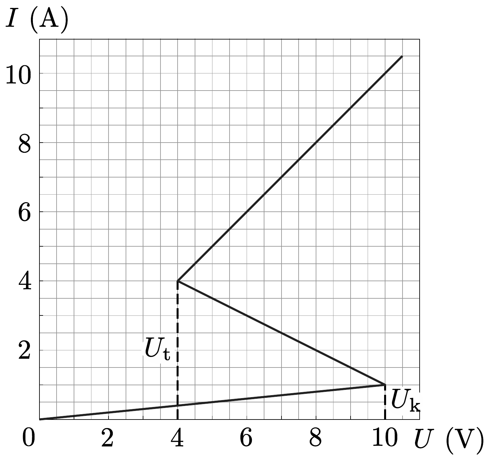
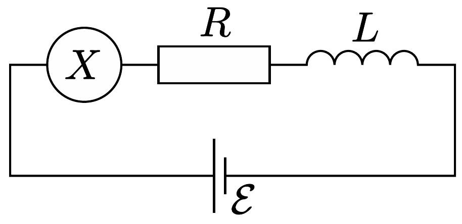
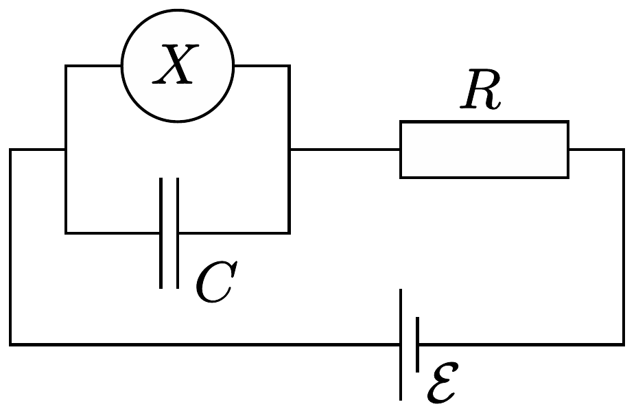
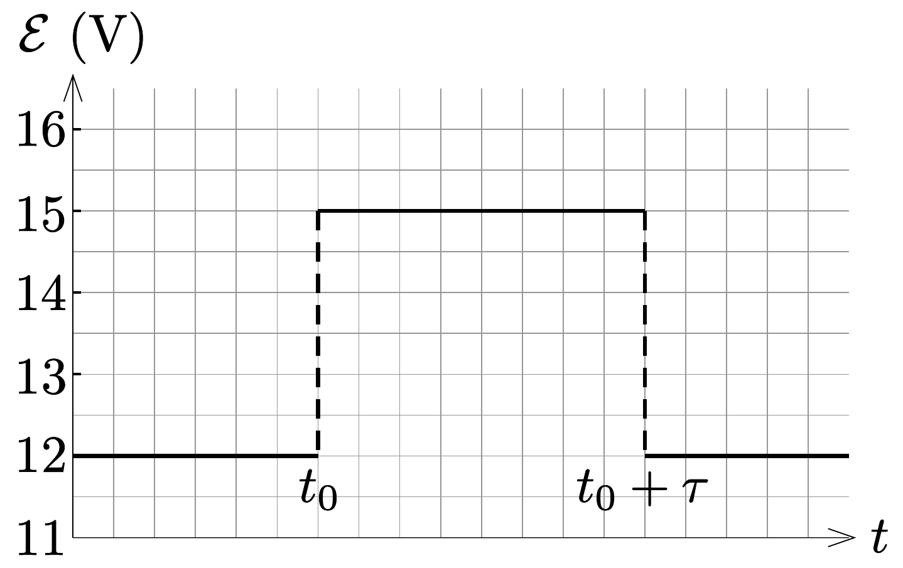

## Feladat 2

Nemlineáris dinamika elektromos áramkörökben

Bevezetés
Bistabil, nemlineáris félvezetó áramköri elemeket (pl. tirisztorokat) széles körben alkalmaznak az elektronikában kapcsolóként és elektromágneses rezgések előállításához. A tirisztorok alkalmazásának elsődleges területe a váltóáram szabályozása a teljesítményelektronikában, például amikor megawattos nagyságrendben kell váltóáramot egyenirányítani. A bistabil elemek önszabályozó jelenségek modelljeként is szolgálhatnak a fizikában (ezzel foglalkozik a feladat $B$ része), a biológiában (lásd a $C$ részt) és a modern tudomány más, nemlineáris jelenségekkel foglalkozó területein.

Célkitűzések
Instabilitások és nemtriviális dinamika tanulmányozása nemlineáris $I-U$ karakterisztikájú elemeket tartalmazó áramkörökben. Megmutatni ezen áramkörök felhasználási lehetőśégeit a mérnöki gyakorlatban és a biológiai rendszerek modelezésben.
A. rész. Stacionárius állapotok és instabilitások

A 378. ábra egy nemlineáris $X$ áramköri elem úgynevezett $S$-alakú $I-U$ karakterisztikáját mutatja. Az $U_{\mathrm{t}}=4,00 \mathrm{~V}$ (tartófeszültség) és a $U_{\mathrm{k}}=10,0 \mathrm{~V}$ (küszöbfeszültség) közötti feszültségtartományban az $I-U$ karakterisztika többértékú. Az egyszerúség kedvéért a 378. ábrán látható grafikon szakaszonként lineá-

ris (minden ág egy egyenes szakasz), továbbá a felső ág meghosszabbítása átmegy az origón. Ez a közelítés jól leír egy valódi tirisztort.

2.A.1. A grafikon alapján határozzuk meg az $X$ áramköri elem $R_{\mathrm{be}}$ és $R_{\mathrm{ki}}$ ellenállását az $I-U$ karakterisztika felső, illetve alsó ágában! A középső ágat a következő egyenlet írja le:
\[
I=I_{0}-\frac{U}{R_{\mathrm{k}}} .
\]

Határozzuk meg az $I_{0}$ és $R_{\mathrm{k}}$ paraméterek értékét!
Az $X$ áramköri elem sorba van kötve egy $R$ ellenállással, egy $L$ induktivitással és egy $\mathcal{E}$ ideális feszültségforrással (lásd a 379. ábrát). Az áramkört stacionárius állapotban lévőnek nevezzük, ha az áramerősség $I(t)=$ állandó.

2.A.2. Hány stacionárius állapota lehet a 379, ábrán látható áramkörnek, ha $\mathcal{E}$ egy rögzített érték és $R=3,00 \Omega$ ? Hogyan módosul a válasz, ha $R=1,00 \Omega$ ?
2.A.3. Legyen a 379, ábrán látható áramkörben $R=3,00 \Omega, L=1,00 \mu \mathrm{H}$ és $\mathcal{E}=15,0 \mathrm{~V}$. Határozzuk meg az $X$ áramköri elem $I_{\mathrm{st}}$ áramának és $U_{\mathrm{st}}$ feszültségének értékét a stacionárius állapotban!

A 379 ábrán látható áramkör stacionáris állapotban van, ahol $I(t)=I_{\mathrm{st}}$. Ezt a stacionárius állapotot stabilnak nevezzük, ha az áramerősség egy kis változtatás (növelés vagy csökkentés) után visszatér a stacionárius állapotba. Ha viszont a rendszer egyre jobban eltávolodik a stacionárius állapottól, akkor ezt az állapotot instabilnak nevezzük.
2.A.4. Használjuk a 2.A.3. kérdésben szereplő numerikus értékeket, és tanulmányozzuk az $I(t)=I_{\mathrm{st}}$ áramú stacionárius állapot stabilitását! Stabil vagy instabil ez az állapot?
B. rész. Bistabil, nemlineáris áramköri elemek a fizikában: rádióadó

Most egy új áramköri elrendezést vizsgálunk (lásd a 380, ábrát). Ez alkalom-

mal az $X$ nemlineáris áramköri elem párhuzamosan van kötve egy $C=1,00 \mu \mathrm{~F}$ kapacitású kondenzátorral. Ezt aztán sorbakötjük egy $R=3,00 \Omega$ ellenállású ellenállással és egy $\mathcal{E}=15,0 \mathrm{~V}$ állandó feszültségú, ideális feszültségforrással. Kiderül, hogy az áramkör rezgéseket végez, azaz az $X$ nemlineáris áramköri elem az $I-U$ karakterisztika egyik ágáról a másikra ugrik egy ciklus során.
2.B.1. Rajzoljuk le a rezgési ciklust az $I-U$ grafikonon, és adjuk meg az irányát is (óramutató járásával megegyező vagy azzal ellentétes)! Indokoljuk a választ egyenletekkel és vázlatokkal.
2.B.2. Vezessünk le kifejezéseket azon $t_{1}$ és $t_{2}$ időtartamokra, amelyeket a rendszer az $I-U$ grafikon egyes ágain tölt a rezgési ciklus során! Számítsuk ki ezek numerikus értékét is! Határozzuk meg a rezgés $T$ periódusidejét is, feltételezve, hogy az az idő, ami az $I-U$ grafikon egyik ágáról a másik ágára való átugráshoz szükséges, elhanyagolható!
2.B.3. Becsüljük meg a nemlineáris elemen az egy ciklus alatt disszipálódó, átlagos $P$ teljesítményt! Elég a nagyságrendet meghatározni.

A 380, ábrán látható áramkört egy rádióadóhoz használjuk. Az $X$ áramköri elemet egy $s$ hosszúságú, lineáris antenna (egy hosszú, egyenes vezeték) egyik végéhez csatlakoztatjuk, a vezeték másik vége szabad. Az antennában egy elektromágneses állóhullám alakul ki. Az elektromágneses hullám sebessége az antenna mentén ugyanakkora, mint vákuumban. Az adó a rendszer alapharmonikusát használja, melynek periódusideje a 2.B.2. részben meghatározott $T$.
2.B.4. Mi az $s$ hosszúság optimális értéke feltéve, hogy nem haladhatja meg az 1 km-t?
C. rész. Bistabil, nemlineáris áramköri elemek a biológiában: neurisztor

A feladat ezen részében a bistabil, nemlineáris áramköri elemet egy biológiai folyamat modelljeként vizsgáljuk. Egy neuron az emberi agyban a következő tulajdonsággal rendelkezik: ha egy külső jel ingerli, akkor egyetlen rezgést végez, majd visszatér az eredeti állapotába. Ezt a tulajdonságot ingerelhetőségnek nevezzük. Ennek a tulajdonságnak köszönhetően impulzusok haladhatnak végig az idegrendszert alkotó, csatolt neuronok hálózatán. Azt a félvezető csipet, amelyet az ingerelhetőség és a jelterjedés utánzására készítenek, neurisztornak nevezik (a neuron és a tranzisztor szavakból).

Megkísérlünk egy egyszerú neurisztort egy olyan áramkörrel modellezni, mely tartalmazza az eddig vizsgált $X$ nemlineáris elemet. Ezért a 380, ábrán látható áramkörben az $\mathcal{E}$ feszültséget lecsökkentjük $\mathcal{E}^{\prime}=12,0$ V-ra. A rezgések megszünnek, és a rendszer eléri stacionárius állapotát. Aztán a feszültséget hirtelen újra $\mathcal{E}=15,0$ V-ra növeljük, majd $\tau$ időtartam után (ahol $\tau<T$ ) ismét $\mathcal{E}^{\prime}$ értékre állítjuk (lásd a 381. ábrát). Kiderül, hogy van egy bizonyos kritikus $\tau_{\mathrm{k}}$ érték, és a rendszer minőségileg más viselkedést mutat, ha $\tau<\tau_{\mathrm{k}}$, illetve ha $\tau>\tau_{\mathrm{k}}$.
2.C.1. Vázoljuk fel az $X$ áramköri elemen folyó $I_{X}(t)$ áramerősséget az idő függvényében ha $\tau<\tau_{\mathrm{k}}$, illetve ha $\tau>\tau_{\mathrm{k}}$ !
2.C.2. Fejezzük ki paraméteresen és határozzuk meg numerikusan is, hogy mekkora az a $\tau_{\mathrm{k}}$ kritikus idő, ahol a viselkedés megváltozik!
2.C.3. Neurisztor-e az áramkör $\tau=1,00 \cdot 10^{-6}$ s érték esetén?
