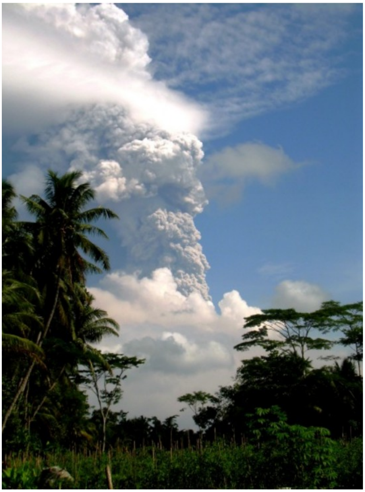
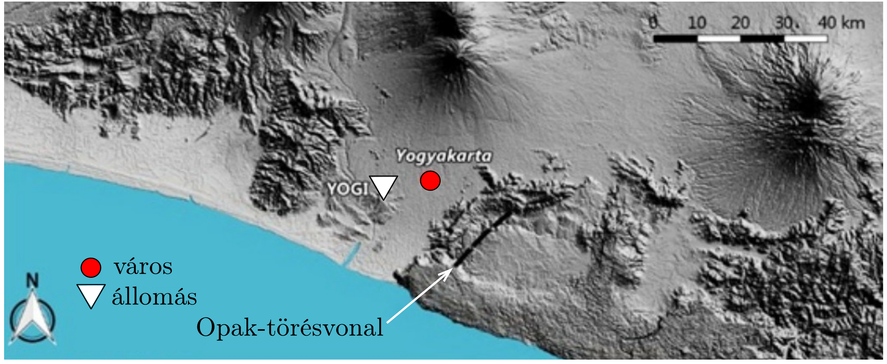
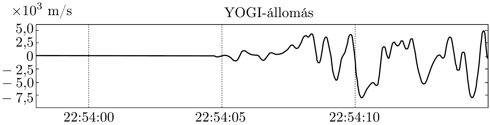
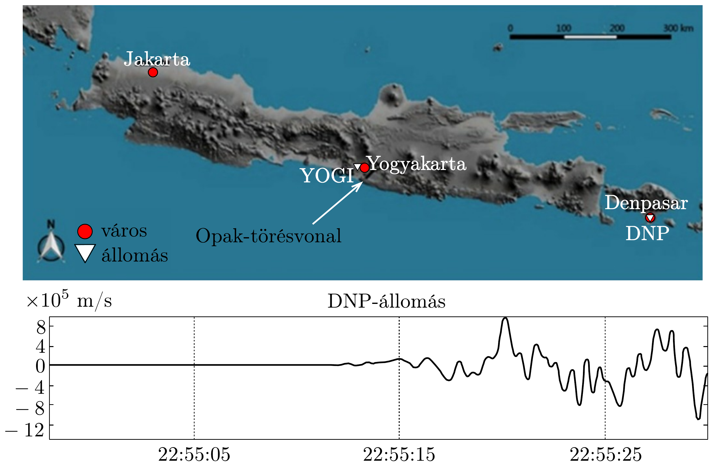
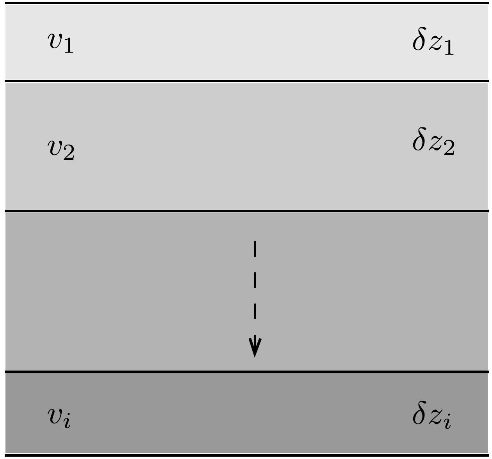
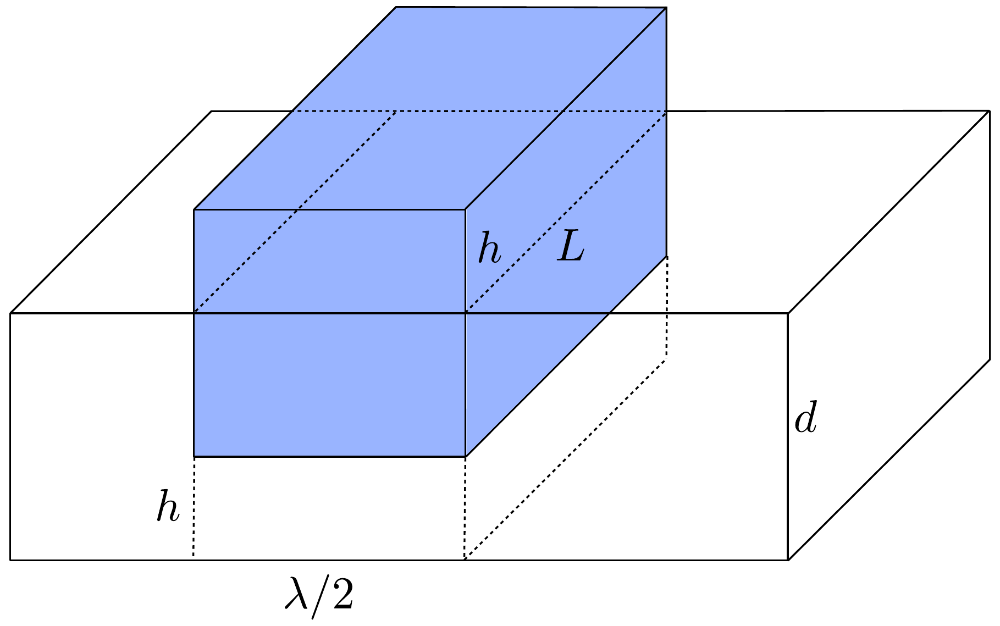

## Feladat 2

Földrengés, vulkán és cunami

Indonézia a természeti veszélyforrások tárháza. Szinte minden veszélyforrás megtalálható, így a vulkánkitörés, földrengés és cunami is.

\section*{A rész. Merapi vulkánkitörés}

A yogyakartai Merapi vulkán az egyik legaktívabb vulkán Jáván. A vulkánok jól ismert kitörési módja a piroklasztikus ár, amely a vulkánból kiáramló gáz és szikla forró keveréke. 2010. október 26-án a Merapi megmutatta robbanásos jellegét, amikor 12 km magasra érő vulkáni hamufelhő̂t hozott létre (393. ábra), és a keletkező piroklasztikus ár miatt 20000 embert kellett kitelepíteni.

Nézzük meg a Merapi legnagyobb, 2010-es kitörésének okait. Geofizikusok körében közismert, hogy a kívülről a magmába folyó víznek fontos szerepe van a vulkáni kitörések robbanásos jellegében (hidromagmatikus kitörés). Tekintsük a vulkánt egy olyan rendszernek, amely magmarészecskékből és vízből áll. A vulkán szellőzőrendszere és az atmoszféra a rendszer határai. A robbanásos kitörés két lépésben történik: (1) pillanatszerú magma-víz kölcsönhatás, (2) a rendszer kitágulása. Az első lépésben az $m_{\mathrm{m}}$ tömegú és $T_{\mathrm{m}}$ abszolút hőmérsékletú magma összekeveredik $m_{\mathrm{w}}$ tömegú és $T_{\mathrm{w}}$ hőmérsékletú vízzel. A termikus egyensúlyt szinte azonnal eléri a rendszer. Ezt a kölcsönhatást közel állandó térfogatúnak tekinthetjük. A víz elpárolgásához és a magma megolvadásához tartozó latens hőket elhanyagolhatjuk.
2.A.1. Határozzuk meg az első lépésben kialakuló egyensúlyi hőmérsékletet a hőmérsékletek, tömegek, valamint a víz $c_{\mathrm{w}}$ és a magma $c_{\mathrm{m}}$ fajhőjének függvényében!
2.A.2. Határozzuk meg az egyensúlyi nyomást az első lépésben feltételezve, hogy a keverék ideális gáznak tekinthető! Tegyük fel, hogy a keverék móltérfogata $v_{\mathrm{e}}$.

A rendszer kitágulása (a második lépés) különböző módokon lehetséges; ezek egyike a termikus robbanás. Bár egy ilyen folyamat nagyon bonyolult, a kilökött keverék relatív sebességét kísérletileg meg tudjuk határozni. A kitörés közben a gáz sebessége függ a $p$ nyomástól, valamint a vulkán kürtőjében lévő keverék teljes $m$ tömegétől és $V$ térfogatától.
2.A.3. Fejezzük ki a kitörő gáz sebességét $p, m$ és $V$ segítségével egy $\kappa$ arányossági tényező erejéig!

A megfigyelt nyomások 100 MPa nagyságrendúek, így a kitörés (relatív) sebessége elérheti a ballisztikus sebességtartományt.

B rész. A yogyakartai földrengés
A 2006-os yogyakartai földrengés, amely $M_{\mathrm{w}}=6,4$ magnitúdós volt és sok épületet összedöntött Bantul és Yogyakarta területén, helyi idő szerint 05:54:00.00kor, UTC (világidő) szerint 22:54:00.00-kor történt. A földrengést egy hirtelen elmozdulás okozta az Opak-törésvonal mentén (lásd a 394. ábra teteje). A hipocentrum 15 km mélyen volt a felszín alatt.

A földkéregben terjedő szeizmikus hullámot szeizmográffal lehet detektálni. A szeizmográf által mért diagram a szeizmogram (394. és 395. ábra alja).

A szeizmogramok a függőleges talajsebességet ábrázolják az idő függvényében. A 394. ábrán látható a Gamping Station Yogyakarta (YOGI) szeizmikus állomáson, a 395, ábrán látható pedig a Denpasar, Bali (DNP) állomáson került rögzítésre. Általában a szeizmikus hullámok három összetevőből állnak: a longitudinális vagy elsớdleges (P-hullám), a transzverzális vagy másodlagos (S-hullám) és a felületi hullám. A P- és S-hullám a felszín alatt, míg a felületi hullám a Föld felszínén terjed. Azok a szeizmikus hullámok, amelyek a felszín alatt terjedve érik el a megfigylőállomást, feloszthatók egyenes vonalban terjedőkre, a rétegek határáról visszaverődőkre és azokra, melyek a réteghatáron megtörve átjutnak a következő rétegbe is. A longitudinális vagy elsődleges hullámok terjednek a legnagyobb sebességgel, míg a felszíni hullámok a leglassabbak, sebességük a P-hullámok sebességének kb. 60\%-a.

Az epicentrum (a hipocentrum vetülete a Föld felszínén) és az egyes megfigyelőállomások távolságai: YOGI 22,5 km, DNP 500 km. A földkéreg vastagsága Jáván 30 km. A földkérgen belül a földköpeny található. Mint minden más hullám a szeizmikusok is teljesítik a Snellius-Descartes-törvényt. A szeizmikus hullám vissza is verődhet a köpeny határáról. Ebben a feladatban elhanyagoljuk a Föld görbületét.
2.B.1. A 394. ábra a YOGI-állomáson készült szeizmogramot mutatja. Az adatok segítségével határozzuk meg a P-hullámok sebességét a földkéregben!
2.B.2. Határozzuk meg a yogyakartai földrengés által keltett direkt és vissza-
vert P-hullámok terjedési idejét a denpasari DNP-állomásig!
Feltételezve, hogy a Föld csak két rétegből, a kéregből és a köpenyből áll, az elsődleges hullám különböző sebességgel terjed a kéregben és a köpenyben. A köpenyben nagyobb a sebesség, mint a kéregben. Vegyük figyelembe, hogy azok a P-hullámok, amelyek törési szöge a köpenybe érkezve derékszög, azok a kéregköpeny határfelületen terjedve mindenhol részlegesen megtörnek és visszalépnek a kéregbe.
2.B.3. Határozzuk meg a P-hullámok sebességét a köpenyben!

A Föld szerkezetének realisztikusabb modelljében a kéreg felosztható egy sor vékony rétegre (396, ábra). A szeizmikus hullám sebessége a $z$ mélység függvénye a $v(z)=v_{0}+a z$ összefüggésnek megfelelően, ahol $a$ egy állandó. A hipocentrumról pedig feltételezzük, hogy a felszínen van. Ebben a modellben a hullám görbült pályán terjed.

2.B.4. Definiáljunk egy $p=\sin \vartheta(z) / v(z)$ hullámparamétert, ahol $\vartheta(z)$ a hullám terjedési iránya és a beesési merőleges által bezárt szög. Tegyük fel, hogy egy $p$ hullámparaméterú szeizmikus hullám érkezik egy megfigyelőállomásra. Fejezzük ki az epicentrum távolságát a $p, v_{0}$ és $a$ paraméterek segítségével! Tegyük fel, hogy a hipocentrum nagyon közel van a felszínhez.
2.B.5. Írjuk fel a $T$ terjedési időt a hipocentrumból valamely állomásig egy $z$ szerinti integrál formájában!

A Föld egy sor homogén rétegből áll, a sebesség az egyes rétegekben $v_{i}$, az egyes rétegek vastagsága $\delta z_{i}$.
2.B.6. Az előző feladat eredménye alapján számítsuk ki közelítőleg a $T$ terjedési idốt a hipocentrumtól a DNP-állomásig feltételezve, hogy a kéreg csak három rétegből áll $(i=1,2,3)$, amelyekben $v_{1}=6,65 \mathrm{~km} / \mathrm{s}, v_{2}=6,97 \mathrm{~m} / \mathrm{s}$, $v_{3}=6,99 \mathrm{~km} / \mathrm{s}, p=0,143 \mathrm{~s} / \mathrm{km}, \delta z_{1}=6,0 \mathrm{~km}, \delta z_{2}=9,0 \mathrm{~km}$ és $\delta z_{3}=15,0 \mathrm{~km}!$

\section*{C rész. Jáva-cunami}

A 2006-os Pangandaran-földrengés és cunami július 17-én helyi idő szerint 15:19:27-kor történt Jáva nyugati és középső partjai előtt. Az olyan földrengés során, amikor az epicentrumnál lévő törésvonal az óceán mélyén van, a törésvonal elmozdulása hatalmas vízhullámokat okozhat. Ezt nevezzük cunaminak. Más szavakkal a cunami egy sekély vizú hullám, amely nagyon kis amplitúdóval, viszont extrém nagy hullámhosszal indul. Vizsgáljunk egy olyan esetet, emikor egy törésvonal hirtelen elmozdul és ez megemeli az óceánfeneket, ahogy a 397. ábrán látszik ( $d$ az óceán mélysége). Tegyük fel, hogy a földrengés energiája átalakul ennek a megemelt óceánvíz helyzeti energiává. Az egyszerú modellünkben a megemelt vizet egy $\lambda L / 2$ alapterületú és $h$ magasságú téglatesttel közelítjük, ahol $L \gg \lambda$.

2.C.1. Határozzuk meg a földrengés következtében megemelt óceánvízben tárolt helyzeti energiát az óceán felszínéhez viszonyítva! A tengervíz sűrúsége $\varrho$.
2.C.2. Határozzuk meg a cunamihullám sebességét egy dimenziótlan faktor erejéig!
2.C.3. Energetikai megfontolásokkal határozzuk meg a cunamihullám amplitúdóját a mélység függvényében! Tegyük fel, hogy a mélység lassan változik, valamint hogy $d_{0}$ mélységnél az amplitúdó $A_{0}$.
