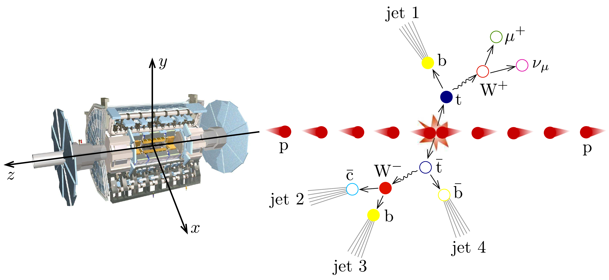
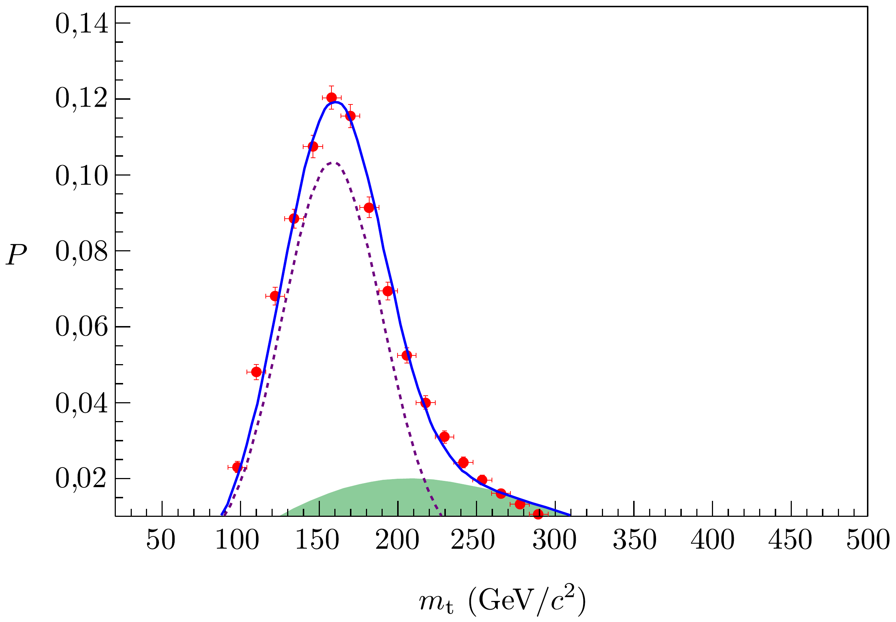

## Feladat 2

Hol van a neutrínó?
Ha két, nagy energiájú proton ütközik a Nagy Hadron Ütköztetőben (Large Hadron Collider, LHC), sokféle részecske keletkezhet, olyanok, mint elektronok, müonok, neutrínók, kvarkok, valamint ezek antirészecskéi. A részecskék legtöbbje detektálható az ütközést körülvevő detektorok segítségével. Például a kvarkok átesnek egy úgynevezett hadronizációs folyamaton, melynek hatására szubatomikus részecskezápor jön létre, amely részecskezáporokat jeteknek nevezünk. A detektorokban található nagy mágneses tér alkalmas továbbá arra, hogy még az igen nagy energiájú töltött részecskéket is eltérítse annyira, hogy azok impulzusa meghatározható legyen. Az ATLAS detektorban szupravezetó szolenoidtekercseket használnak arra, hogy időben állandó, homogén 2,00 T indukciójú mágneses teret hozzanak létre az ütközési zóna körül. Azok a töltött részecskék, amelyeknek az impulzusa egy bizonyos érték alatt van, olyan mértékben eltérülnek, hogy pályájuk önmagába záródik, aminek hatására azokat nem detektáljuk. A neutrínókat pedig egyáltalán nem tudjuk detektálni, mert természetükből adódóan úgy haladnak át a detektoron, hogy azzal nem lépnek kölcsönhatásba.

Adatok: elektron nyugalmi tömege: $m=9,11 \cdot 10^{-31} \mathrm{~kg}$; elemi töltés nagysága: $e=1,60 \cdot 10^{-19} \mathrm{C}$; fénysebesség: $c=3,00 \cdot 10^{8} \mathrm{~ms}^{-1}$; a vákuum dielektromos állandója: $\varepsilon_{0}=8,85 \cdot 10^{-12} \mathrm{Fm}^{-1}$.

\section*{A rész. Az ATLAS detektor fizikája}
2.A.1. Vezessük le az $r$ ciklotronsugarat megadó összefüggést egy olyan körpályán keringő elektron esetén, amely csak a mágneses térrel hat kölcsön! A mágneses indukció vektora merőleges a részecske sebességére. Fejezzük ki a sugarat a $K$ kinetikus energia, az $e$ töltés, az $m$ tömeg és a $B$ mágneses indukció függvényében! Feltételezzük, hogy az elektron egy nemrelativisztikus, klasszikus részecske.

Az ATLAS detektorban keletkező elektronokat relativisztikus megközelítésben kell tárgyalni. A ciklotronsugárra levezetett összefüggésünk mégis alkalmas a relativisztikus mozgás tárgyalására, ha relativisztikus impulzust alkalmazunk.
2.A.2. Számítsuk ki a keletkező elektron minimális impulzusát, amely ahhoz szükséges, hogy elhagyja a detektort, feltételezve, hogy a részecske sugárirányban indult! A detektor belseje henger alakú, melynek sugara 1,1 méter. Az elektron a részecskeütközés során keletkezik a henger középpontjában. Az eredményt $\mathrm{MeV} / c$ egységben fejezzük ki.

Ha egy $m$ nyugalmi tömegú, $e$ töltésú, relativisztikus részecske a sebességére merőleges irányban gyorsul, elektromágneses sugárzást bocsájt ki, melyet szinkrotronsugárzásnak nevezünk. A kisugárzott teljesítményt az alábbi összefüggés adja meg:
\[
P=\frac{e^{2} a^{2} \gamma^{4}}{6 \pi \varepsilon_{0} c^{3}},
\]
ahol $a$ gyorsulás és $\gamma=\left[1-(v / c)^{2}\right]^{-1 / 2}$.
2.A.3. Egy részecskét ultrarelativisztikusnak nevezünk, ha a sebessége igen közel van a fénysebességhez. Egy ultrarelativisztikus részecske által kibocsájtott teljesítmény kifejezhető az alábbi formában:
\[
P=\xi \frac{e^{4}}{\varepsilon_{0} m^{k} c^{n}} E^{2} B^{2},
\]
ahol $\xi$ egy valós szám, $n, k$ egész számok, $E$ a töltött részecske energiája, $B$ pedig a mágneses indukció értéke. Határozzuk meg $\xi$-t, $n$-et és $k$-t!
2.A.4. Ultrarelativisztikus közelítésben az elektron energiáját az alábbi összefüggés adja meg az idő függvényében:
\[
E(t)=\frac{E_{0}}{1+\alpha E_{0} t},
\]
ahol $E_{0}$ az elektron kezdeti energiája. Határozzuk meg az $\alpha$ paramétert $e, c, B$, $\epsilon_{0}$ és $m$ függvényében!
2.A.5. Tekintsünk egy elektront, mely az ütközési pontban keletkezik és sugárirányban indul el. Kezdeti energiája 100 GeV. Becsüljük meg, mennyi energiát veszít az elektron a szinkrotronsugárzás következtében, amíg kilép a detektor belsejéből! Az eredményt MeV egységben fejezzük ki.
2.A.6. Határozzuk meg a keringő elektron ciklotronfrekvenciáját az idő függvényében ultrarelativisztikus közelítésben!

\section*{B rész. A neutrínó megtalálása}

A 406. ábrán látható, ahogy két proton ütközése során keletkezik egy t-kvark (top) és egy $\overline{\mathrm{t}}$-antikvark (anti top), melyek a legnehezebb elemi részecskék, melyet valaha is detektáltak. A t-kvark felbomlik egy $\mathrm{W}^{+}$bozonra és egy b-kvarkra (bottom), amíg a $\overline{\mathrm{t}}$-antikvark felbomlik egy $\mathrm{W}^{-}$bozonra és egy $\overline{\mathrm{b}}$-antikvarkra (anti bottom). Ahogy a406, ábrán látható, a $\mathrm{W}^{+}$bozon felbomlik egy antimüonra ( $\mu^{+}$) és egy neutrínóra $(\nu)$. A $\mathrm{W}^{-}$bozon felbomlik egy kvarkra és egy antikvarkra. A feladat az, hogy rekonsruáljuk a neutrínó teljes impulzusát a detektált részecskék impulzusának ismeretében. Az egyszerűség kedvéért tekintsünk el attól hogy a részecskék és a jetek tömeggel rendelkeznek, csak a t-kvark, és a $W^{ \pm}$bozon tömegét vegyük figyelembe.

A t-kvark bomlástermékeinek impulzusa meghatározható a mérések útján (ld. a táblázatot alább), kivéve a neutrínó impulzusának ütközés tengelyével ( $z$ tengely) párhuzamos összetevőjét. A végtermékek teljes impulzusmomentumának csak a transzverzális síkkal ( $x y$-sík) párhuzamos komponense zérus, az impulzus ütközéssel párhuzamos, $z$ komponense nem tekinthető nullának.
2015. június 4-én az ATLAS detektor az LHC-ben lezajlott kísérlet során a 406. ábrán látható proton-proton ütközést rögzítette. (Az ábra bal oldalán az ATLAS sematikus képe látható. A detektor monumentális méretét mutatja, hogy az ember milyen kicsi hozzá képest. A kép forrása: CERN.)

A t-kvark bomlásából származó három részecske impulzusának komponenseit tartalmazza az alábbi táblázat.

\begin{tabular}[t]{|l|l|l|l|}
\hline Részecske & $p_{x}(\mathrm{GeV} / c)$ & $p_{y}(\mathrm{GeV} / c)$ & $p_{z}(\mathrm{GeV} / c)$ \\
\hline antimüon ( $\mu^{+}$) & -24.7 & -24.9 & -12.4 \\
\hline jet $1\left(j_{1}\right)$ & -14.2 & +50.1 & +94.1 \\
\hline neutrínó $(\nu)$ & -104.1 & +5.3 & - \\
\hline
\end{tabular}
2.B.1. Vezessünk le egy összefüggést, amely megadja a $\mathrm{W}^{+}$bozon tömegének $m_{\mathrm{W}}^{2}$ négyzetét a neutrínó és az antimüon táblázatban található impulzuskomponenseinek ismeretében! A választ fejezzük ki a neutrínó és az antimüon alább definiált transzverzális impulzusaival, $\boldsymbol{p}_{\mathrm{T}}^{(\nu)}=p_{x}^{(\nu)} \boldsymbol{i}+p_{y}^{(\nu)} \boldsymbol{j}$ és $\boldsymbol{p}_{\mathrm{T}}^{(\mu)}=p_{x}^{(\mu)} \boldsymbol{i}+p_{y}^{(\mu)} \boldsymbol{j}$, valamint $z$-tengellyel párhuzamos $p_{z}^{(\mu)}$ és $p_{z}^{(\nu)}$ impulzuskomponenseivel!
2.B.2. Feltételezve, hogy a $\mathrm{W}^{+}$bozon tömege $m_{\mathrm{W}}=80,4 \mathrm{GeV} / c^{2}$, számítsuk ki a neutrínó $z$ tengellyel párhuzamos $p_{z}^{(\nu)}$ impulzuskomponensét! Két megoldás létezik!
2.B.3. Számítsuk ki a t-kvark tömegét az előző feladat mindkét megoldása esetén! Fejezzük ki a megoldást $\mathrm{GeV} / c^{2}$ egységben. (Ha nem sikerült kiszámítani a 2.B.2. feladat két megoldását, számoljunk a következőkkel: $p_{z}^{(\nu)}=70 \mathrm{GeV} / c$ és $p_{z}^{(\nu)}=-180 \mathrm{GeV} / c$.)

Azon események normált száma, amikor a t-kvarkot adott tömegünek mérjük, két részből áll: az úgynevezett jelből, amely a t-kvark bomlásokból adódik, és egy háttérbő̌l, amely egyéb, t-kvark bomlását nem tartalmazó fizikai folyamatokból ered. A kísérleti adatok mindkét folyamatot tartalmazzák. A 407. ábrán a t-kvark mérés útján meghatározott tömegének valószínűségi eloszlása látható. A diagramon a tömegmérések normált számát ábrázoltuk a kvarktömeg függvényében. A pontok felelnek meg a mérési adatoknak. A szaggatott vonal ábrázolja a jelet, a sötétített terület pedig a hátteret.
2.B.4. A két korábbi tömegeredmény közül melyiket tekinthetjük leginkább helyesnek a t-kvarkok tömegeloszlásának ismeretében? Adjunk becslést a legvaló-
színűbb megoldás valószínúségére!
2.B.5. Számítsuk ki, mekkora utat tesz meg a t-kvark, mielőtt elbomlik! Használjuk a legnagyobb valószínúségú tömegmegoldást. A t-kvark várható élettartama nyugalmi állapotban $5 \cdot 10^{-25} \mathrm{~s}$.
