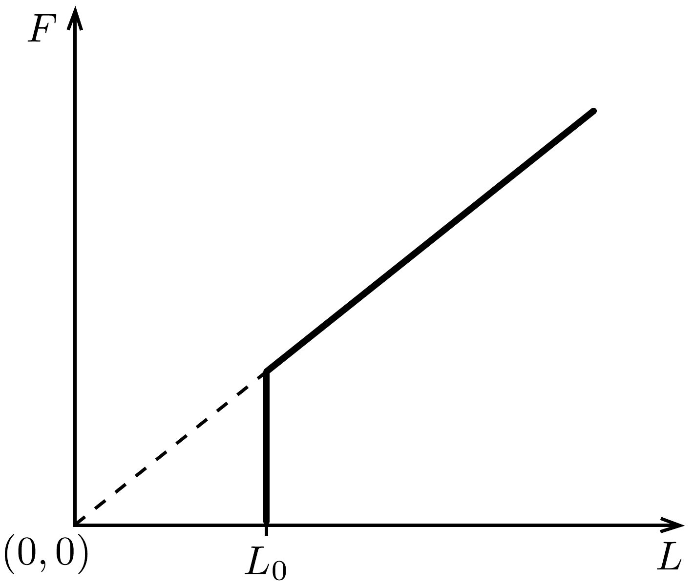
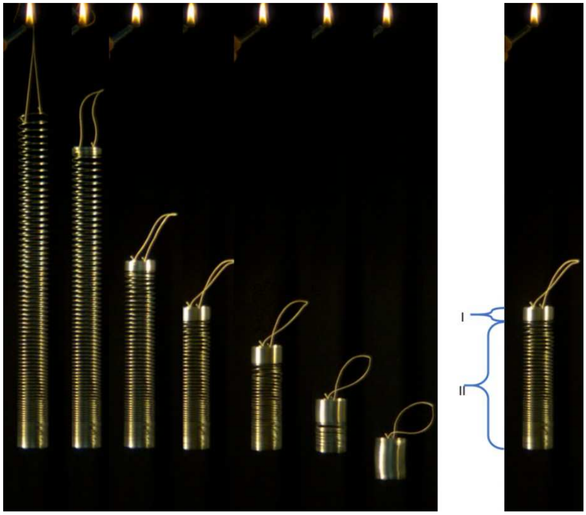

## Feladat 1

Nulla hosszúságú rugók és a slinky

Nulla hosszúságú rugó (zero-length spring, röviden ZLS) egy olyan rugó, amelyben az eró arányos a rugó hosszával: $F=k L, L>L_{0}$-ra, ahol $L_{0}$ a rugó minimális hossza, ami a nyújtatlan hossza is egyben. A 411. ábra ZLS-re mutatja az $F$ eró és a rugó $L$ hossza közötti kapcsolatot, ahol az egyenes meredeksége a $k$ rugóállandó.

Egy ZLS a szeizmográfiában hasznos, és segítségével a $g$ nehézségi gyorsulás változása nagyon pontosan mérhető. A feladatban homogén ZLS-t tekintünk, melynek $M g$ súlya nagyobb, mint $k L_{0}$. Legyen $\alpha=k L_{0} / M g<1$, ami a rugó relatív lágyságát jellemző, dimenzió nélküli szám. A „slinky” néven ismert játék lehet (de nem feltétlenül) ilyen ZLS.

A rész. Statika
1.A.1. Tekintsünk egy nyújtatlan ZLS $\Delta \ell$ hosszúságú szakaszát. Ezután a rugót a súlytalanság állapotában $F$ erốvel megnyújtjuk. Mekkora ennek a szakasznak a $\Delta y$ hossza az $F$, a $\Delta \ell$ és a rugó adataival kifejezve?
1.A.2. Határozzuk meg azt a $\Delta W$ munkát, ami ahhoz szükséges, hogy az eredetileg $\Delta \ell$ hosszúságú szakaszt $\Delta y$-ra nyújtsuk meg!

Ebben a kérdésben a rugó egy pontját a nyújtatlan állapotban az aljától mért $0 \leq \ell \leq L_{0}$ távolsággal jellemezzük. A rugó megnyújtásakor annak minden pontjára $\ell$ változatlan marad.
1.A.3. Tegyük fel, hogy a rugót az egyik végénél fogva fellógatjuk, úgy hogy az a saját súlya alatt megnyúlik. Mekkora a felfüggesztett, egyensúlyban lévő rugó $H$ hossza? A választ $L_{0}$ és $\alpha$ segítségével fejezzük ki.

B rész. Dinamika

A kísérletek azt mutatják, hogy ha a nyugalomban lévő, felfüggesztett rugót elengedjük, a rugó a tetején fokozatosan összehúzódik, míg az alja nyugalomban marad (lásd a 412. ábrát; bal oldal: sorozatkép a slinky szabadeséséről, jobb oldal: a mozgó I-es és a nyugalomban lévő II-es rész a rugó szabadesése során). Ahogy az idő telik, az összehúzódó rész úgy mozog, mint egy szilárd anyagdarab és egyre több rugómenetet foglal magába, mialatt a nyugalomban lévő rész rövidebb lesz. A rugó minden egyes pontja csak akkor kezd el mozogni, amikor a mozgó rész eléri azt. A rugó legalsó vége csak akkor mozdul meg, amikor már a rugó teljes egészében összecsukódott, és elérte a nyújtatlan $L_{0}$ hosszát. Ezután az összehúzódott rugó tovább esik egyenesen lefelé úgy, mint egy merev test a gravitáció hatására.

A feladat további részében a megoldást erre, az előzőekben leírt modellre alapozzuk. A légellenállás elhanyagolható, de $L_{0}-\mathrm{t}$ nem hanyagolhatjuk el.
1.B.1. Határozzuk meg azt a $t_{\mathrm{c}}$ időt, ami a rugó elengedésének pillanatától a legkisebb $L_{0}$ hosszra történő összecsukódásáig eltelik! Fejezzük ki a választ $L_{0}, g$ és $\alpha$ segítségével.

Számítsuk ki $t_{\mathrm{c}}$ értékét egy olyan rugóra, melyre $k=1,02 \mathrm{~N} / \mathrm{m}, L_{0}=0,055 \mathrm{~m}$ és $M=0,201 \mathrm{~kg}$, valamint $g$-t vegyük $9,80 \mathrm{~m} / \mathrm{s}^{2}$-nek!
1.B.2. Ebben a részben $\ell$ jelöli az I-es (412. ábrán a mozgó) és a II-es (412. ábrán az álló) rész határvonalát. Egy bizonyos pillanatban, amikor a nyugalomban lévő rész még jelen van, annak a tömege $m(\ell)=\frac{\ell}{L_{0}} M$, és a mozgó rész minden pontja azonos $v_{\mathrm{I}}(\ell)$ pillanatnyi sebességgel esik. Mutassuk meg, hogy ebben a pillanatban (amikor létezik még a nyugalomban lévő rész) a mozgó rész sebessége $v_{\mathrm{I}}(\ell)=\sqrt{A \ell+B}$ alakú! Fejezzük ki az $A$ és $B$ állandókat $L_{0}, g$ és $\alpha$ segítségével.
1.B.3. Az 1.B.2. kérdés alapján határozzuk meg a rugó mozgó részének $v_{\min }$ legkisebb sebességét a rugó elengedése és földre érkezése között létrejövő mozgása során! A választ $L_{0}, \alpha, A$ és $B$ segítségével adjuk meg.

C rész. Energia
1.C.1. Határozzuk meg, mekkora $Q$ mechanikai energia vész el hó formájában a rugó elengedésétól számítva, amíg földet nem ér! Fejezzük ki a választ $L_{0}, M$, $g$ és $\alpha$ segítségével.
