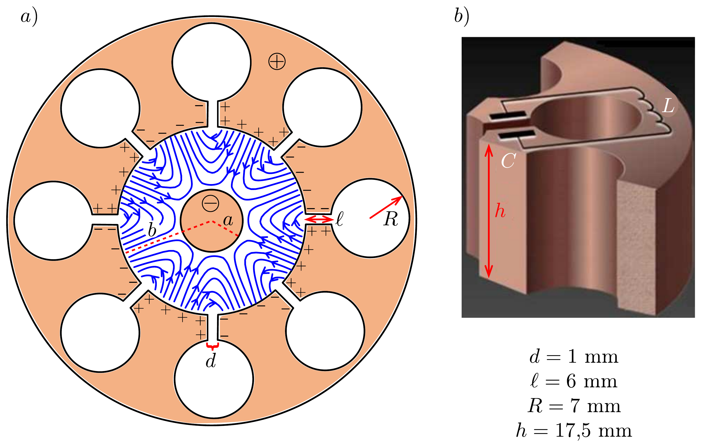
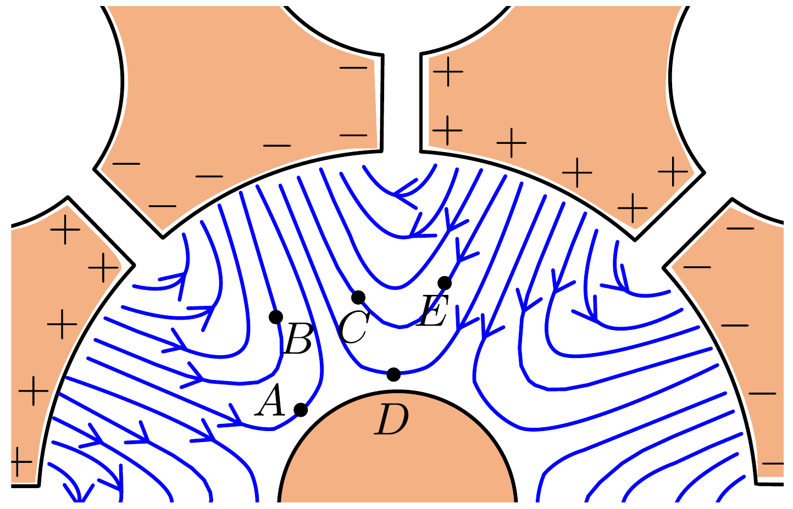
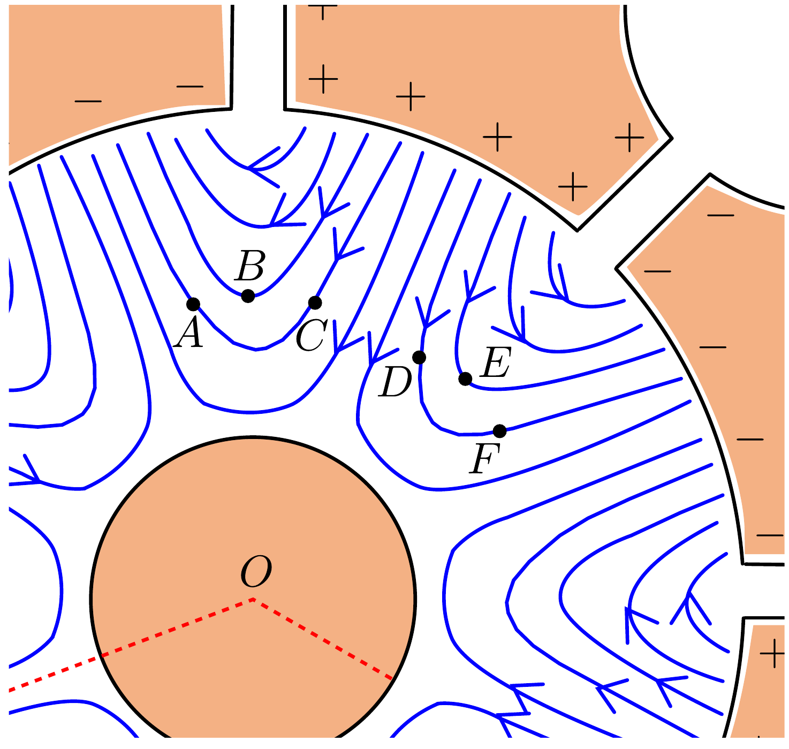
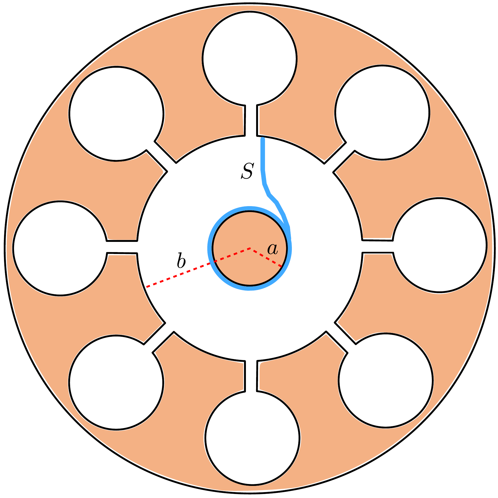
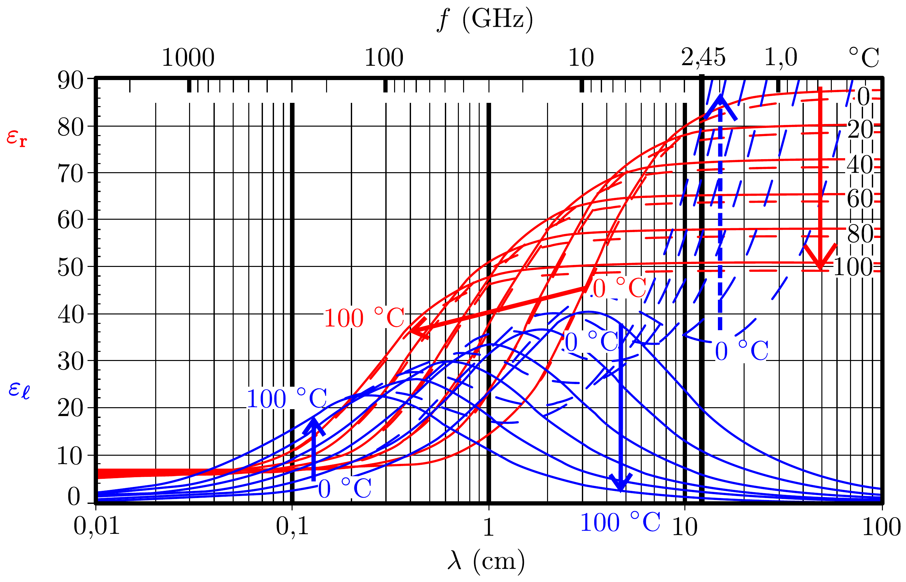

## Feladat 2

A mikrohullámú sütő fizikája

Ez a feladat a mikrohullámú sütőben lévő sugárzás létrehozását és annak az étel melegítésére való felhasználását tárgyalja. A mikrohullámú sugárzást a „magnetronnak" nevezett egység állítja elő. Az A rész a magnetron múködésével, a B rész pedig a mikrohullámú sugárzás ételben való elnyelődésével foglalkozik.

A rész. A magnetron felépítése és múködése
A magnetron mikrohullámú sugárzás előállítására képes eszköz, akár pulzusokban (radar alkalmazásokban), vagy folytonosan (pl. a mikróban). A magnetronnak van egy önerősítő rezgési módusa. A magnetronra sztatikus (nem váltakozó) feszültséget kapcsolva ez a módus gyorsan gerjesztődik. Az így keletkező mikrohullámú sugárzást a magnetron kibocsátja.

Egy tipikus, mikrohullámú sütőben lévő magnetron egy tömör, hengeres, $a$ sugarú rézkatódból és egy $b$ sugarú anódból áll. Az utóbbi alakja egy vastag falú, hengeres cső, amibe henger alakú üregek vannak fúrva. Ezeket az üregeket „rezonátornak” nevezik. Az egyik rezonátor egy antennához van csatolva, amely kivezeti a mikrohullámú energiát; a továbbiakban az antenna hatását elhanyagoljuk. Minden belső üregben vákuum van. Egy olyan tipikus magnetront fogunk vizsgálni, amelynek nyolc rezonátora van, ahogy az a 413.a) ábrán látható. Egy rezonátor háromdimenziós szerkezetét a 413.b) ábra mutatja. Ahogy itt is látszik, mind a nyolc üreg egy-egy LC-rezgőkörként viselkedik, melynek müködési frekvenciája $f=2,45 \mathrm{GHz}$.

A magnetron hosszanti tengelyével párhuzamosan sztatikus, homogén mágneses mezőt hozunk létre, a 413a) ábrán a papír síkjából kifelé mutató irányban. Ezen kívül állandó feszültséget kapcsolunk az anód (pozitív potenciál) és a katód (negatív potenciál) közé. A katódból kilépő elektronok elérik az anódot és feltöltik azt, ezzel egy olyan rezgési módust gerjesztve, amelyben a töltés előjele bármely két szomszédos rezonátor között ellentétes. Az üregek saját rezgése felerősíti ezeket a rezgéseket.

A fent leírt folyamat az alkalmazott állandó feszültség által keltett sztatikus tér mellett egy, a már említett $f=2,45 \mathrm{GHz}$ frekvenciával váltakozó elektromos mezőt is eredményez a katód és anód közötti térrészben (ezek a kék vonalak a 413, a) ábrán; a sztatikus tér nincs jelölve). Állandósult állapotban az anód és katód közötti váltakozó elektromos térerősség amplitúdója tipikusan kb. $\frac{1}{3}$-szorosa az ott lévő sztatikus tér erősségének. A katód és az anód közötti térrészben lévő elektronok mozgását mind a sztatikus, mind pedig a váltakozó tér befolyásolja. Emiatt az anódot elérő elektronok a sztatikus térből megszerzett energiájuk kb. 80\%-át átadják a váltakozó elektromos mezőnek. A kilépő elektronok kis része visszaér a katódhoz, ott további elektronokat léptet ki, ezáltal tovább erősítve a váltakozó elektromos teret.

Mindegyik rezonátor egy kapacitásnak és egy induktivitásnak tekinthető (lásd a 413, b) ábrát). A kapacitás nagyrészt a rezonátor felületének sík részéből adódik, míg az induktivitás a hengeres résztől származik. Tételezzük fel, hogy a rezonátorban az áram egyenletes eloszlásban folyik a hengeres üreg felületéhez nagyon közel,
és hogy az áram által keltett mágneses indukció nagysága 0,6-szer akkora, mint egy ideális, végtelen szolenoid esetén. A rezonátor geometriáját jellemző különbözó méretek a 413, b) ábrán láthatók. A vákuum permittivitása és permeabilitása rendre $\varepsilon_{0}=8,85 \cdot 10^{-12} \frac{\mathrm{~F}}{\mathrm{~m}}$ és $\mu_{0}=4 \pi \cdot 10^{-7} \frac{\mathrm{H}}{\mathrm{m}}$.
2.A.1. A fenti adatok felhasználásával becsüljük meg egyetlen rezonátor $f_{\mathrm{b}}$ frekvenciáját! (Az eredmény eltérhet a valódi $f=2,45 \mathrm{GHz}$ értéktől. A feladat további részében használjuk a valódi értéket.)

A következő, 2.A.2. rész nem a magnetronnal foglalkozik, de a releváns fizika egy részét segít bemutatni. Tekintsünk egy elektront szabad térben, amely a negatív $y$ tengely irányába mutató homogén, $\boldsymbol{E}=-E_{0} \hat{\boldsymbol{y}}$ elektromos mező, valamint a pozitív $z$ tengely irányába mutató homogén, $\boldsymbol{B}=B_{0} \hat{\boldsymbol{z}}$ indukciójú mágneses mező hatása alatt mozog (itt $E_{0}$ és $B_{0}$ pozitívak; $\hat{\boldsymbol{x}}, \hat{\boldsymbol{y}}, \hat{\boldsymbol{z}}$ pedig a szokásos irányokba mutató egységvektorok). Jelölje az elektron sebességvektorát a $t$ időpillanatban $\boldsymbol{u}(t)$. Az elektron $\boldsymbol{u}_{\mathrm{D}}$ sodródási (drift-) sebességén az elektron átlagsebességét értjük. Az elektron tömegét és töltését rendre $m$ és $-e$ jelöli.
2.A.2. A következő két esetben határozzuk meg $\boldsymbol{u}_{\mathrm{D}}-\mathrm{t}$, valamint rajzoljuk le az elektron pályáját (a laboratóriumi rendszerben) a $0<t<\frac{4 \pi m}{e B_{0}}$ időintervallumban, ha:
- 1. a $t=0$ időpillanatban az elektron sebességvektora $\boldsymbol{u}(0)=\left(3 E_{0} / B_{0}\right) \hat{\boldsymbol{x}}$,
- 2. a $t=0$ időpillanatban az elektron sebességvektora $\boldsymbol{u}(0)=-\left(3 E_{0} / B_{0}\right) \hat{\boldsymbol{x}}$.

Most visszatérünk a magnetron tárgyalásához. A katód és az anód közötti távolság 15 mm. Tételezzük fel, hogy a korábban említett, váltakozó tér miatti energiaveszteség következtében az egyes elektronok maximális mozgási energiája nem haladja meg a $K_{\text {max }}=800 \mathrm{eV}$ értéket. Az állandó mágneses tér indukciója $B_{0}=0,3 \mathrm{~T}$. Az elektron tömege és töltése rendre $m=9,1 \cdot 10^{-31} \mathrm{~kg}$ és $-e=$ $=-1,6 \cdot 10^{-19} \mathrm{C}$.
2.A.3. Becsüljük meg az elektronok maximális $r$ pályasugarának számszerú értékét abban a vonatkoztatási rendszerben, amelyben a pálya jó közelítéssel kör; tekintsük ezt a rendszert közelítőleg inerciarendszernek!
2.A.4. A 414. ábra a váltakozó elektromos tér erốvonalait szemlélteti az anód és a katód között egy adott időpillanatban (a sztatikus tér nincs ábrázolva). Adjuk meg, hogy az $A, B, C, D$ és $E$ pontokban található elektronok közül melyek sodródnak az anód felé, melyek a katód felé, és melyek sodródnak a sugárirányra merőlegesen!

A 415. ábra a váltakozó elektromos tér erốvonalait szemlélteti az anód és a katód között egy adott időpillanatban (a sztatikus tér nincs ábrázolva). Ebben a pillanatban hat elektron helyzetét jelzik az $A, B, C, D, E$ és $F$ pontok. Mindegyik elektron ugyanakkora távolságra van a katódtól.
2.A.5. Tekintsük a 415 ábrán látható helyzetet. Az $A B, A C, B C, D E, D F$, $E F$ elektronpárok mindegyike esetén adjuk meg, hogy a sodródásuk hatására

a pár tagjainak (a katód $O$ középpontjától mért) helyvektorai által bezárt szög csökken vagy növekszik az adott időpillanatban!

A mintázat, ami a 2.A.5. részben felismerhető, fókuszáló hatásként múködik, a katód és anód közötti térrészben lévő elektronokat küllőkbe tömöríti. A 416. ábra egy ilyen küllőt ábrázol, melyet $S$-sel jelöltünk.
2.A.6. Rajzoljuk be a többi küllőt is ebben a pillanatban! Nyilakkal jelöljük a forgásuk irányát, és számítsuk ki a forgás átlagos $\omega_{\mathrm{s}}$ szögsebességét!

Használjuk azt a közelítést, hogy a teljes elektromos térerősség a katód és anód között félúton egyenló a sztatikus elektromos térerősségnek a katódtól az anódig tartó sugárirányú vonalra számított átlagos értékével, valamint hogy a küllők közelítőleg sugárirányúak ebben a tartományban. A katód és anód sugara ( $a$ és $b$ ) a 416. ábrán van megadva.

2.A.7. Vezessünk le egy közelítő összefüggést annak a sztatikus $V_{0}$ feszültségnek az értékére, amely a magnetron fent leírt módon való üzemeltetéséhez szükséges! (A kifejezés, amit kapni fogunk, a magnetron üzemeltetéséhez szükséges minimális érték becslése; az optimális feszültség ennél valamivel nagyobb.)

B rész. A mikrohullámú sugárzás kölcsönhatása vízmolekulákkal
Ez a rész a (magnetron antennája által a mikró belső terébe vezetett) mikrohullámú sugárzás fózésre való használatával foglalkozik; azaz hogy hogyan melegíthető fel egy olyan veszteséges dielektrikum, mint a sós vagy tiszta víz (ami jelen esetben számunkra egy leves modellje).

Egy elektromos dipólus két azonos nagyságú, de ellentétes előjelú, $q$ és $-q$ töltést jelent egymástól kicsiny $d$ távolságra. A dipólmomentum-vektor a negatív töltéstől a pozitív felé mutat, nagysága $p=q d$.

Egyetlen, $\boldsymbol{p}(t)$ dipólmomentumú, állandó $p_{0}=|\boldsymbol{p}(t)|$ erósségú dipólusra időfüggő, $\boldsymbol{E}(t)=E(t) \hat{\boldsymbol{x}}$ elektromos teret alkalmazunk. Az elektromos térerősség és a dipólus által bezárt szög $\theta(t)$.
2.B.1. Adjuk meg az elektromos tér által a dipólusra kifejtett $\tau(t)$ forgatónyomatékot és a térből a dipólusnak átadott $H_{i}(t)$ teljesítményt $p_{0}, E(t), \theta(t)$ és azok deriváltjai segítségével!

A vízmolekulák polárosak, így elektromos dipólusokként kezelhetők. Folyékony állapotban a vízmolekulák a közöttük lévő erős hidrogénkötések miatt nem kezelhetők egymástól független dipólusoknak. Ehelyett a $\boldsymbol{P}(t)$ polarizációvektort
kell használnunk, ami nem más, mint a dipólmomentum-sűrúség (egységnyi térfogatban található vízmolekulák eredő dipólmomentumának átlagos értéke). A $\boldsymbol{P}(t)$ polarizáció párhuzamos a mikrohullámú sugárzás lokálisan jelenlévó, váltakozó $\boldsymbol{E}(t)$ elektromos terével, és a lokális, váltakozó elektromos tér amplitúdójával arányos amplitúdóval oszcillál, attól azonban $\delta$ fázissal lemaradva.

A lokális, váltakozó elektromos térerősséget a víz belsejében egy adott pontban $\boldsymbol{E}(t)=E_{0} \sin (\omega t) \hat{\boldsymbol{x}}$ adja meg, ahol $\omega=2 \pi f$, ez $\boldsymbol{P}(t)=\beta \varepsilon_{0} E_{0} \sin (\omega t-\delta) \hat{\boldsymbol{x}}$ polarizációt hoz létre, ahol a $\beta$ dimenziótlan állandó a víz jellemzője.
2.B.2. Vezessünk le egy összefüggést a víz által térfogategységenként elnyelt teljesítmény $\langle H(t)\rangle$ időátlagára!

Egy időben periodikusan változó $f(t)$ mennyiség időátlaga a $T$ periódusidőre számítva a következő:
\[
\langle f(t)\rangle=\frac{1}{T} \int_{t_{0}}^{t_{0}+T} f(t) \mathrm{d} t
\]

Vizsgáljuk most a sugárzás terjedését vízben. A víz relatív dielektromos állandója (az elektromágneses hullám frekvenciáján) $\varepsilon_{\mathrm{r}}$, az ennek megfelelő törésmutató pedig $n=\sqrt{\varepsilon_{\mathrm{r}}}$. Az elektromos tér pillanatnyi energiasúrúségét az $\frac{1}{2} \varepsilon_{\mathrm{r}} \varepsilon_{0} E^{2}$ összefüggés adja meg. Az elektromos és mágneses mezó időátlagolt energiasűrúsége megegyezik.
2.B.3. Jelölje a sugárzás időátlagolt energiafluxus-sűrúségét $I(z)$ (ami az egységnyi felületre esó átlagos sugárzási teljesítmény). Itt $z$ a sugárzás által elért vízmélységet jelöli, a sugárzás a $z$ irányban terjed. Vezessünk le egy összefüggést arra, hogyan függ az $I(z)$ energiafluxus-súrúség $z$-től! A víz felszínén lévő $I(0)$ energiafluxus szerepelhet a válaszban.

A $\delta$ fáziskésés a vízmolekulák közötti kölcsönhatás következménye. Ez a $\operatorname{tg} \delta=\varepsilon_{\ell} / \varepsilon_{\mathrm{r}}$ kifejezés szerint függ a dielektromos veszteség dimenziótlan $\varepsilon_{\ell}$ együtthatójától és az $\varepsilon_{\mathrm{r}}$ relatív dielektromos állandótól (mindkettő függvénye a sugárzás $\omega$ körfrekvenciájának és a hőmérsékletnek). Ha $\delta$ elég kicsiny, az elektromos térerősség a víz belsejében $z$ mélységben a következő:
\[
\boldsymbol{E}(z, t)=\boldsymbol{E}_{0} e^{-\frac{1}{2} n k_{0} z \operatorname{tg} \delta} \sin \left(n k_{0} z-\omega t\right),
\]
ahol $k_{0}=\omega / c$ és $c=3,0 \cdot 10^{8} \frac{\mathrm{~m}}{\mathrm{~s}}$ a vákuumbeli fénysebesség.
2.B.4. $\operatorname{A} \operatorname{tg} \delta \approx \sin \delta$ közelítést alkalmazva fejezzük ki a 2.B.2. részben definiált $\beta$ mennyiséget a többi paraméter segítségével!

A 417. ábra $\varepsilon_{\ell}$ (kék) és $\varepsilon_{\mathrm{r}}$ (piros) értékét mutatja tiszta vízre (folytonos vonalak) és híg sós oldatra (szaggatott vonalak) a hullámhossz és a frekvencia függvényében, néhány különböző hőmérsékleten. Az $\omega=2 \pi \cdot 2,45 \cdot 10^{9} \mathrm{~s}^{-1}$ értéknek megfelelő frekvenciát vastag függőleges vonal jelzi. A továbbiakban csak ezt a frekvenciájú mikrohullámú sugárzást tekintjük. A nyilak a hőmérséklet változását jelzik a görbék között a $0^{\circ} \mathrm{C}-100^{\circ} \mathrm{C}$ tartományban.

2.B.5. Használjuk a 417, ábrát a következő kérdésekhez:
- 1. 20 °C-os víz esetére határozzuk meg a $z_{1 / 2}$ behatolási mélységet, ahol az egységnyi térfogatra jutó teljesítmény a $z=0$ helyen lévő értékhez képest felére csökken!
- 2. Vízben növekszik, csökken vagy nem változik a mikrohullámú sugárzás behatolási mélysége, ha a hőmérsékletet növeljük?
- 3. Levesben (híg sós oldatban) növekszik, csökken vagy nem változik a mikrohullámú sugárzás behatolási mélysége, ha a hómérsékletet növeljük?
