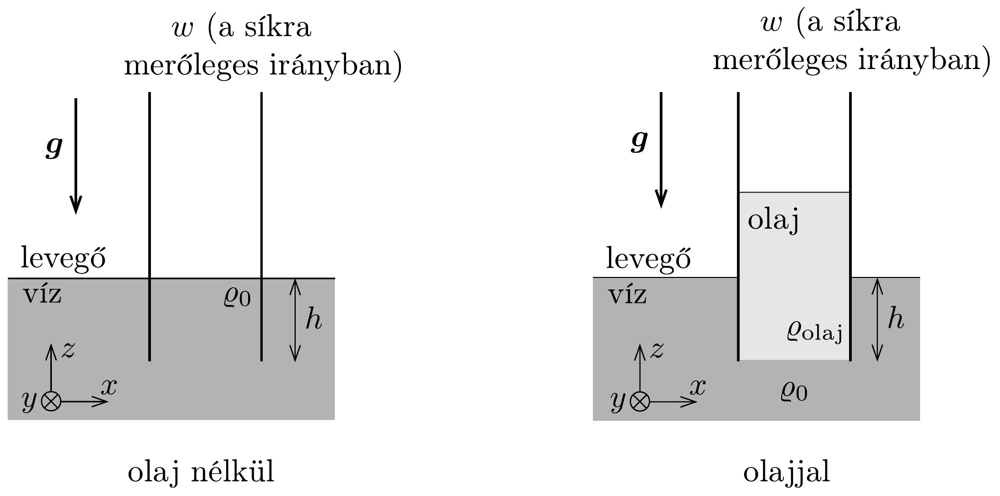
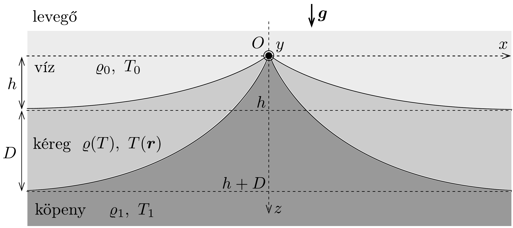
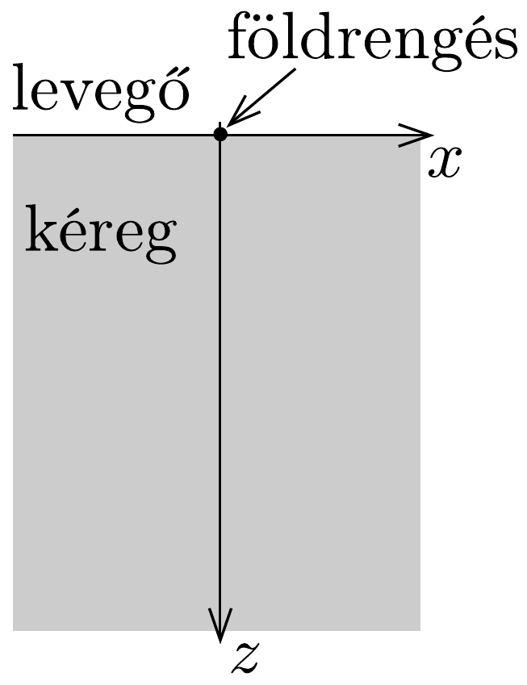

## Feladat 1

Bolygófizika

Ez a feladat két független részből áll, melyek a bolygók belsejével foglalkoznak. A bolygófelszín görbületének hatásaitól eltekinthetünk. Szükség lehet az alábbi formulára:
\[
(1+x)^{\varepsilon} \approx 1+\varepsilon x, \quad \text { ha }|x| \ll 1 .
\]

A rész. Ơceáni hátság
Tekintsünk egy nagy edény vizet, ami egy $g$ nehézségi gyorsulással jellemezhető, homogén gravitációs térben helyezkedik el. Két, téglalap alakú, egymással párhuzamos, függőleges lemezt az edénybe helyezünk úgy, hogy a lemezek függőleges szélei szorosan, hézag nélkül érintkezzenek az edény függőleges falaival. Mindegyik lemez $h$ hosszúságú részét merítjük bele a vízbe (424. ábra). A lemezek az $y$ tengely mentén $w$ szélesek, a víz súrúsége $\varrho_{0}$.

A lemezek közötti térrészbe annyi $\rho_{\text {olaj }}\left(<\rho_{0}\right)$ sürúségü olajat töltünk, hogy az olaj alja a lemezek alsó szélét elérje. Tegyük fel, hogy a lemezek és az edény szélei elég magasan vannak ahhoz, hogy az olaj ne csorduljon túl. A felületi feszültségtől és a folyadékok keveredésétől tekintsünk el.
1.A.1. Mekkora a jobb oldali lemezre ható eredő erő $x$ irányú $F_{x}$ komponense (nagysága és iránya)?

A 425. ábra az óceáni hátság egy keresztmetszetét mutatja (vegyük figyelembe, hogy a $z$ tengely lefelé mutat.). Ezt a következő rétegek alkotják: köpeny, kéreg és az óceán vize. A köpenyt olyan kőzetek alkotják, amelyekről feltesszük, hogy földtani időskálán mért idő alatt el tudnak mozdulni, azaz a köpeny ebben a feladatban folyadékként kezelhető. A kéreg vastagsága sokkal kisebb, mint az $x$ irányban jellemző hosszúságskála, ezért a kéreg szabadon hajlítható lemezként viselkedik. Egy ilyen hátság nagy pontossággal modellezhető egy kétdimenziós rendszerrel, amelyben a 425, ábra síkjára merőleges $y$ tengely mentén mért paraméterek nem változnak. Feltesszük, hogy a hátság $y$ irányú $L$ hossza sokkal nagyobb, mint bármelyik más, ebben a feladatban bevezetett hosszúság.

Feltesszük, hogy a hátság közepén a kéreg vastagsága nulla. Ahogyan a közepétől mért vízszintes $x$ távolságot növeljük, a kéreg vastagodik, és a vastagsága egy állandó $D$ értékhez tart, ha $x \rightarrow \infty$. Ennek megfelelően az óceán feneke a hátság O tetőpontjától (ez a koordináta-rendszerünk origója) mérve függőlegesen $h$ mélységben van (425. ábra). A víz $\rho_{0}$ sürúségét és $T_{0}$ hőmérsékletét időben és térben állandónak vehetjük. Ugyanezt tételezhetjük fel a köpeny $\rho_{1}$ sürúségéről és $T_{1}$ hőmérsékletéről. A kéreg $T$ hőmérséklete szintén állandó időben, de függhet a helytől.

Ismert, hogy a kéreg anyaga a $T$ hőmérséklettel jó közelítéssel lineárisan tágul. Mivel a víz és a köpeny hőmérsékletét állandónak tételezzük fel, kényelmesebb egy átskálázott hőtágulási együtthatót használni. Így
\[
\ell(T)=\ell_{1}\left(1-k_{\ell} \frac{T_{1}-T}{T_{1}-T_{0}}\right),
\]
ahol $\ell$ egy kéregdarab hossza, $\ell_{1}$ a kéregdarab hossza $T_{1}$ hőmérsékleten és $k_{\ell}$ az átskálázott hốtágulási együttható, amiről feltehetjük, hogy állandó.
1.A.2. Feltéve, hogy a kéreg izotróp, határozzuk meg, hogyan függ a kéreg $\rho$ súrúsége a $T$ hőmérsékletétől! Feltételezve, hogy $\left|k_{\ell}\right| \ll 1$, az eredményt írjuk a
\[
\rho(T) \approx \rho_{1}\left[1+k \frac{T_{1}-T}{T_{1}-T_{0}}\right],
\]
közelítő alakba, ahol a $k_{\ell}^{2}$ és az ennél nagyobb nagyságrendú tagokat elhanyagolhatjuk. Ezután adjuk meg a $k$ állandót!

Tudjuk, hogy $k>0$. A kéreg $\kappa$ hővezetési együtthatója állandónak vehető. Ennek következménye, hogy a hátság tengelyétől nagyon távol lévő kéreg hőmérséklete a mélységtől lineárisan függ.
1.A.3. Feltéve, hogy mind a köpeny, mind az óceánvíz hidrosztatikai egyensúlyban lévő, összenyomhatatlan folyadékként viselkedik, fejezzük ki a kéreg nagy távolságban érvényes $D$ vastagságát $h, \rho_{0}, \rho_{1}$, és $k$ függvényében! Az anyag bármilyen mozgása elhanyagolható.
1.A.4. Határozzuk meg $k$-ban vezetó rendben a kéreg jobb oldali felére ( $x>0$ ) ható $F$ eredő erőt $\rho_{0}, \rho_{1}, h, L, k$ és $g$ függvényében!

Most képzeljük el, hogy a kérget a bolygó többi részétől termikusan elszigeteljük. A hővezetés eredményeként a kéreg alsó és felsó felszínének hőmérséklete egyre közelebb kerül egymáshoz, míg a kéreg el nem éri a termikus egyensúlyt. A kéreg állandónak vehető fajhője $c$.
1.A.5. Dimenzióanalízis segítségével vagy nagyságrendi elemzéssel becsüljük meg azt a $\tau$ karakterisztikus időt, ami alatt a hátság tengelyétől távol lévő kéreg alsó és felsó felszíne közötti hőmérséklet-különbség nullához közeli lesz! Feltehetjük, hogy $\tau$ nem függ a kéreg két felszínének kezdeti hőmérsékletétől.

B rész. Szeizmikus hullámok egy rétegzett közegben
Tegyük fel, hogy egy rövid földrengés történik egy bolygó felszínén. Feltehető, hogy a szeizmikus hullámok a $z=x=0$ vonal mentén fekvő forrásból származnak, ahol $x$ a vízszintes koordináta, $z$ pedig a felszíntől mért mélység (426. ábra). Feltételezhető, hogy a szeizmikus hullámforrás sokkal hosszabb bármelyik más, ebben a feladatban figyelembe vett hosszúságnál.

A földrengés eredményeként úgynevezett longitudinális P-hullámok indulnak ki egyenletes eloszlásban az $x-z$ sík minden olyan irányába, amelynek $z$ irányú
vetülete pozitív. Mivel egy szilárd anyagban a hullámelmélet általában bonyolult, ebben a feladatban minden más, a földrengés által létrehozott hullámot elhanyagolunk. A bolygó kérge oly módon rétegződött, hogy a benne terjedő P-hullám $v$ sebessége a $z$ mélységtől a $v(z)=v_{0}\left(1+z / z_{0}\right)$ kifejezés szerint függ, ahol $v_{0}$ a felszínen mért sebesség és $z_{0}$ egy ismert pozitív állandó.
1.B.1. Tekintsünk egy, a földrengés által kibocsátott sugarat, ami a $z$ tengellyel kezdetben $0<\theta_{0}<\pi / 2$ szöget zár be, és az $x$ - $z$ síkban terjed. Mekkora az a vízszintes $x_{1}\left(\theta_{0}\right) \neq 0$ koordináta, ahol a sugár a bolygó felszínére ér? Tudjuk, hogy a sugár körvonal alakú pályán halad. Választ az $x_{1}\left(\theta_{0}\right)=A \operatorname{ctg}\left(b \theta_{0}\right)$ alakban írjuk le, ahol $A$ és $b$ meghatározandó állandók.

Ha esetleg nem sikerül meghatározni $A$-t és $b$-t, akkor a következő kérdésekben az $x_{1}\left(\theta_{0}\right)=A \operatorname{ctg}\left(b \theta_{0}\right)$ eredményt megadottnak vehetjük. Tegyük fel, hogy a földrengés ideje alatt a forrás egységnyi hosszára jutó, a kéregbe hatoló P-hullámként kibocsátott teljes energia $E$. Feltételezzük, hogy a hullámok teljesen elnyelődnek, amikor alulról érkezve elérik a bolygó felszínét.
1.B.2. Adjuk meg, hogyan függ a felszín által elnyelt, egységnyi felületre vonatkoztatott $\varepsilon(x)$ energiasűrúség a felszínen mért $x$ távolság függvényében! Vázoljuk fel az $\varepsilon(x)$ függvényt!

Innentől feltesszük, hogy a hullámok nem elnyelődnek, hanem visszaverődnek, amikor elérik a felszínt. Képzeljük el, hogy egy olyan eszközt helyeztünk a $z=x=0$ helyre, amely ugyanolyan geometriájú, mint a földrengés előzőekben látott forrása. Az eszköz képes egy szabadon választott szög szerinti eloszlásban P-hullámokat kibocsátani. Az eszközt úgy állítjuk be, hogy egy szűk szögtartományban bocsásson ki jelet. Azaz a jel függőlegessel bezárt kezdeti szöge a $\left[\theta_{0}-\frac{1}{2} \delta \theta_{0}, \theta_{0}+\frac{1}{2} \delta \theta_{0}\right]$ tartományban van, ahol $0<\theta_{0}<\pi / 2, \delta \theta_{0} \ll 1$ és $\delta \theta_{0} \ll \theta_{0}$.
1.B.3. A forrástól mérve a felszínen mekkora $x_{\text {max }}$ távolságra van az a legtávolabbi pont, ahova jel nem jut el? Választ $\theta_{0}, \delta \theta_{0}$ segítségével, valamint egyéb, a fentebb megadott állandókkal fejezzük ki.
