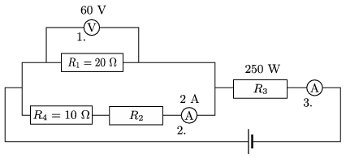

G. 579. Az ábrán látható kapcsolást állítottuk össze.

 $a)$ Mekkora az $R_2$ és $R_3$ ellenállás?
 $b)$ Mennyit mutat a 3-as számú műszer?
 $c)$ Mekkora az áramforrás feszültsége és a leadott teljesítménye?

