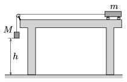

G. 587. Egy kezdetben nyugalomban lévő, $m$ tömegű, könnyen gördülő kis­kocsira $t$ ideig $F$ nagyságú húzóerő hat, majd az erő megszűnte után szabadon gördül vízszintes pályán. Mekkora utat tett meg a kocsi az indulástól számított $2t$ idő alatt?
 Adatok: $m=1{,}6$ kg, $F=2$ N, $t=0{,}5$ s.

