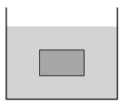

G. 597. Egy folyadékkal telt edényben egy tömör kocka lebeg. Az egész rendszert lassan melegíteni kezdjük. Kapkó Dóra azt mondja, hogy a kocka lassan le fog süllyedni. Hirte Lenke azonnal rávágja, hogy épp az ellenkezője igaz, fel fog emelkedni. Kinek lehet igaza?

