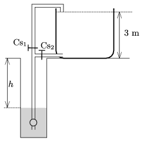

G. 602. Egy kútból kétféleképpen is fel lehet tölteni egy 3 m magas, kezdetben üres víztartályt. Egyszer úgy, hogy a $\rm Cs_2$ csapon keresztül a víztartály aljára nyomjuk a vizet, a másik esetben pedig a víztartály tetején folyatjuk be a vizet a $\rm Cs_1$ csapon keresztül.

 $a)$ Melyik az olcsóbb megoldás?
 $b)$ Valaki kiszámította, hogy ha a szivattyú veszteségeit és a csőben áramló víz súrlódását elhanyagolhatjuk, akkor a tartály 20%-kal kevesebb energia felhasználásával is feltölthető, mint ha a gazdaságtalan megoldást választjuk. Milyen mélyen áll a víz a kútban? (A kút bővizű, a vízszint $h$ mélysége a szivattyúzás során nem változik.)
 Nagy László (1931–1987) feladata

