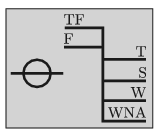

G. 651. Az óceánjáró hajók oldalán látható az úgynevezett Plimsoll-jel. Ez megmutatja, hogy milyen mélyen merül be a vízbe a hajó a különböző vizekben, ha a megengedett maximális tömegű rakománnyal terhelik. (TF = Tropical Fresh Water; F = Fresh Water; T = Tropical Seawater; S = Summer Seawater; W = Winter Seawater; WNA = Winter North Atlantic.)
 A legfelső, TF jelű vonal a trópusi édesvíz (sűrűsége 996 kg/m${}^3$) esetén érvényes bemerülést jelzi, alatta a mérsékelt övi édesvíz (sűrűsége 999 kg/m${}^3$) esetén érvényes, F jelű vonal látható. Egy bizonyos hajón a két vonal távolsága 7 cm. Mekkora a téli tengervíz sűrűsége, ha a W feliratú, a téli tengervízben érvényes vonal a legfelső vonaltól 21 cm-rel lejjebb van?

