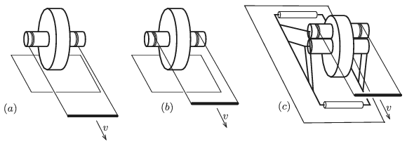

G. 662. Az $(a)$ és a $(b)$ ábrán látható összeállítás egy nagyobb korongból és egy-egy, hozzá koncentrikusan rögzített, kisebb hengerből áll. A kis hengerekre fonalakat csévéltünk, amelyeknek végét egy rúd segítségével vízszintesen, $v$ sebességgel mozgatjuk.

 A $(c)$ esetben a kis hengerhez felülről egy vele azonos átmérőjű, szabadon forgó másik kis henger is csatlakozik. A felső henger nekiszorul az alsónak, és a lebillenését egy-egy görgőhöz csatlakozó rúdszerkezet akadályozza meg. A felső hengerre is fonalat csévéltünk, és a fonál végét $v$ sebességgel húzzuk. A korongok a talajon, illetve a kis hengerek egymáson nem csúsznak meg.
 Melyik irányban, és $v$-nél nagyobb vagy kisebb sebességgel fog mozogni a korong középpontja az egyes esetekben?

