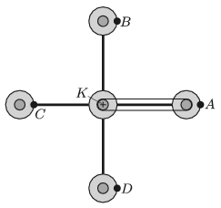

G. 666. Az ábrán egy vidámparki szórakoztatószerkezet vázlata látható. A középső, nagy henger egyenletesen forog körbe. A rajta lévő négy rögzítőkar segítségével négy tengelyezett, kör alakú ,,gondola'' is körbejár. Minden gondola közepéhez egy-egy korongot rögzítettek, melyek ugyanúgy vannak tengelyezve, mint a gondola. A gondolák közepén lévő korongok csúszásmentes szíjáttétel segítségével csatlakoznak a szerkezet közepén található $K$ koronghoz, ami rögzített, tehát egyáltalán nem forog. (Az ábrán – az áttekinthetőség kedvéért – csak az egyik gondolánál tüntettük fel ezt a szíjat.)

 Az $A$, $B$, $C$ és $D$ pontok egy-egy utast ábrázolnak. Milyen pályán mozognak az utasok? Hogyan változik a közöttük lévő távolság a forgás közben? (A szerkezet vízszintes síkban forog, a tengelyek mind függőlegesek.)
 Amerikai feladat nyomán

