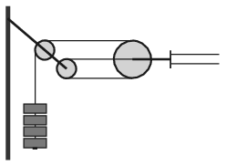

G. 699. Pályaudvarokon, vasútállomásokon figyelhetjük meg, hogy elektromos vezetékeket például az  ábrán látható módon csigákon átvetett drótkötélre akasztott, nehéz súlyokkal feszítenek ki.

 $a)$ Miért előnyösebb ez a módszer, mintha fix rögzítése lenne a felsővezetéknek?
 $b)$ Mekkora erő feszíti a dupla vezeték egyes szálait, ha a feszítősúlyok együttes tömege 300 kg?
 $c)$ Egy verőfényes, felhőtlen napon hogyan változik a súlyok helyzete reggeltől estig?

