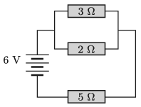

G. 715. Egy áramkör három ellenállásból és egy telepből áll az  ábrán látható módon.

 $a)$ Mekkora az egyes ellenállásokon átfolyó áram és a rajtuk eső feszültség?
 $b)$ Hogyan változnak ezek az értékek, ha a két párhuzamos ellenállás mellé még bekötünk rengeteg (,,végtelen sok'') $1~\mathrm{k}\Omega$-os ellenállást párhuzamosan?
 $c)$ Mekkora lesz az eredeti áramkör három ellenállásának árama és feszültsége, ha az $5~\mathrm{k}\Omega$-os ellenállás mellé bekötünk még rengeteg (,,végtelen sok'') $1~\mathrm{k}\Omega$-os ellenállást sorosan?
 (A nyomtatásban megjelent feladat ábráján tévesen szerepelnek az ellenállások. Helyesen mindhárom ellenállás nagysága k$\Omega$-ként értendő.)

