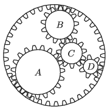
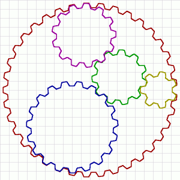

G. 726. Az ábrán látható négy belső fogaskerék körbejár, a külső pedig áll. (A fogaskerekek mozgása a honlapon megtekinthető.)

 $a)$ Hasonlítsuk össze a fogaskerekek keringési idejét!
 $b)$ Rakjuk a fogaskerekeket a középpontjuk sebessége szerint növekvő sorrendbe!

