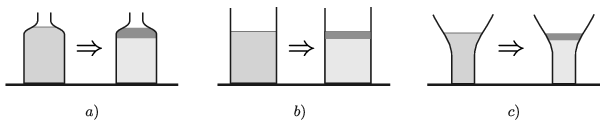

G. 728. Vannak olyan folyadékok, például a nyers tej vagy az olívaolajos-balzsamecetes salátaöntet, melyeket ha állni hagyunk, akkor a folyadék két alkotóelemére válik szét. Az olaj kerül az öntet tetejére, illetve zsíros tejszín lesz a tej tetején, miközben a teljes térfogat nem változik. Ha az ilyen folyadékokat
 $a)$ felfelé keskenyedő üvegben tartjuk;
 $b)$ hengeres mérőpohárba töltjük;
 $c)$ felfelé szélesedő pohárba öntjük,
 majd megvárjuk az alkotóelemek szétválását, akkor a folyadék aljánál a hidrosztatikai nyomás megnő, lecsökken vagy változatlan marad?

