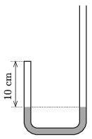

G. 740. Az ábrán látható aszimmetrikus U alakú cső $2~\mathrm{cm}^2$ keresztmetszetű, benne higany található. A bal oldali ág tetején a csövet lezárjuk, így ott 10 cm magas, 1 atm nyomású levegőoszlop zárul be. Hány $\mathrm{cm}^3$ higanyt kell lassan és óvatosan a jobb oldali szárba töltenünk, hogy a bal oldali ágban a levegőoszlop magassága felére csökkenjen?

