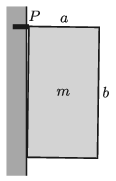

G. 743. Egy megpakolt konyhabútor egyik felső szekrénye egy olyan $m = 40$ kg tömegű téglatest, melynek ,,mélysége'' $a =
40$ cm, magassága $b = 75$ cm, tömegközéppontja pedig a geometriai középponttal esik egybe. A szekrényt a fallal érintkező két felső csúcsánál egy-egy tiplis csavarral rögzítik (az  ábrán ezek egymást fedve a $P$ pontban találhatók). A szekrény a fallal csak az alsó éle mentén érintkezik. Legalább mekkora húzóerőt kell kibírnia a rögzítéseknek külön-külön, hogy a csavarok ne szakadjanak ki a falból? (A falnál a súrlódást hanyagoljuk el!)

