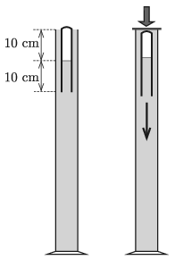

G. 748. Egy magas, vízzel telt mérőhengerbe szájával lefelé fordított, 20 cm hosszú kémcsövet (Cartesius-búvárt) helyezünk úgy, hogy a kémcső felső felében levegő, alsó felében pedig víz legyen. Ekkor a kémcső úszik, zárt, felső vége kissé kiemelkedik a mérőhengerben lévő vízből. A mérőhenger tetejét gumilappal zárjuk le, majd akkora erővel nyomjuk lefelé a gumilapot, hogy ennek hatására a kémcsőben lévő levegő nyomása 5 kPa-lal megnő. Ebben a pillanatban a ,,búvár'' elindul lefelé.

 $a)$ A ,,búvár'' elmerülésének a kezdetén mekkora volt a kémcsőbe zárt levegőoszlop magassága?
 $b)$ Legalább milyen magas a mérőhenger, ha a ,,búvár'' lent marad akkor is, amikor eltávolítjuk a gumilapot a mérőhenger tetejéről?

