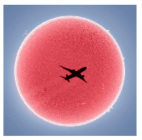

G. 749. A United Airlines 425-ös járata éppen akkor haladt el a Nap előtt, amikor Andrew McCarthy, az ismert amerikai asztrofotós a mellékelt képet készítette. Becsüljük meg, hogy milyen messze volt a repülőgép a fotós fényképezőgépétől!

