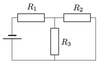

G. 806. Az ábrán látható kapcsolásban ismert az $R_1$, $R_2$ és az $R_3$ ellenállás, valamint az $R_3$ ellenálláson átfolyó áram $I_3$ erőssége.

 Határozzuk meg
 $a)$ a másik két ellenálláson átfolyó $I_1$ és $I_2$ áramok erősségét;
 $b)$ a telep elektromotoros erejét!
 $c)$ Mennyi hő fejlődik összesen $t$ idő alatt a rendszerben?
 ( Adatok: $R_1 = 20~\Omega$, $R_2 = 10~\Omega$, $R_3 = 40~\Omega$, $I_3=2~\mathrm{A}$, $t=30~\mathrm{s}$.)

