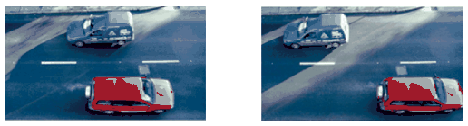

G. 813. Egy toronyház tetejéről sorozatfelvételt készítettünk a ház melletti utca forgalmáról. A kiválasztott két felvétel egymást követően 4/15 másodperc időkülönbséggel készült az egyenletesen haladó gépkocsikról. Becsüljük meg a gépkocsik úttesthez viszonyított sebességét, ha az úttestet kettéosztó fehér, szaggatott választóvonal egy szakaszának hossza kb. 2 méter.

 Öveges József Országos Fizikaverseny feladata nyomán

