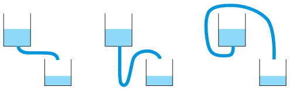

G. 819. A képen három, ugyanolyan folyadékot tartalmazó tartály látható, melyekhez leeresztő csövek csatlakoznak. Melyik tartály ürül ki leggyorsabban, ha a folyadék belső súrlódásától (viszkozitásától) eltekinthetünk?

 Biztos, hogy a középső tartály egyáltalán kiürül, ha a csatlakozó cső legalja nagyon mélyre kerül? Biztos, hogy a jobb szélső tartály egyáltalán kiürül, ha a csatlakozó cső legteteje nagyon magasra kerül?

