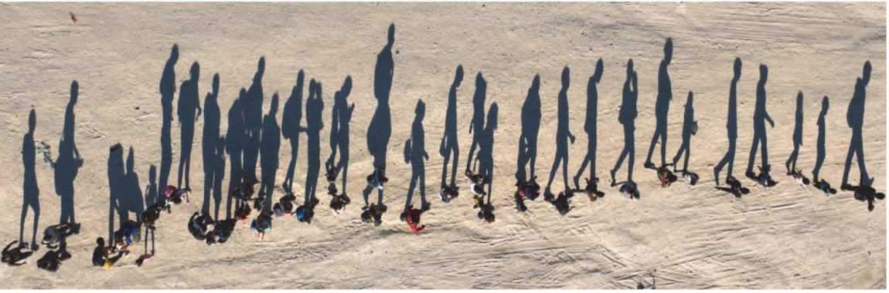

G. 838. Az alábbi, drónról készült fényképen vízszintes talajon emberek haladnak a Rio Grande partján Mexikó és az Egyesült Államok határán. Becsüljük meg, hogy milyen magasan volt a Nap a fotó készítésekor!

