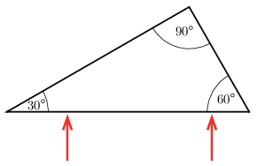

G. 851. A cirkónium-dioxid törésmutatója $2{,}1$. Ebből az anyagból egy $30^\circ$–$\,60^\circ$–$\,90^\circ$-os prizmát készítünk, amelyre az ábrán látható módon két vékony fénysugarat bocsátunk. Mekkora szöget zár be egymással a prizmából kilépő két fénysugár?

