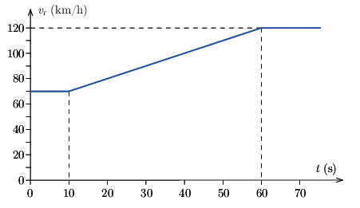
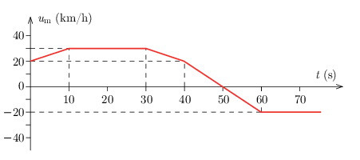

G. 853. Egy rendőrautó az autópályán halad. Sebességét a számítógépes rendszer rögzítette, ez alapján készült az alábbi $v_\mathrm{r}(t)$ grafikon . Egy motoros egyszer csak megelőzi a rendőrautót, a rendőrautó méri a motoros sebességét. Az $u_\mathrm{m}(t)$ grafikon azt mutatja, hogy mekkora a motoros sebessége a rendőrautóhoz viszonyítva.

 $a)$ Rajzoljuk meg a motoros földhöz viszonyított sebességének $v_\mathrm{m}(t)$ grafikonját!
 $b)$ A grafikonokon ábrázolt időtartam alatt mikor volt a legtávolabb egymástól a két jármű? Mekkora ez a távolság?
 $c)$ A 60. másodperc után állandó sebességgel haladnak tovább. Mikor előzi vissza a rendőrautó a motorost?

